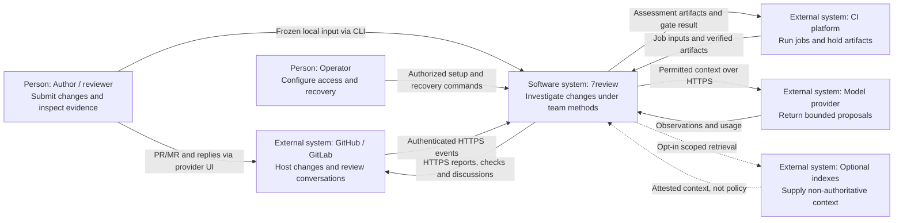
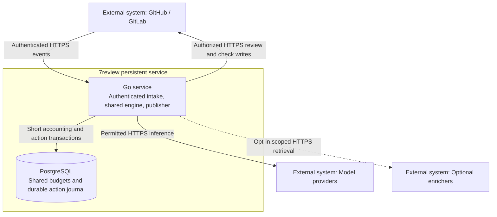
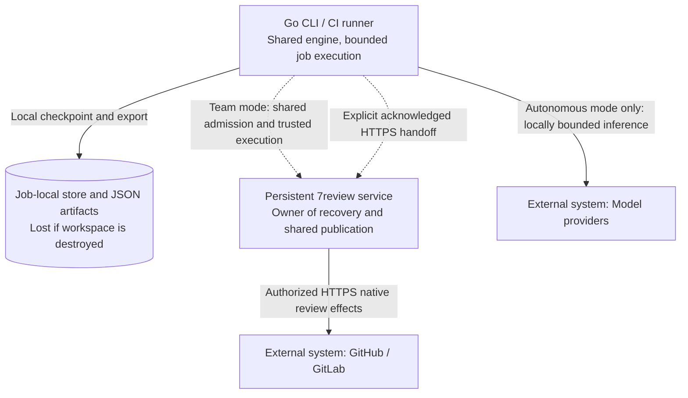
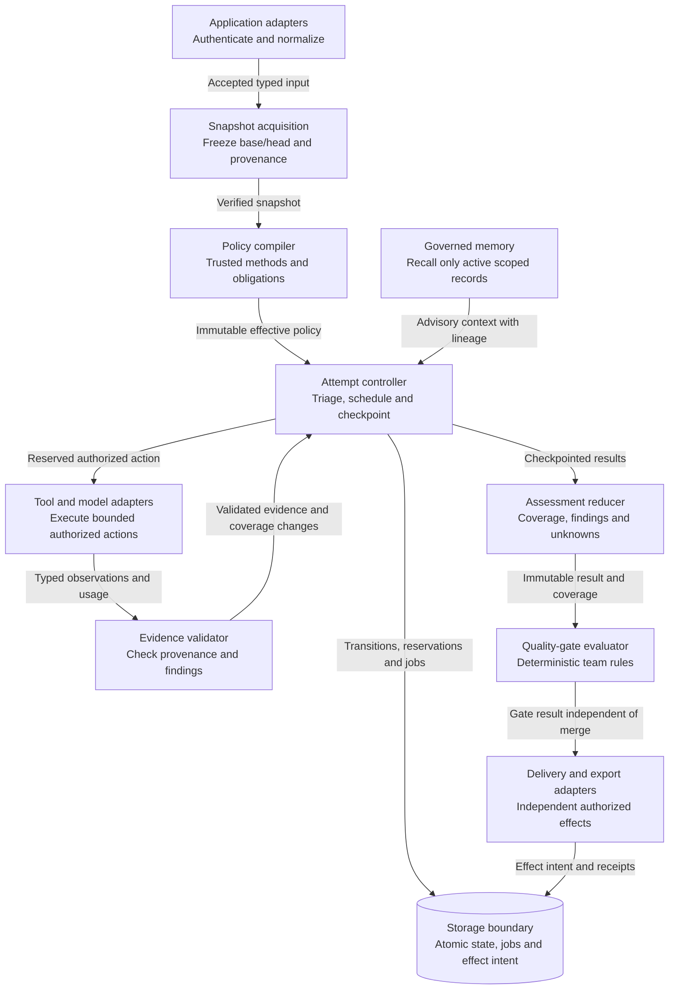
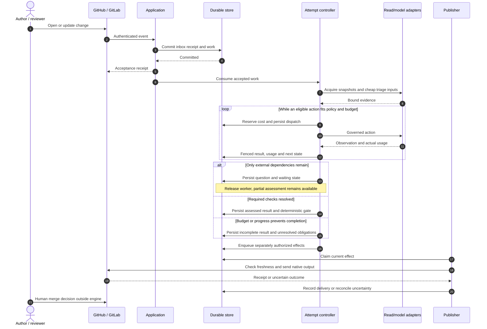
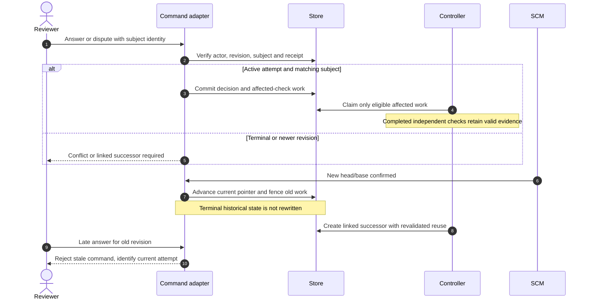
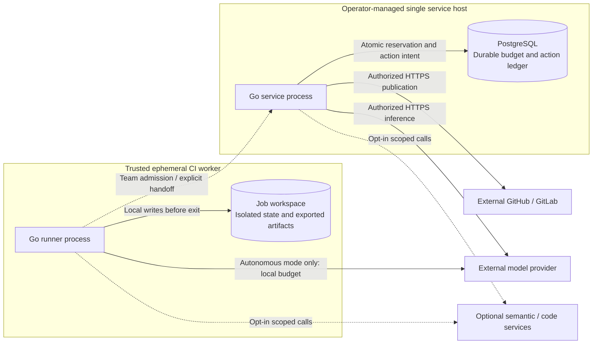

# 7review Architecture

Updated: 2026-09-25
Status: DESIGN CANDIDATE; NOT IMPLEMENTATION-READY OR FINALLY APPROVED.
Owner: 7review maintainers. Decision authority: project owner and designated reviewers.

This document now follows the twelve arc42 sections in order, not a selection
of convenient headings. SPEC owns behavioral contracts; ROADMAP owns planned work;
STATUS records implementation and verification facts. The prior claim was only
an adapted coverage map, not evidence of complete specification quality.

Documentation basis: [arc42](https://arc42.org/overview/), C4 abstraction levels
and its [diagram checklist](https://c4model.com/diagrams/checklist).
Mermaid is the rendering notation, not an architecture standard or certification.
C4 code-level views are intentionally omitted: the target code does not yet exist.
Container, component, runtime and deployment views are distinct below.
Normative terms use SPEC's BCP 14 convention; explanatory diagrams do not create
additional permissions or override the written contracts.

| Section | Purpose | Evidence status |
| --- | --- | --- |
| [1](#1-introduction-and-goals) | Product and stakeholder contract | R01-R23 and J01-J10 specified |
| [2](#2-constraints) | Boundaries and non-goals | Explicit, candidate |
| [3](#3-context-and-scope) | External systems and integration scope | Diagram and provider contracts; hosted qualification pending |
| [4](#4-solution-strategy) | Reuse and adaptive execution approach | Candidate |
| [5](#5-building-block-view) | Logical containers and internal ownership | Diagrammed; two publication modes selected |
| [6](#6-runtime-view) | Investigation and revision/answer flows | Scenarios specified, not executed |
| [7](#7-deployment-view) | Service and ephemeral hosting | Candidate, no installation changes |
| [8](#8-crosscutting-concepts) | Trust, evidence, memory and effects | SPEC contracts; implementation evidence pending |
| [9](#9-architectural-decisions) | Alternatives and consequences | ENG-D1-ENG-D13 approved directions; remaining detailed choices are candidates |
| [10](#10-quality-requirements) | Observable quality scenarios | Targets and qualification gaps distinguished |
| [11](#11-risks-and-technical-debt) | Design closure and remaining runtime risks | Closed design gaps and open evidence conditions |
| [12](#12-glossary) | Common terminology | Defined |

The direction remains installed GitHub/GitLab review, local and CI execution,
team-owned methods, bounded adaptive investigation and governed memory.
Rich contracts express intended behavior; ordinary invariant-backed defects do
not require design documents. A deterministic team gate can block; the AI cannot
approve or merge code. Consolidation or rendered diagrams do not approve a design.

## 1. Introduction And Goals

### Product Contract

### Purpose And Non-Purpose

7review investigates a change using the team's methodology and produces a
reviewable assessment. It reduces the effort needed to understand consequences,
not the accountability of deciding whether to merge. It serves developers with
and without formal design corpora; explicit contracts govern intended behavior
when present, while concrete code evidence can establish ordinary defects.

It is not a compliance certification, merge bot, automatic repair loop, generic
workflow platform or document-management product. More models, graph edges or
stored memories are not product success measures.

### Actors And Jobs

CI and code-quality integration are first-class product workflows, not merely
tests of 7review itself. It must run non-interactively in existing pipelines and
act as an integrated PR/MR reviewer with native checks, findings and updates.
A configurable quality gate may prevent merging through repository protection;
7review does not perform the merge or convert model confidence into approval.

| Actor | Job and useful result | Authority |
| --- | --- | --- |
| Change author | Understand risks before submission; clarify intent without repeating a full review | Submit scoped input, answer assigned questions, dispute findings |
| Reviewer | See evidence, uncovered risks and disagreements; decide where human attention belongs | Request investigation, disposition findings, authorize report publication where granted |
| Method owner | Express team practices and evolve them with reviewable examples | Change repository methods through normal repository governance |
| CI principal | Submit verified job inputs and publish permitted artifacts/checks without interactive prompts | Explicit repository/job/disclosure scope; no human impersonation or merge permission |
| Operator | Run, recover and limit the system without interpreting business intent | Configure credentials/ceilings, restore service, reconcile uncertain delivery; no automatic method ownership |

One person may hold several roles. Authentication and role assignment remain
explicit; possession of a notification or attempt ID confers no authority.

### Requirements

| ID | Product requirement | Success observation |
| --- | --- | --- |
| R01 | Stable change/revision/attempt identity | New commits or reruns do not overwrite prior investigation |
| R02 | Portable, frozen inputs | GitHub, GitLab and local snapshots share investigation semantics |
| R03 | Repository-owned methodology | Methods can differ by domain/module/feature without runtime code edits |
| R04 | Explainable composition | Every selected rule, conflict and exclusion has provenance |
| R05 | Proportional effort | Impact and uncertainty, not line count or model confidence, govern depth |
| R06 | Context-aware readiness | Missing information is explicit; independent useful work can proceed |
| R07 | Test/CI integrity | Changes to verification itself are inspected |
| R08 | Evidence-based findings | Claims link to validated content and concrete consequences |
| R09 | Independent scrutiny when justified | High-risk omission search is distinguishable from candidate verification |
| R10 | Bounded autonomy | Calls, tokens, cost, time and progress have enforced limits |
| R11 | Scoped clarification and resumption | Answers resume dependent checks; waiting holds no worker |
| R12 | Attributable human control | Merge, publication, finding disposition and memory activation are distinct |
| R13 | Trustworthy delivery | Revisions and uncertain side effects remain visible; no blind duplicate publication |
| R14 | Durable recovery | Service-acknowledged work survives a process restart under supported storage assumptions; ephemeral job receipts disclose their limited lifetime |
| R15 | Governed learning | Feedback remains scoped, reversible and evidence-linked |
| R16 | Optional enrichment | Baseline works without semantic/code indexes or context compression |
| R17 | Isolation and confidentiality | Repository data, roles and credentials cannot cross trust boundaries |
| R18 | Compatible transition | Existing records/commands migrate without invented history or approval |
| R19 | Usable assessment | Coverage, unknowns, findings and next actions are independently inspectable |
| R20 | Measurable value | Quality, useful escalation, user effort and costs are compared on representative cases |
| R21 | CI-native execution | Bounded non-interactive jobs produce machine-readable results and unambiguous exit status |
| R22 | Native code-quality feedback | GitHub checks/annotations and GitLab status/Code Quality reports refer to the correct revision |
| R23 | Configurable quality gates | Teams select advisory/blocking policy by scope; incomplete analysis cannot silently clear a required gate |


### User Journeys

| Journey | Trigger and input | Interaction | Result and failure behavior |
| --- | --- | --- | --- |
| J01 Local review | Frozen working-tree diff, base, configured model | Select purpose/focus, inspect triage | Private assessment; missing trust blocks acquisition, missing model permits deterministic inspection only |
| J02 PR/MR assessment | Authenticated event, bound head/base, policy | Cheap checks then eligible investigation | SHA-bound assessment; CI pending becomes a dependency, not generic failure |
| J03 Clarification | A check depends on unknown intent | Ask named actor one scoped question with evidence | Resume affected checks; duplicate answer returns receipt; expired question needs new attempt |
| J04 Dispute | Reviewer challenges a claim or consequence | Persist disposition/reason, choose whether to investigate | Preserve original finding and evidence; no silent deletion or automatic suppression |
| J05 Revision update | Provider confirms a different head or base | Mark active attempt superseded; link successor | Revalidate reusable evidence; human permissions/results never carry as fresh approval |
| J06 Feedback learning | Attributable disposition or correction | Propose scoped memory; separately activate | Recall can improve relevance; revoked/contradicted records stop influencing new work |
| J07 Method change | Team edits review pack/method/design contract | Preview against baseline and proposed examples | Change is reviewed under base policy; proposed policy cannot authorize itself |
| J08 Operational recovery | Restart, disk-full or uncertain publication | Inspect durable receipt, reconcile/retry scoped effect | Analysis is not repeated solely because delivery failed |
| J09 CI job | Pipeline passes trusted comparison, revision and existing test/lint artifacts | Execute without interactive prompts; export assessment and gate result | Exit status distinguishes violations from incomplete/error; no hidden sidecar requirement |
| J10 Integrated code-quality review | GitHub/GitLab change or rerun event | Native check/status, annotations/report, follow-up investigation | Current-generation status updated idempotently; repository protections may require the configured quality gate |

### Assessment Presentation Contract

The first view answers: which revision, why this depth, which consequences,
which required gaps, and who can act next. Details then expose evidence, applied
methods and action history. Do not lead with an overall safety score.

States visible on every existing surface: accepted, queued/running, waiting,
assessed, incomplete, failed, cancelled and superseded. Each has a reason and
permitted next actions. Delivery, memory and quality-gate status are separate fields. CI distinguishes analysis completion from pass/violations/incomplete/error; a missing result never means a clean review. A report
with no findings can still be incomplete, and a complete assessment can contain
severe defects.

Each question shows the dependent scope and what can proceed without an answer.
Each error identifies an actionable category without leaking credentials. Progress
shows completed checks and work remaining, not fictional model-thought progress.

### Success And Validation Boundaries

Acceptance examples cover positive, negative and recovery paths. Real-model
evaluation measures missed seeded issues, invalid claims, useful questions,
human time, repeated work and cost; test coverage is not itself product quality.
Graph/memory/second-reviewer features require paired ablations before default
activation. No numeric commercial benefit or user adoption is established yet.

Review hypotheses to validate with developers later: team-owned methods improve
relevance; visible gaps improve trust; scoped resume reduces repeated effort.
These are not reasons to block writing the technical candidate, nor evidence
that interviews or usability tests have already happened.

## 2. Constraints

### Methodology Freedom

Three distinct things MUST NOT be collapsed into one configuration setting:
- Security invariants: trusted policy source, permission boundaries, provenance,
  bounded execution and no model-owned merge authority; never overridable.
- Team requirements: mandatory checks, readiness requirements, evidence quality,
  owner involvement and independent review; declared in trusted policy.
- Execution preferences: preferred model role, optional analyses and formatting;
  configurable within requirements and operator ceilings.

Default methods are starting points, not an imposed universal method. Teams may
replace them explicitly and explain the replacement. Hard runtime restrictions
remain. An invocation may narrow a requested focus but cannot silently omit
mandatory matched checks; disclose excluded scope or refuse incompatible focus.

Two purposes are explicit: `assessment` evaluates configured obligations;
`exploration` investigates a named question and reports unresolved obligations.
Exploration never masquerades as satisfying the normal review contract. A
clarification is captured as an engineering statement, not hidden reasoning.

### Success And Non-Goals

Success requires scenario correctness, provider parity, restart safety, useful escalation and measured finding quality against the baseline. Acceptance fixtures must have no silent missing coverage, stale approvals or duplicated publication. Unit tests do not establish real-world precision.

No autonomous merge, auto-fix loop, mandatory swarm, executable policy language, new channel, cross-project memory sharing or global knowledge graph. The [specification](SPEC.md) is the gate before development resumes. This draft does not claim completed gstack engineering approval.

## 3. Context And Scope

### Integration Model And Boundaries

The installed reviewer connects selected repositories, receives events, publishes authorized
summaries and threads, follows new commits and accepts scoped conversation commands.
The local/CI entry path shares the engine without requiring a webhook installation.

### Context View

Figure A1. C4 level 1: people and external systems around the target 7review system.

Diagram notation: boxes are named people, systems or components as labeled;
cylinders are stores. Solid arrows are required interactions, dashed arrows
are explicitly optional. Each arrow names its purpose and, across processes,
its transport. Layout and color do not encode additional semantics.



### Comparison With Documented Products

Checked against official public documentation on 2026-09-12. "Comparable" means
the developer-facing workflow, not API compatibility, equal model quality or
the same internal architecture.

| Dimension | Observed reference | 7review target / deliberate distinction |
| --- | --- | --- |
| Repository connection | Greptile documents GitHub App and GitLab token/webhook setup; CodeRabbit offers provider-specific repository onboarding | Selected-repository install, capability validation and explicit enablement; no automatic access to future repositories |
| Automatic review | Both document automatic PR review and configurable draft/update filters | Default ready/open/update triggers after opt-in, with reasoned exclusions and trusted policy |
| Follow-up | Greptile documents mentions and contextual replies; CodeRabbit distinguishes incremental/full review and pause/resume | Authorized commands map to domain operations; new revisions create new attempts and revalidate reused evidence |
| Native feedback | Greptile documents summaries/inline comments and a GitHub status option | Summary and positioned threads on both providers, plus independent checks/artifacts; no implication of identical provider UI |
| Repository methods | Both expose repository review configuration | Methods by project/domain/module/feature; trusted base policy, not self-authorizing head instructions |
| Autonomous actions | References include approval/fix features beyond review | No autonomous merge, automatic code approval or repair loop in this milestone |
| CI execution | Repository integration is not itself proof of a standalone CI runner | Bounded CI runner and native quality exports are separately specified and qualified |

Sources: [Greptile setup](https://www.greptile.com/docs/quickstart),
[Greptile configuration](https://www.greptile.com/docs/code-review/greptile-json-reference),
[Greptile interaction](https://www.greptile.com/docs/code-review/developer-essentials),
[CodeRabbit setup](https://docs.coderabbit.ai/getting-started/quickstart),
[CodeRabbit automatic review](https://docs.coderabbit.ai/configuration/auto-review),
[CodeRabbit commands](https://docs.coderabbit.ai/reference/review-commands).

The concrete provider/installation/event/output contract is
[SPEC section 16](SPEC.md#16-ci-execution-and-code-quality-integration), including
I01-I08 and S53-S60. This is a design target; equivalence has not been demonstrated.

## 4. Solution Strategy

### Preserve And Change

Evaluate `review.Source`, SCM normalization, corpus scoring, skills, tools, model roles, validation, channels and publishing adapters for reuse, adaptation or replacement. Existing package boundaries are evidence, not constraints on the reconception. Preserve characterized compatibility deliberately, not by requiring the old architecture.

Replace `review -> draft -> HIL -> publish -> memory` with a durable bounded scheduler and separate delivery/decision records. Existing reruns, per-change run identifiers and file snapshots do not supply these semantics. No new channel or microservice rewrite is needed.

### Policy Versus Execution

An immutable policy snapshot fixes permissions, methodology, required checks, ceilings, publication requirements and provenance. The initial plan records intake and triage. Subsequent execution decisions are appended, not silently rewritten into that plan.

The model proposes hypotheses, reads and optionally authorized isolated verification actions. The controller checks permission, scope, dependencies, novelty, budget and expected evidence gain. New observations may increase impact or change the next action; they cannot relax hard safety requirements.

Stagnation suspends a line, not independent checks. Protected coverage precedes
discretionary deepening. Automatic PR/MR tracking prioritizes the latest confirmed
revision; reused evidence is revalidated rather than carried forward as approval.
Optional method evaluation and portable correction dossiers are product direction,
not automatic activation, code repair or transmission to another agent.

Risk, blast radius, uncertainty, coverage and finding confidence are separate. Small diff size is not low risk. Missing context is unknown, not favorable. Test/CI edits trigger dedicated integrity checks.

## 5. Building Block View

### System Architecture

#### Container View

Figure A2a. C4 level 2: persistent service containers and external systems.
The application and coordinated ledger are distinct units; no distributed queue
or extra microservice is implied.



Figure A2b. C4 level 2: autonomous CI and coordinated-service execution. Shared
SCM effects have exactly one owner: the coordinated service.



#### Component View

Figure A3. C4 level 3: internal responsibilities of the shared Go application/engine.
Arrows are in-process typed calls or artifact flows, not additional services.



These are responsibility boundaries, not separate services.

| Ownership | Responsibility | Must not own |
| --- | --- | --- |
| `agent/review` | Canonical types and invariants | HTTP, credentials, database clients |
| `agent/app` | Auth, normalized commands, DTOs, composition | Strategy or direct model dispatch |
| `agent/pipeline` initially | Scheduling, transitions, budget reservations | Provider-specific APIs |
| Proposed `agent/policy` | Trusted methods, gate rules and deterministic resolution | Network effects or model-chosen permissions |
| Gate evaluator (domain boundary, package not prescribed) | Assessment-to-pass/violations/incomplete/error projection | Model dispatch, merge authority or publication |
| CI runner and exporters (application/adapters) | Bounded non-interactive execution, artifact schemas, exit mapping | A second review engine or hidden durable handoff |
| Proposed `agent/repository` | Verified base/head/local snapshots | Trusting arbitrary mounted content |
| Proposed `agent/evidence` | Corpus projection, provenance, proof validation | Policy mutation |
| Proposed `agent/memory` | Governed records, recall, feedback | Publishing or merge approval |
| Proposed `agent/storage` | Transactions, migrations, recovery, inbox/outbox | Risk classification |
| Tools, orchestrator, LLM adapters | Governed execution and external I/O | Unilateral lifecycle transitions |
| `agent/channel` | Transport and identity mapping | Per-channel review semantics |

Create packages only when extracting their first tested boundary. No speculative workflow framework.

## 6. Runtime View

### Investigation And Supervision

`assessed` means every required applicable check has completed with validated evidence (satisfied or violated) and no unresolved blocking question remains. It does not mean bug-free or approved. Partial assessments also exist while waiting or incomplete, with findings and coverage shown separately. Terminal investigation state is immutable; additional investigation creates a linked attempt. Feedback, access-revocation notices and delivery records may still reference old attempts.

One controller may use bounded workers for independent domains, sharing an attempt budget. Workers return observations, never external comments. High-risk independent review can find omissions; candidate verification alone cannot. Record actual models and assignments: different role names do not establish independence.

Clarifying intent, disputing findings, authorizing publication and requesting investigation are separate commands. Human merge decisions remain outside the agent. Report approval never activates memory.

#### Initial Review And Delivery

Figure A4. Durable service sequence, covering S10/S15/S16/S27 and native integration.
The scheduler repeats eligible actions, not a fixed mandatory list of reviewers.



#### Clarification And New Revision

Figure A5. Scoped continuation versus successor attempt, covering S11-S14/S39/S56.



The normative state diagram and transition guards are in [SPEC section 5](SPEC.md#5-states-and-transition-guards).

## 7. Deployment View

### Deployment View

Figure A6. Coordinated service and autonomous/connected worker placement. An
autonomous worker emits local artifacts and exit status only; a connected worker
hands immutable input to the service. No network filesystem or multi-instance
safety is implied by the local store.



### Execution And Persistence Boundaries

ENG-D7/D8 supersede candidate D06 for coordinated execution: a budget authority
inside the 7review server owns PostgreSQL-backed reservations and durable action
intent. Server-integrated workers execute outside transactions. This does not
select PostgreSQL for every memory/graph concern or authorize installation.
Autonomous local execution retains a persistent local ledger; SQLite remains a
candidate there. Independent ledgers cannot enforce a shared project ceiling.

The coordinated authority must reserve all applicable scopes atomically and
retain unresolved usage across restarts and fixed-period renewal. When unavailable,
new spending requiring admission stops; there is no silent local fallback.
If SQLite is selected locally, use supported same-host storage, not a shared
network file. Neither topology promises survival after destruction of its storage.

The durable service persists input before acknowledging acceptance. An ephemeral CI runner checkpoints in its isolated job store; destroying that workspace destroys recovery state. Local-only CI export requires no shared server. Native shared-status publication requires a trusted coordinator; separate runners cannot claim a global current-attempt pointer. The full mode and handoff contract is in specification section 16.

Persist input before acknowledging acceptance. Network calls never run inside transactions. Persist dispatch intent and budget reservation first, then version-check results. Rebuild pending work from durable jobs after restart.

External exactly-once effects are not promised. Durable intent is not permission
for blind at-least-once provider execution. Reconcile uncertain sends; retry an
ambiguous billable call only within verified provider idempotency guarantees,
using the same key and request. Lease expiration never proves remote cancellation.

### Migration And Rollback

Import legacy records read-only, preserve aliases and mark unverified provenance instead of inventing checkpoints. Do not dual-write two authoritative stores. Drain in-flight legacy work before switching the engine; translate existing routes and commands explicitly.

```text
spec review -> baseline fixtures -> storage migration rehearsal
      -> shadow strategy -> opt-in new attempts -> recovery/provider gates
      -> broader enablement

regression -> stop new-engine intake -> preserve/drain new-format attempts
           -> legacy only for explicitly routed new work
```

Old binaries must not write a new schema. Rollback means routing plus compatible read/drain support, not destructive schema downgrade. Backup/restore and disk-full tests are release gates for persistent mode. CI migration separately validates runner exit codes, artifact schemas, native permissions and protection context names; legacy report approval does not activate a new required check. Multi-instance coordination is outside this milestone.

## 8. Crosscutting Concepts

### Evidence, Graph And Memory

Keep three concepts separate:
1. Corpus graph: rich repository document discovery and selection.
2. Review evidence graph: bounded explanations of this attempt's checks, observations and findings.
3. Optional code intelligence: revision-attested symbols/dependencies for beyond-diff impact; missing edges mean limited coverage.

No mandatory graph database. Index adapters declare languages, revision, tool/config version and freshness. Stale data can guide a fresh lookup, not establish a finding. See [graph design](SPEC.md#17-evidence-graph-contract).

The local store owns memory records and lineage. MemPalace is an optional replaceable semantic index; exact scoped recall works without it. Feedback produces candidates asynchronously. Activation is separately authorized, contradictions retain sources, and procedural changes become repository PRs/MRs. See [memory design](SPEC.md#18-governed-memory-contract).

Headroom is optional; baseline budgeting works without it. Setup explicitly offers optional integrations, never downloads or enables them silently. A required but unavailable capability yields a visible blocked/incomplete assessment, not equivalent-coverage claims.

### Configuration And Developer Outputs

#### CI And Code Quality Are Product Surfaces

Support both an ephemeral non-interactive CI job and the durable webhook-driven
service. They share the same engine, policy and findings, not separate review
implementations. CI jobs export machine-readable assessments and code-quality
artifacts; integrated service adapters update native checks/statuses and PR/MR
feedback. A pure CI run needs no persistent review server; human waits become
explicit incomplete results at its bounded deadline, with optional durable-service
handoff configured before execution.

An independent deterministic quality-gate evaluator consumes validated findings,
coverage and trusted team policy. It emits pass, violations, incomplete or error.
Teams choose advisory or blocking operation; repository branch protections may
require its status. This is compatible with human merge ownership and AI as a
sensor: the model neither invents the gate policy nor merges the change.
Section 16 of the specification defines export, security and runner semantics.

Repository configuration is declarative: `.7review/review.yaml`, packs, `methods/*/SKILL.md`, rules and scenario manifests. Markdown carries method content; typed metadata declares applicability and capabilities. Instructions cannot grant permissions.

CLI, HTTP, TUI and channels share application commands. Every assessment exposes revision, methods, impact, coverage, completeness, evidence, findings, unknowns, stop reason, cost and permitted next actions. Local runs default to no external publication. Owners may explicitly grant revocable informational sharing for specified destinations. Check/artifact disclosure is authorized separately at setup and need not wait for per-report consent; a mandatory manual disclosure rule remains binding. Human merge authority is unaffected. Notifications link to state; they are not the state store.

JSON remains the API, storage and model-output format. Strict TOON is only a future model-input optimization for suitable collections after tokenizer-specific and quality evaluation; no domain contract changes.

Normative concurrency, cost, permission and artifact contracts live in SPEC sections
1, 3, 6-11 and 15-18. No transport, memory backend or provider owns separate policy.

## 9. Architectural Decisions

### Decisions And Tradeoffs

#### Candidate Decision Register

The legacy D identifiers below are retained for reference. ENG identifiers own
the subsequent user-approved direction; acceptance does not validate unspecified
schemas, provider behavior, operational thresholds or implementation.

| ID | Decision | Why / consequence | Alternative and revisit trigger |
| --- | --- | --- | --- |
| D01 | Assessment artifact independent of completion state | Useful findings survive missing evidence; partial label mandatory | One success flag hides gaps; reject |
| D02 | Readiness gates only dependent checks | Preserves useful correctness work; protected scopes may require stronger proof | Global readiness gate adds needless friction |
| D03 | Team methods replace defaults explicitly, not runtime invariants | Developer freedom without self-authorizing PR policy | Arbitrary model-chosen policy rejected |
| D04 | Manual sharing default; optional scoped repository grant | Disclosure controlled without per-report ceremony when opted in | Automatic sharing everywhere rejected |
| D05 | Deduplicated questions, maximum two unsolicited question batches | Prevents infinite human escalation | Unlimited questioning rejected; owner may request another batch |
| D06 | Superseded for coordinated mode by ENG-D7/D8 | PostgreSQL authority and action journal; local SQLite remains candidate | No shared SQLite network file or mandatory broker |
| D07 | Shared monotonic budget reservations | Retries/parallel roles cannot reset cost | Per-worker independent budget rejected |
| D08 | Scoped exact recall + optional semantic/code enrichment | Concrete prior-adjudication reuse, no hidden normative learning | Universal graph and automatic policy mutation rejected |
| D09 | Freeze evidence identity; separately record mutable access rights | Reproducibility does not authorize future access | Permission snapshot alone insufficient |
| D10 | Read-only legacy import with explicit aliases and opt-in | Preserve history without inventing resumable state | Dual authoritative writes rejected |
| D11 | No scenario counts escalation as detection | Honest recall, false-positive and interruption measurement | Safe-but-useless escalation must not pass detection benchmarks |
| D12 | Locally fenced publication with shared grant lifecycle and remote reconciliation | Revision check and withdrawal can fence queued writes | Exactly-once across SCM network cannot be guaranteed |
| D13 | CI-native runner and integrated quality checks are core product scope | User explicitly corrected their omission; shared engine, machine artifacts, scoped advisory/blocking gates | Human merge ownership does not prohibit required checks; no separate review engine |

Unamended legacy details remain candidates; the following directions were
explicitly approved on 2026-09-25. Development still requires separate authorization.

| ID | Approved direction | Contract |
| --- | --- | --- |
| ENG-D1 | Observable evidence-linked progress, not confidence or rephrasing | SPEC 4 |
| ENG-D2 | Suspend stagnant lines; retain global limits and unresolved coverage | SPEC 4-6 |
| ENG-D3 | Protect mandatory/priority coverage before discretionary depth | SPEC 4/6 |
| ENG-D4 | Revision-specific assessment; selective revalidated evidence reuse | SPEC 1/7 |
| ENG-D5 | Latest confirmed revision for automatic tracking; historical work explicit | SPEC 1/15 |
| ENG-D6 | Attempt, PR/MR and project ceilings | SPEC 6 |
| ENG-D7 | Server-integrated budget authority and PostgreSQL coordinated ledger; autonomous guarantees local only | SPEC 6/10 |
| ENG-D8 | Durable intent, conservative uncertain-call recovery, integrated workers | SPEC 10/14 |
| ENG-D9 | Deterministic provenance/identity guards plus evidence-linked interpretation | SPEC 4/7 |
| ENG-D10 | Fixed configured budget periods; unresolved reservations survive renewal | SPEC 6 |
| ENG-D11 | Trusted billing boundary; repository execution receives no model/publisher secrets | SPEC 10/19 |
| ENG-D12 | Automated review/publication under configured grants; truthful incomplete CI, human merge | SPEC 8/9/16 |
| ENG-D13 | Delegated project/domain/module/feature authority; explicit scoped conflicts | SPEC 3 |

The earlier CEO direction also includes optional isolated runtime verification,
method comparison before activation, and a portable correction dossier. These
remain in scope; detailed sandbox and evaluation contracts are not complete.

#### Persistence And Orchestration Comparison

For durable service mode, requirements are atomic inbox/state/jobs/effects, stable identities, recovery,
bounded concurrency and no mandatory external service for local use.

| Option | Fit | Operational cost | Decision |
| --- | --- | --- | --- |
| JSON files plus in-memory queue | Existing, simple reads | Requires custom journal, transaction and recovery protocol | Retain legacy import only |
| SQLite plus Go scheduler | Embedded transactions, one local volume | Single writer; bounded transactions, backup and WAL management | Candidate for autonomous local mode only |
| PostgreSQL plus Go scheduler | Shared transactional coordination | Requires database operations and recovery qualification | Approved coordinated budget/action ledger: ENG-D7/D8 |
| Temporal plus activities | Durable workflow abstraction | Workflow versioning and extra service model | Not justified for this bounded single-host engine |

[SQLite WAL](https://www.sqlite.org/wal.html) documents single-host/single-writer
constraints and synchronization behavior. [PostgreSQL locking](https://www.postgresql.org/docs/current/explicit-locking.html)
provides concurrency mechanisms, not automatic business idempotency.
[Temporal workflows](https://docs.temporal.io/workflows) offer durable execution;
they do not remove the need for permission checks or effect reconciliation.

Candidate local-only Go driver: [modernc.org/sqlite](https://pkg.go.dev/modernc.org/sqlite),
chosen for a CGo-free integration compatible with a Go binary. Exact dependency
version is selected during approved implementation after Go-version, license,
security and supported-platform checks; it is not a structural design decision.
Initial qualification target: Linux amd64/arm64 local filesystem, single process;
other platforms are unqualified until tested, not claimed unsupported forever.

Ephemeral CI uses the same store contract on a per-job workspace without a
survival promise after runner destruction. Cross-job shared status requires the
coordinated service; isolated databases do not coordinate runs. Autonomous CI
therefore remains server-free but artifact-and-exit-only.

No installer, go.mod edit, broker or database is introduced by this comparison.
The candidate contains a concrete recommendation, not a claim it has been load
tested. Reject unsupported shared/network volumes at setup.

#### Concrete Enrichment Benefits To Test

Memory: a reviewer previously established why an auth exception is intentional.
On a later relevant change, retrieve that adjudication, its scope and source;
revalidate against current code before using it. Compare redundant questions and
false positives with memory off, including a contradictory newer contract.

Graph: a changed API field affects a caller outside the patch. Use attested
dependency evidence to retrieve the caller and test the consequence. Compare
missed seeded caller failures and token cost with bounded text retrieval alone.
Do not claim index completeness when languages or generated code are missing.

### Research And Design Challenge

#### Research And Its Limits

- [Addy Osmani](https://addyosmani.com/blog/agentic-code-review/) argues for
  risk-proportional effort, early inexpensive checks, explicit intent and test
  evidence, stronger scrutiny of changed tests, diverse reviewers where stakes
  justify them, and human accountability. These are design inputs, not measured
  guarantees for 7review. Vendor statistics are not acceptance criteria.
- [Greptile Agent](https://www.greptile.com/agent) documents repository graph
  context, parallel review beyond the diff, configurable triggers and severity,
  and follow-up conversations. This demonstrates product surface, not the
  correctness or implementation of its internal algorithms.
- [Greptile Learning](https://www.greptile.com/learning) documents repository
  settings, directory-scoped rules, existing instruction-file ingestion, and
  learning from reactions and replies. For 7review, feedback should produce
  attributable memory candidates, not silently authoritative rules.
- [Greptile Independence](https://www.greptile.com/independence) describes
  coding-agent integration and multi-provider models. Its perfect-score loop is
  not a suitable correctness criterion: zero comments can also mean missed bugs.
- The public [Codex plugin](https://github.com/greptileai/codex-plugin/blob/main/plugins/greptile/README.md)
  documents pre-PR CLI dispatch, MCP result retrieval, knowledge-base access,
  custom context and analytics. These are useful lifecycle and interoperability
  references; they do not expose the server's review engine.
- Public [deployment architecture](https://github.com/greptileai/akupara/blob/main/deploy/kubernetes/docs/architecture.md)
  informs operational separation, not reasoning design. DeepWiki lookups of the
  public repositories did not yield indexed architecture during this research.
  No proprietary engine architecture was verified through DeepWiki.

#### Greptile Comparison: What To Adopt And What Not To Infer

| Product dimension | Recommendation for 7review | Limit or tradeoff |
| --- | --- | --- |
| Beyond-diff understanding | Optional revision-bound symbol/dependency index; bounded impact traversal | A document graph alone is not a code dependency graph; report unsupported languages and missing edges |
| Scoped methodology | Project/domain/module rules with explicit precedence and explainable applicability | Trusted base policy wins over instructions introduced in the reviewed change |
| Feedback learning | Store author, scope, revision, evidence, disposition and expiry; allow inspection and revocation | A merge or thumbs-up does not prove a rule is universally correct |
| Conversation | A reply can answer a question, dispute evidence or request investigation | Do not implement every reply as report rewriting or a full rerun |
| Multiple reviewers | Independent risk-focused pass only when justified; capable of finding omissions | A verifier restricted to existing findings cannot discover missing findings |
| Local and SCM review | Same normalized investigation contract for local runs, PRs and MRs | Live provider parity needs separate integration evidence |
| Noise control | Stable finding identity, deduplication, changed-revision revalidation, useful thresholds | Suppressed findings and incomplete coverage must remain inspectable |
| Developer workflow | Show checked scope, evidence, unknowns, responsible human and next action | No single confidence score implying that merging is safe |

#### Addy's Principles As Acceptance Tests

| Principle | Proposed observable behavior |
| --- | --- |
| Proportional depth | One-line authorization changes receive deeper scrutiny than large generated-file updates |
| Triage first | Trivial or inapplicable changes avoid corpus-wide retrieval and unnecessary model calls |
| Intent, acceptance, test proof | Intake records present/missing/not-applicable with reasons; execution proof includes revision and provenance |
| Tests and CI are review targets | Detect removed assertions, skipped tests and weakened gates, rather than treating green CI as sufficient |
| Different reviewers for high risk | Trace why an independent pass ran, its actual model and what additional risks it covered |
| Human final decision | Publishing a report neither merges code nor implicitly activates learned rules |
| AI as sensor | Empty findings plus incomplete coverage reports an incomplete assessment, not approval |

Intent means an explicit engineering rationale, not hidden model chain-of-thought.
Readiness requirements should fit the project: a typo need not require a design
document, while ambiguous payment behavior needs clarification before conclusions.

#### Existing Primitives And Required Changes

The initial review of baseline `11f3f55` identified five gaps, not five runtime
fixes: per-change IDs overwrote attempt history; rerun restarted review rather
than resuming investigation; publication and memory were coupled; cached SCM
state weakened publication freshness; triage followed costly retrieval.
The current contracts address these through attempt identities, scoped resume,
independent effects, full freshness fencing and triage-first scheduling.
Existing Source, corpus, skills, adapters and model roles remain reusable.

#### Product And Developer Experience Decisions

- Missing intent gates only dependent checks; concrete invariant checks continue.
- Partial assessments remain useful; no overall safety score substitutes for evidence.
- Team-owned methods can replace defaults, not permissions or required obligations.
- Questions are scoped, deduplicated and budgeted, not an unlimited escalation loop.
- Independent high-risk review searches for omissions, not only existing candidates.
- Local and CI entry paths require no semantic infrastructure; setup explains
  optional capabilities, credentials, privacy and reduced coverage.
- Sharing grants are explicit and revocable; manual comment consent does not
  impose interactive approval on an independently authorized CI gate.
- CI is a core workflow: native outputs, deadlines, incomplete exits, provenance,
  fork isolation and coordinated status publishing are designed into the engine.
- Memory/graph value needs paired evaluations, not more retrieved text or nodes.
- Replacing the system with a workflow framework/swarm or dropping governed
  memory from scope was rejected; preserve primitives and measure added value.

#### Engineering Amendments

The independent engineering review raised the following six issues. They were
resolved at contract level, not demonstrated by executed candidate tests.

| Finding | Candidate amendment | Verification |
| --- | --- | --- |
| Publication checked head, not base/policy/generation | Canonical current pointer and full freshness tuple; separate historical-artifact flag | S39 |
| Revocation omitted already-derived content | Transitive lineage/epochs; invalidate dependent checks and disclosure, acknowledge past egress | S40 |
| Grant precedence could bypass manual policy or never activate | Replaceable defaults separate from mandatory constraints; grant never overrides the latter | S41 |
| Output-only reservations missed billable input | Atomic complete-price upper bound; uncertain reservation retained; settle once | S42 |
| Aggregate CAS could reject valid parallel completion | Action token/dependency epoch separate from aggregate version; bounded reducer retry without repeated I/O | S43 |
| Publication identity collided across assessment versions | Immutable version/digest operation, separate logical comment, serialized reconciliation | S44 |

#### Review Limits

gstack product and engineering methods were applied using separate Codex contexts.
No Claude/cross-provider consensus, full autoplan certification or independent DX
usability result is claimed. The later CI expansion and consolidation have not
received a new independent review. Historical source research is not evidence of
competitor internals, commercial superiority or runtime correctness.
[STATUS.md](STATUS.md#september-25-contract-reconciliation) records what was actually checked.

## 10. Quality Requirements

Priority order: correctness of authority/currentness and safety before liveness,
then review usefulness, bounded cost and ergonomics. Existing budget defaults
are evaluation inputs, not proven latency or throughput objectives.

| Quality scenario | Stimulus and environment | Required observable response | Verification |
| --- | --- | --- | --- |
| Accepted-work recovery | Service crashes after acknowledged commit; volume survives | Recover accepted job without resubmission or duplicate effective transition | S15-S17; section 23 recovery objectives |
| Isolation | Unauthorized actor or fork requests a scoped artifact/action | Deny access/dispatch without source or credential disclosure | S22/S26/S48/S53/S60 |
| Currentness | Head, base, policy or generation changes during work | Fence stale effects; retain history and reconcile already-sent output | S12/S30/S39/S47 |
| Resource bounds | Concurrent actions compete for budget; one times out | Reserve total cost atomically and retain unknown usage | S21/S35/S42/S43 |
| Coverage honesty | Evidence missing despite zero findings | Partial/incomplete result, never false required-gate success | S07/S19/S21/S45/S58 |
| Review value | Paired representative changes with/without enrichment | Report detected defects, invalid claims, human effort and cost separately | R20/S37/S38; section 23 acceptance targets |
| Developer continuity | Reviewer answers or disputes after a change update | Resume only valid affected work or identify successor; no silent whole rerun | S11/S55-S57 |

No numeric claim is inferred from a diagram, test count or vendor marketing.

## 11. Risks And Technical Debt

| ID | Status / remaining risk | Owner role | Evidence |
| --- | --- | --- | --- |
| DOC-01 | Design closed; validators and compatibility fixtures do not exist | Contract maintainer | SPEC 20 and precision register |
| DOC-02 | Design closed; lifecycle and allocation tests do not exist | Engine maintainer | SPEC 21 and precision register |
| DOC-03 | Design closed; migration characterization and dry run do not exist | Migration maintainer | SPEC 22 and precision register |
| DOC-04 | Design closed; targets have not been measured against the evaluation corpus | Product owner and operator | SPEC 23 and precision register |
| DOC-05 | Design closed; coordinated publication races and recovery are unqualified | Integration maintainer | SPEC 24 and precision register |
| DOC-06 | Design closed; executable clause manifest and assertion audit do not exist | Specification maintainer | SPEC 25 and precision register |
| OPS-01 | Open runtime risk: legacy accepted work is process-local; remote outcomes can be uncertain | Runtime maintainer | Future durable recovery and provider reconciliation tests |
| SEC-01 | Open runtime risk: credentials, source egress and derived-memory revocation cross multiple boundaries | Security reviewer | Future negative permission/provenance tests and disclosure review |

DOC-01 through DOC-06 are closed as design decisions, not as implementation or
qualification work. Their normative detail is owned by [SPEC's precision register](SPEC.md#specification-precision-register);
[ROADMAP](ROADMAP.md#immediate-queue) keeps product acceptance and evidence-producing
implementation as separate gates. Assumptions are not runtime guarantees.

## 12. Glossary

### Glossary

| Term | Meaning |
| --- | --- |
| Change | Local comparison or provider PR/MR, independent of one run |
| Attempt | Immutable revision/policy-bound investigation identity |
| Assessment | Versioned findings, evidence, coverage and unknowns, including partial work |
| Method | Team-owned review procedure with scoped applicability and obligations |
| Evidence | Provenance-bound observations, not merely model confidence |
| Quality gate | Deterministic evaluation of team rules; distinct from human approval |
| Integration | Authenticated SCM lifecycle, feedback and permissions, not just a CI script |
| Execution mode | Durable service or ephemeral job using the same engine |
| Publisher | Authorized adapter/controller for external effects; never the model |
| Memory | Scoped governed feedback/history, not repository policy or defect proof alone |
| SCM | Source code management provider, here GitHub or GitLab |
| CI | Continuous integration pipeline and its jobs/artifacts |
| PR / MR | Pull request / merge request: provider-hosted change under review |
| HIL | Human-in-the-loop interaction; legacy approval is not the target agent loop |
| CAS | Compare-and-swap version guard for local atomic state updates, not remote SCM atomicity |
| WAL | SQLite write-ahead log; durability still depends on the supported local volume |
| C4 | Context, container, component and code abstraction levels for architecture views |
