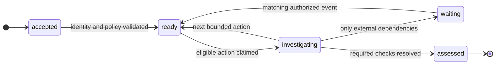
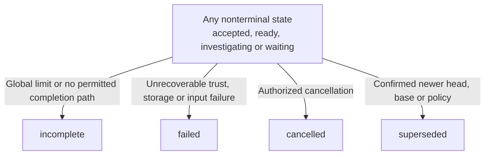
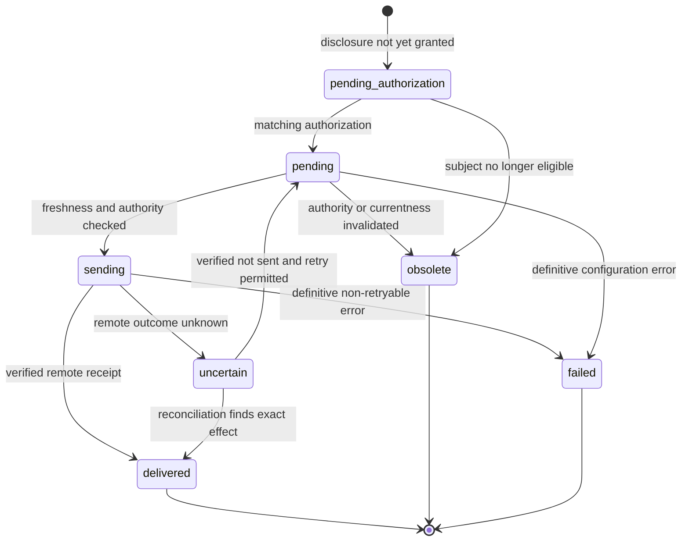
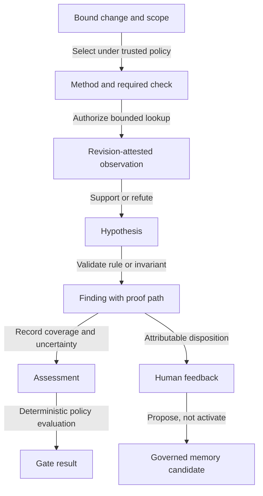
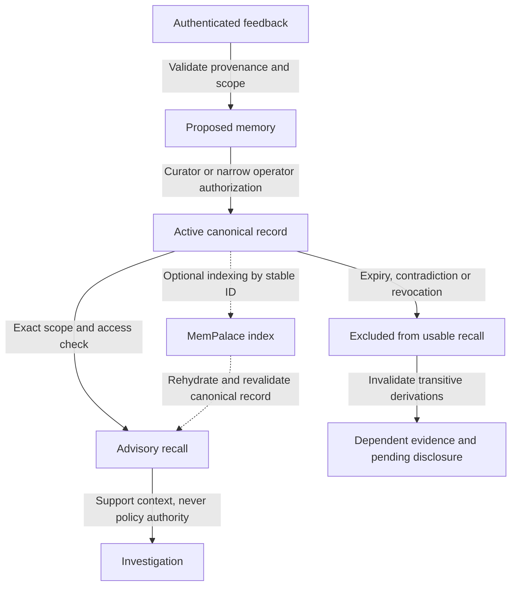

# 7review Specification

Updated: 2026-09-25
Version: design candidate 3, approved loop directions reconciled
Status: ENG-D1-ENG-D13 DIRECTIONS APPROVED; DETAILED SPECIFICATION NOT FINALLY APPROVED OR IMPLEMENTATION-READY.

[ARCHITECTURE.md](ARCHITECTURE.md) owns product requirements and design decisions.
[ROADMAP.md](ROADMAP.md) owns conditional implementation order;
[STATUS.md](STATUS.md) records evidence and pending validation.
The uppercase keywords MUST, MUST NOT, SHOULD, SHOULD NOT and MAY follow
[BCP 14 / RFC 8174](https://www.rfc-editor.org/rfc/rfc8174.html), with meanings
from [RFC 2119](https://www.rfc-editor.org/rfc/rfc2119.html). They express target
requirements, not current runtime capability. Lowercase usage is ordinary prose.
A SHOULD exception requires an explicit rationale and impact record.
Names, interfaces and defaults are proposed contracts, not existing CLI/API promises.
The BCP 14 convention defines keyword strength only; it does not establish
completeness, consistency or testability of a whole specification. Prose can be
normative without uppercase keywords. Examples never override explicit contracts.

## Document Control And Acceptance

Owner: specification maintainer. Approval requires project-owner acceptance and
technical review of unresolved design findings. No sign-off has occurred for this
revision as a whole. Requirements R01-R23, legacy candidate decisions D01-D13 and
approved engineering directions ENG-D1-ENG-D13 are owned by ARCHITECTURE;
I01-I08 refine integration; S01-S60 and the 50 ENG cases are unexecuted acceptance
cases. This revision specifies consequences of the approved directions, not new
runtime capabilities. Detailed representations below remain review candidates.

Document quality is checked against: unambiguous obligations, one responsibility
per operation, typed inputs/outputs, preconditions, successful postconditions,
errors and side effects, lifecycle completeness, compatibility and traceability.
This is the declared project review rubric, not claimed ISO conformance. The
[precision register](#specification-precision-register) records failures against it.

Changes MUST preserve stable requirement/scenario identifiers or record their
replacement and rationale. A contract change requires affected scenarios and
compatibility implications to be reviewed; layout changes alone do not approve
behavior. Diagram captions identify normative versus illustrative content.

## Reading Guide

- [Identity and intake](#1-identity-and-canonical-state): sections 1-2.
- [Methods and adaptive loop](#3-policy-contract): sections 3-6.
- [Evidence and human authority](#7-evidence-and-findings): sections 7-9.
- [Persistence and optional integrations](#10-storage-and-recovery): sections 10-11.
- [Verification and interfaces](#12-acceptance-scenarios): sections 12-15.
- [CI and code quality](#16-ci-execution-and-code-quality-integration): section 16.
- [Evidence graph](#17-evidence-graph-contract) and [governed memory](#18-governed-memory-contract): sections 17-18.
- [Risk and verification walkthrough](#19-risk-and-verification-walkthrough): section 19.
- [Acceptance cases](#acceptance-cases) and [requirement traceability](#requirement-traceability).

Sections 1-16 retain their numbering so scenario contract references remain stable.
Sections 17-19 give supporting subsystem and verification detail under those
shared lifecycle, trust and CI contracts. No enrichment can weaken them.

## 1. Identity And Canonical State

| Object | Required fields and semantics |
| --- | --- |
| ChangeKey | provider, host, repository stable ID, change number; local mode uses workspace identity and explicit comparison ID |
| SnapshotIdentity | repository, base revision, head revision or immutable local snapshot digest, file manifest digest |
| Attempt | unique opaque ID, ChangeKey, snapshot, policy digest, generation, predecessor, state, version, timestamps |
| PolicySnapshot | schema version, trusted base, normalized rules/methods, runtime permission intersection, digest |
| ExecutionDecision | sequence, triggering event, input artifact refs, action, reason, risk/coverage delta, budget reservation |
| Check | stable ID, method, scope, requirement, applicability reason, status, evidence refs |
| Observation | action ID, source, repository/revision, timestamp, tool/model version, content digest, authority, completeness |
| Question | ID, attempt, revision, subject/check refs, recipient role, blocking scope, deadline, status |
| Decision | ID, actor identity, role, action, subject version, revision, reason, timestamp |
| Assessment | immutable version, purpose, findings, coverage, completeness, unknowns, risk, stop reason, costs, evidence references |
| ExecutionContext | service or ephemeral mode, producer/job identity, comparison tree, persistence boundary, deadline |
| GateResult | assessment version/digest, policy digest, mode, outcome, violated rules, unknown obligations, evaluation provenance |

One canonical domain representation MUST own investigation data; `review.Source`
is the existing reuse candidate, not a mandatory final package layout. Persisted events and the
materialized aggregate MUST commit atomically. Derived graph views and DTOs MUST
not become competing authorities. Store explicit action rationale, not hidden
model chain-of-thought.

Duplicate delivery identity is provider + host + repository + delivery ID.
The same ID with a different payload digest is rejected and audited. Different
events for the same head may update checks/discussions without creating a new
attempt. An explicit rerun creates a new linked generation, even on the same SHA.

Within a coordinating store, each ChangeKey has one automatic-tracking current-attempt pointer. Its freshness tuple is
head/local-manifest, base/comparison identity, trusted policy digest and generation.
Accepting a new generation atomically updates the pointer and fences old jobs;
duplicate delivery does not advance generation. Terminal investigation states
are not rewritten: a separate artifact-freshness flag marks their assessments
historical when the pointer changes. Explicit rerun, changed base or policy can
invalidate currentness even when head SHA stays unchanged.

An explicit historical request has a separate immutable work_intent_id and
requested snapshot. It never advances or fences the automatic pointer. Its
eligibility means that this intent is active, authorized and bound to its requested
snapshot, not that its head equals today's SCM head. Historical work shares the
same change/project budgets, uses a distinct attempt budget, and cannot write the
automatic current-head CI context. Its results and disclosures are labeled historical.
Cancellation/revocation still fences its own intent. This distinction also applies
to LOOP-01 and the pre-dispatch freshness checks.

Local dirty changes MUST be frozen into an immutable manifest before analysis;
subsequent workspace edits are not silently observed by the running attempt.
Local policy comes from the trusted base, or an explicit operator-approved
initial policy snapshot for repositories without a base. Missing trust fails
planning; it does not promote arbitrary working-tree instructions.

## 2. Intake And Readiness

For service HTTP intake, authentication, payload size/schema checks, identity resolution and durable inbox
commit precede acknowledgement. Invalid credentials return 401/403, invalid input
400/422, admission-limit rejection 429, and storage unavailability 503. Accepted
work returns 202 with a durable receipt, including when workers are busy.

Local/CI application calls return typed receipts or errors, not HTTP responses.
They checkpoint before dispatch in the selected store. An ephemeral receipt is
job-local and MUST declare that runner destruction removes recovery state;
only acknowledged service handoff transfers recovery responsibility (section 16).

Readiness fields: intent summary, acceptance criteria, test execution evidence.
Each is `present`, `missing`, `not_applicable` or `contradictory`, with provenance
and reason. Presence of prose does not prove correctness or execution.

Test evidence includes revision, command/check name, result, source URL/artifact,
execution time and producer. Author assertions are labeled unverified; provider
checks are verified only when adapter provenance establishes revision binding.
An adapter lacking that field reports unknown, never an assumed current result.

Default behavior:
- Docs-only changes may mark runtime tests inapplicable with a recorded reason.
- Request intent and criteria for behavioral changes, but wait only on checks
  explicitly dependent on missing facts. Concrete invariant checks continue.
- Protected high-impact scopes require applicable test proof by default; trusted
  team policy defines those scopes and obligations. Missing proof does not
  prevent issuing useful partial assessments.
- Pending CI is a wait condition, not an error or a failing test.
- Contradictory authoritative intent requires an accountable human response.

Purpose is `assessment` or `exploration`. Exploration may narrow investigation
but must disclose unsatisfied normal obligations, not bypass them. Assessments
exist for partial and complete work; lifecycle status indicates completion, not
whether a useful review can be read or shared.

## 3. Policy Contract

Proposed layout:

```text
.7review/review.yaml
.7review/packs/*.yaml
.7review/methods/<name>/SKILL.md
.7review/rules/*.{md,yaml,json}
.7review/scenarios/<name>/scenario.yaml
```

All policy and method files are read from the trusted base snapshot. Head design
documents are evidence for proposed intent, visibly distinct from existing
authority. Paths are confined to the snapshot; symlinks cannot escape it.
Unknown schema keys, duplicate IDs, missing references and inheritance cycles
fail validation. No executable expressions, scripts or remote policy imports.
ENG-D13: authority and delegation are evaluated before preference priority.
Narrower scope alone never authorizes replacing a parent obligation. A proposed
delegation identifies grantor, recipient scope, permitted rule IDs/fields and
constraints; it cannot delegate runtime permissions the grantor does not hold.
Missing delegation means no override, not implicit permission.

Quality-gate policy uses the same trusted source and applicability resolver.
Root selects advisory/blocking mode; matching mandatory blocking constraints
cannot be weakened by a lower-priority preference or invocation flag. Gate rule
IDs use stable union, required coverage uses union, and unequal scalar thresholds
at equal authority/priority produce scoped conflicts. Explain includes rule scope, baseline policy
and disclosure permissions. Analysis rules and publication grants stay separate.

Illustrative pack-resolution fragment, not a standalone `ReviewConfigV2`; section
20 contains the complete valid configuration example:

```yaml
packs:
  - id: backend-auth
    priority: 100
    match:
      paths: ["backend/auth/**"]
    methods: [repo/auth-boundaries]
    checks: [intent, acceptance, test-proof, auth-boundaries]
    risk_floor: high
    independent_review: true
  - id: frontend
    priority: 50
    match:
      paths: ["frontend/**"]
    methods: [repo/ui-contract]
```

Rule resolution MUST be deterministic:
1. Runtime security restrictions are absolute; repository configuration cannot
   widen credentials, model tools or hard ceilings.
2. Defaults then matching packs ordered by numeric priority, then stable ID.
   Path depth does not imply undocumented precedence.
3. First apply explicitly delegated replacements to the named parent obligations
   within the granted scope, recording both original and replacement provenance.
   Outside that scope the parent obligation remains. Then methods/checks use stable
   union over the effective obligations; required wins over optional. A pack exclusion
   prevents that pack matching; it cannot remove another pack's required check.
4. Risk floors take the maximum. Allowed tools intersect runtime permission.
   Publication defaults are replaceable by an explicit root setting; mandatory
   pack constraints combine most-restrictive. A sharing grant is authorization,
   not a policy override. It can replace per-artifact consent only if effective
   policy permits grants; a matched mandatory manual requirement always wins.
5. Delegated preferences may replace defaults at higher priority within runtime ceilings;
   unequal values at equal priority are a conflict, not last-file-wins.
6. All scalar fields MUST have an explicit schema merge law. Otherwise reject
   conflicting values in the affected scope. Explain records each contributor and winner.

Malformed or untrusted policy fails admission. An otherwise valid policy with
contradictory applicable requirements records `policy_conflict` for those checks;
independent checks may proceed. The conflicted scope cannot be marked satisfied
or exempt. If conflict prevents establishing permissions, no affected action is
eligible. A model cannot decide which normative authority wins.

Domain/module/feature predicates are explicit repository mappings to paths or
declared metadata. Labels and PR prose may add scrutiny but MUST NOT bypass
protected-path rules or supply permissions. Built-ins use `builtin/`, repository
methods `repo/`; name shadowing is rejected.

Project root may explicitly replace built-in default methods using
`defaults.replace_default_methods`; matched required checks and runtime invariants remain.
Predicate families combine with ALL, values within a family with ANY. Paths use
case-sensitive repository-relative slash globs (`**` crosses directories, `*`
does not). Unknown domain/module/feature mappings fail validation. Inheritance
expands before matching without implicit precedence. Empty optional lists match
nothing; absent optional predicates impose no restriction.

Policy preview MUST list unavailable required capabilities, affected scopes and
upper resource bounds before activation. Baseline packs use baseline tools.
Additional obligations require explicit operator acknowledgement; later outages
still produce unknown required checks, not silent degradation.

## 4. Triage And Adaptive Scheduling

Cheap triage uses bounded metadata, changed paths, diff statistics and relevant
patch slices before semantic memory, corpus-wide retrieval or reviewer calls.
It records impact scope, sensitivity, uncertainty and affected checks separately.

Default tiers are low, standard and high, with unknown impact represented
separately. Security boundaries, destructive migrations and protected policy/CI
changes raise scrutiny. Generated files do not automatically exempt dependency
or supply-chain consequences. Risk cannot be reduced by model confidence.

The scheduler repeats these steps, without requiring every action on every run:
1. Consume a durable event and validate attempt version and revision.
2. Update readiness, check coverage and evidence-derived risk.
3. Enumerate eligible actions: retrieve, inspect, review, verify, ask, wait,
   synthesize, or stop. Dependencies and permissions are explicit.
4. Prefer inexpensive deterministic checks and actions resolving required gaps.
   Model suggestions require a check/hypothesis reference and expected gain.
5. Reserve shared budget and persist dispatch intent; execute outside transaction.
6. Persist observation, actual usage, check transitions and next decision atomically.

No arbitrary graph query, shell command or publish action is model-accessible.
Independent domain work may run concurrently; shared reservations prevent budget
overspend. Stable action ordering breaks ties for deterministic replay with
recorded observations, not reproducibility of new LLM outputs.

An independent high-risk pass receives the change, trusted rules and risk focus
before first-pass candidates, to reduce anchoring. It may discover omissions.
Candidate verification is a distinct optional action. If required diversity is
unavailable, expose the gap and remain incomplete; do not rename the same model
twice. Record resolved model/provider, not just an alias such as `openrouter/free`.

### Loop Eligibility And Progress

LOOP-01: an action is eligible only when the attempt is active/current, actor and
capability are authorized, dependency versions match, its line is runnable, and
its resource upper bounds fit all applicable budgets. Unknown is not true.
Rejected proposals record a safe reason without executing a tool.

LOOP-02: every proposal identifies a check/question, action kind, immutable inputs,
expected evidence gain and resource bound. Protect mandatory/priority coverage
before discretionary depth. Protected allocation is explicit in the effective
plan, not an extra budget. Discretionary reservations cannot spend capacity
protected for other eligible checks. Observed risk may change allocation with an
attributed reason; model confidence alone cannot. Tie breaks use recorded priority,
ready order and stable identity; detailed weight calibration remains open.

LOOP-03: progress is a distinct admitted change: relevant new evidence, justified
question resolution/refutation, an observed new dependency/risk, or justified
evidence invalidation. Record before/after state, supporting observation IDs and
target check. Rephrasing, fresh IDs, repeated delivery and confidence alone earn
no credit. Provenance establishes origin, not truth; unsupported interpretation
remains a hypothesis. Deduplicate progress receipts. Semantic equivalence and
evidence-sufficiency algorithms still require evaluation.

LOOP-04: maintain a per-line stagnation counter. Completed admitted investigation
steps without distinct progress increment it; progress resets that line's counter,
never its budget. Transport retries are not extra completed steps. At the configured
threshold suspend that line, retaining unknown coverage. Other eligible checks
continue. Resume only with relevant new input and fresh eligibility checks; a new
hypothesis label is insufficient. Numeric thresholds remain qualification inputs.

LOOP-05: reevaluate coverage, currentness, dependencies and allocation after results.
Assessed requires all required checks resolved by evidence or justified
non-applicability; violations are resolved checks. With no runnable action, wait
only on an identified dependency with a deadline and wake event; otherwise end
incomplete with explicit gaps. Expired required waits yield incomplete. Zero
findings never implies completion.

LOOP-06: automatic tracking coalesces queued revisions toward the latest confirmed
source state. Stop new investigation dispatch on superseded attempts; preserve
cleanup and settlement. Explicit historical reviews remain separate labeled work.
Late webhooks never roll back currentness solely through arrival order.

## 5. States And Transition Guards

Figure S1a. Normal investigation states from the transition table below. Assessed
means checks resolved, not defect-free or approved. Figure S1b separately shows
interruptions from any nonterminal state; split views avoid ambiguous crossings.



Figure S1b. Terminal interruptions. The source box is a set of existing states,
not an additional state. Arrows identify event guards; the resulting states have
no transition back into the same investigation.




| From | Event/condition | To |
| --- | --- | --- |
| accepted | identity/policy validated | ready |
| ready | eligible action claimed | investigating |
| investigating | required checks complete, no blocking unknown | assessed |
| investigating | only external dependencies remain | waiting |
| waiting | relevant authenticated answer/check/retry due | ready |
| investigating | next bounded action available | ready |
| nonterminal | newer revision confirmed | superseded |
| nonterminal | cancellation authorized | cancelled |
| nonterminal | global limits or no permitted completion path; no justified wait | incomplete |
| nonterminal | unrecoverable trust/storage/input failure | failed |

Terminal: assessed, incomplete, failed, cancelled, superseded. No terminal-to-active
transition; follow-up work creates a linked attempt. Assessment may contain severe
findings. Finding severity MUST NOT masquerade as execution failure.

Investigation state, assessment completeness, gate result and delivery state are
four separate projections. An assessed attempt can yield gate violations; an
incomplete attempt cannot yield gate pass. Pending/running CI indicators are
lifecycle projections, not fabricated final assessments.

Before terminal transition with a valid snapshot, persist a partial or complete
assessment. Failure before acquisition produces a diagnostic receipt, not
invented evidence. Useful findings remain inspectable when work is incomplete.
A changed base/policy snapshot also supersedes active work. Conflicting or
reordered webhooks trigger fresh provider inspection, never rollback to an old
head based only on arrival order.

Check states: pending, running, satisfied, violated, unknown, not_applicable.
Satisfied/violated require evidence; not_applicable requires reason. Unknown
required checks prevent assessed status. A detected violation is completed work,
not a reason to loop until the finding disappears.

Every transition requires expected version and an authorized event. One logical
lease per attempt controls scheduling; bounded sub-actions use distinct IDs and
reservations. An action has its own lease/fencing token and dependency epoch,
separate from aggregate CAS version. Independent action completions may retry
the reducer transaction against a newer aggregate version without repeating I/O,
provided their dependency epoch, token, currentness and cancellation epoch remain
valid. Retry reducer CAS at most three times, then durably requeue reduction.
Reject results whose actual dependencies or authority became invalid.

## 6. Budgets And Stopping

Initial standard defaults: 8 total model calls, 12 read-tool calls, 2 concurrent
sub-actions, 180 seconds active execution, 1 MiB total observation payload and
3 optional evidence-expansion rounds per line. Low-risk defaults: 2 model calls and 4 tool calls.
High-risk may use 12 model calls, 20 tools and 300 active seconds, subject to
operator ceilings. These are evaluation starting points, not performance claims.

All roles, repair calls, fallback attempts and newly billable retries consume the
shared budget. Retries never reset counters. Before dispatch atomically reserve billable input
tokens, maximum billable output/reasoning tokens and any fixed/tool charges using
the resolved model's configured upper price bound. All concurrent reservations
count against token and monetary limits. If safe input/price bounds cannot be
established, refuse dispatch rather than estimate optimistically. Fallbacks and
newly billable retries reserve separately; dynamically routed models require bounds for every
eligible route or are ineligible for budgeted dispatch.

Interrupted calls retain their full reservation until provider reconciliation
or operator-confirmed settlement. Late usage receipts settle once by action ID,
releasing only verified unused allowance; receipt replay cannot double-charge
or double-release. Unknown usage may exhaust the budget and stop work visibly.
Operator configuration MUST also supply input/output-token and monetary ceilings
for enabled paid models. Admission fails if required budget accounting is absent.

Waiting time is separate: default dependency deadline 24 hours, extendable only
by an authorized command within operator limits. Expiry ends incomplete; no
worker sleeps awaiting a human. Default network retries: 2 retries with bounded
backoff; respect Retry-After only within deadline and remaining budget.

Stagnation suspends the affected line under LOOP-04, not the whole investigation.
The earlier global two-round rule is superseded by ENG-D1/D2. Hypotheses end
supported, refuted, insufficient or duplicate. Global budget exhaustion or absence
of a permitted completion route yields incomplete when required gaps remain.
Zero findings is never a stopping criterion by itself.

### Hierarchical Accounting

BUD-01: coordinated execution reserves against attempt, change (PR/MR) and project
ceilings atomically through the server authority. Autonomous stores enforce only
their declared local scope; disconnected jobs cannot claim project-wide enforcement.
Local ChangeKey uses workspace identity and an explicit comparison ID. Shared
period limits and per-attempt lifetime limits are distinct; an attempt's lifetime
allowance never replenishes at a shared period boundary.

BUD-02: use fixed configured half-open periods `[start, end)` with UTC instants.
The authority assigns origin period at reservation commit. Ledger replays and
provider-idempotent retries that guarantee no extra billed execution retain the
same identity, reservation and origin period. A newly billable retry, fallback,
repair or authorized replacement is a new action/reservation assigned the period
of its own commit; link it to its predecessor without inheriting the old period.
If provider deduplication does not also bound repeat-request charges, reserve any
additional charges explicitly before dispatch; do not assume replay is free.
Configuration is versioned prospectively, never used to rewrite historical usage.
Candidate arithmetic for each shared scope and current period p:

```text
remaining(p) = limit(p)
             - settled_usage(origin_period = p)
             - sum(unsettled_reservation_upper_bounds across all origin periods)
```

An unsettled reservation appears once, not once per missed renewal. Settlement
atomically replaces the hold with verified actual usage in its origin period at
all scopes. Past-period settled spend remains historical, not charged again in p.
Negative capacity denies dispatch; it never erases usage. Partial or unknown receipts
retain the conservative hold until final supported settlement. Corrections need
authorized auditable adjustments; their exact command schema remains open.

BUD-03: reserve input plus maximum output/reasoning/tool charges using bounded
provider pricing. Missing trustworthy bounds denies billable dispatch. Stable action
ID plus request digest identifies retries; same ID with different input conflicts.
Database transaction retries MUST NOT repeat network execution.

BUD-04: new revisions, cancellation and lease expiry never clear spend or uncertain
holds. At authority outage, refuse new reservation-dependent spending; never switch
silently to local allowance. Work without new spend may continue within permissions
and other limits. This covers only calls passing through the authority, not unrelated
use of the same provider account. A final receipt exceeding its reserved upper
bound records actual spend and a budget-integrity incident, then blocks further
affected admission pending operator review; never clamp recorded spend to conceal
the violation. Such a case disproves the configured provider cost-bound assumption.

Human interruption default: two unsolicited question batches per attempt,
each at most three distinct subjects. Deduplicate by missing fact, check and
revision; group recipients only within shared authorization scope. After this
budget, finish independent work and expose remaining questions without further
notifications. Explicit user-initiated investigation may grant more within
operator limits. No automatic reminders in this milestone.

## 7. Evidence And Findings

Each finding MUST have claim, affected location, concrete consequence, evidence
references, strength, confidence and deterministic validation result. Support
may be a documented contract violation or a demonstrable correctness invariant.
No formal design file is required to prove a null dereference or broken call.

Normative authority (what should happen) is distinct from observed evidence
(what code does). Conflicting requirements create a question; memory and model
inference alone cannot establish a confirmed defect. Unaddressable beyond-diff
findings remain report-level with explicit impact linkage, not fabricated inline
coordinates. Verify all citations against the bound artifact content.

Graph expansion supports open hypotheses AND uncovered required checks, including
an independent omission search. Deduplicate by semantic issue and evidence, not
only line number. Across revisions, retain lineage but revalidate before carrying
a finding or disposition forward. Reuse requires validated relevant content and
dependencies, policy/check context and freshness eligibility; decisions never carry
implicitly. An unchanged file does not prove unchanged behavior when its callers,
dependencies or test environment changed. Unknown applicability requires fresh
acquisition/recomputation or explicit unknown coverage. Raw-content reuse and
reuse of its former conclusions are separate decisions.

## 8. Commands And Human Authority

Proposed application commands share an envelope:
`command_id, attempt_id, expected_version, revision, actor, kind, payload`.
Actor identity comes from authenticated transport, never request-body claims.
Local single-user setup can explicitly map one operator principal to all roles.
A shared service token does not establish arbitrary human identities; sensitive
remote commands require a mapped, authenticated actor.

| Command | Required authority | Effect |
| --- | --- | --- |
| answer_question | named recipient or delegated project role | resolve scoped dependency; reevaluate affected checks |
| dispute_finding | authorized project participant | persist feedback; optional new investigation, not erase evidence |
| authorize_publication | reviewer/publisher for repository | authorize exact assessment digest, revision and destination |
| request_investigation | project reviewer/operator | new linked attempt if terminal; scoped action if active |
| cancel_attempt | project reviewer/operator | stop dispatch and fence in-flight writes |
| activate_memory | separately authorized memory curator | activate a specific validated proposal |

Same command ID and digest returns its original receipt. Different payload with
same ID or stale expected version returns conflict. Wrong repository/role returns
forbidden. Stale revision returns a link to the current attempt, never a generic
success. CLI/TUI/channels consume these same results.

Legacy `approve` translates only to publication authorization for a verified
assessment; it does not mean merge or memory activation. Legacy `revise` remains
explicitly editorial; a factual challenge must route to investigation. Ambiguous
legacy run aliases may be read but require an exact attempt ID for mutation.

## 9. Publication And Revision Races

Figure S2. Main delivery paths. Section 21 supplies the exhaustive transition
guards, failure, retry and withdrawal rules. In particular, uncertainty MUST NOT
be treated as verified absence.




Publication states: pending_authorization, pending, sending, delivered, uncertain,
failed, obsolete. Each operation key binds destination, attempt, assessment kind,
assessment version and exact payload digest. Payload is immutable after enqueue.
A logical remote-comment identity is separate from operation identity; updates
for that comment are serialized by assessment version. Never mutate a sending
or uncertain operation to carry a newer assessment. Reconcile v1 before updating
the same logical comment to v2; use explicit versioned reports where adapters
cannot safely update. Notification and memory-index jobs have separate keys.

Default external draft/final comment publication is human_authorized; private local mode is none. CI check/artifact classes have independent setup grants under section 16; the comment default does not impose per-report approval on an authorized automated gate.
Trusted policy may allow automatic informational drafts, visibly labeled as AI
assessments; it cannot grant merge permission. Legacy mode preserves its current
draft behavior until explicitly migrated, recorded in explain output.

A repository owner may opt into a revocable informational-sharing grant scoped
to repository, destination and artifact class. It replaces per-report consent
only for matching informational artifacts, not merge or memory activation.
New surfaces say `share assessment`, not `approve code`. Withdrawal fences
pending effects; reconcile in-flight effects and report any already delivered.

Grant records include ID, version, issuer, scope, destination, permitted classes,
policy digest and revocation epoch. Policy changes require revalidation/new grant
before reuse. Effective mandatory manual constraints cannot be bypassed by grants.

Before dispatch, refresh the complete freshness tuple and canonical pointer,
authorization digest, grant version and actor permission. If changed, mark the
queued publication obsolete and start/link the current attempt. Providers
without atomic compare-and-publish have an unavoidable race: include reviewed
head/base and generation in every report, recheck after dispatch, mark stale
output superseded and prohibit presenting it as a current approval.

After a timeout, reconcile by stable marker/remote ID before retry. If remote
outcome cannot be established, remain uncertain and request operator resolution.
Do not claim exactly-once network delivery. Notification/index failures do not
change assessed status or rerun the model. Suppression never deletes audit history.

## 10. Storage And Recovery

ENG-D7/D8 select a PostgreSQL-backed budget authority and action journal inside
the 7review server for coordinated team/CI execution. No separate broker or
workflow service is required initially. SQLite remains an autonomous local-store
candidate, not a shared network file or the chosen coordinated ledger. This does
not select storage for every memory/graph artifact. No dependency is installed.

### Durable Actions And Accounting

REC-01: persist immutable action request, intent and all budget reservations in
one transaction before eligibility for dispatch. Claim ownership with a monotonically
changing fencing token and bounded lease. Atomically recheck currentness, authority
and token while committing the sending marker; provider I/O occurs outside SQL.
For a prepared action, reclaim only after the old owner can no longer commit that
marker. For sending/uncertain actions, ownership expiry never permits blind resend.

REC-02: execution outcome, evidence admission and financial settlement are separate
dimensions. A recorded response can have unknown usage, invalid content or stale
revision. Persist what is known, retain conservative usage holds, and reduce only
eligible evidence once logically. Never call the model again merely because local
reduction or delivery failed.

| Execution state | Event/guard | Result and permitted effect |
| --- | --- | --- |
| prepared | valid owner, revision, permission and reservation | sending committed before remote I/O |
| prepared | cancelled/superseded before sending marker wins | not_executed; release verified unused reservation |
| sending | attributable response durably received | result_recorded; admit evidence separately; settle known usage |
| sending | timeout, crash or lease expiry without durable outcome | uncertain; retain reservation and reconcile |
| uncertain | definitive response recovered | result_recorded; preserve origin identity |
| uncertain | verified provider idempotency within its scope/retention window, still authorized/current | retry identical key/request, bounded; no reset of costs |
| uncertain | no reliable recovery mechanism | remain uncertain; expose incomplete work and authorized next actions |
| result_recorded | local processing interrupted | replay local reduction only |
| any | malformed output or provider refusal | record result/error; do not infer zero spend |

REC-03: a replacement action authorized despite uncertainty is distinct, linked
work with a fresh reservation. The previous unresolved hold remains. Provider
request IDs are not evidence of idempotency. Disable SDK/proxy automatic retries
for ambiguous non-idempotent calls; adapters must declare retry and reconciliation
capabilities. No provider capability is presumed from its brand or route alias.

REC-04: accepting a late result for accounting does not revive an old worker's
write authority. Use a separate authenticated receipt-reconciliation operation
bound to action/request/provider identity; it can settle usage or archive evidence,
not rewrite current attempt state. An unmatched receipt is quarantined for review.
Cancellation is best effort externally, but fences new internal dispatch.

### Typed Journal Contract

Candidate field contract, shared by local and coordinated implementations. No new
HTTP endpoints are implied. IDs are opaque nonempty UTF-8 strings bounded to 256
bytes; digests are algorithm-tagged SHA-256 hex values; timestamps are UTC RFC3339;
counters/versions are nonnegative 64-bit integers. Monetary amounts are checked
nonnegative integer micro-units in the configured currency; floats are forbidden.
All listed fields are required unless explicitly optional. Unknown command fields,
overflow, mixed currencies or an unsupported schema version fail before admission.

| Record | Fields |
| --- | --- |
| ActionIntent | schema_version, action_id, attempt_id, work_intent_id, intent_kind (automatic/manual/historical/local), change_key, project_id, snapshot_digest, policy_digest, request_digest, capability_id, input_refs[], check_refs[], dependency_version, reservation_id, execution_state, created_at; optional provider_operation_id |
| RequestArtifact | digest, schema_version, payload_ref, byte_length, access_scope, retention_class; exact immutable request bytes retained under restricted access, credentials excluded |
| Reservation | reservation_id, action_id, request_digest, currency, upper_amount, scope_period_refs[], accounting_state, version; optional final_actual_amount and settlement_receipt_id only when known |
| ScopePeriod | scope_kind (attempt/change/project), scope_id, policy_version, limit_amount, origin_period_id; shared scopes also start/end; attempt scope lifetime has no renewal |
| ActionClaim | action_id, worker_principal, fencing_token, lease_until, expected_action_version |
| ObservationReceipt | receipt_id, action_id, request_digest, provider_id, origin_snapshot_digest, result_digest, source_refs[], received_at, usage_certainty (unknown/partial/final); optional usage_amount and provider_operation_id |
| ProgressReceipt | attempt_id, line_id, check_id, kind, observation_refs[], before_digest, after_digest, distinct_change_key, justification_ref |

Lists are bounded by configured admission limits; duplicate IDs are rejected.
Payload references must resolve to immutable authorized content; a digest alone
cannot reconstruct an interrupted request. Section 20 owns limits and schema
evolution across public configuration and export records; this journal subset
does not silently redefine them.

| Operation | Atomic behavior | Conflict/error behavior |
| --- | --- | --- |
| ReserveAndPrepare(intent, upper_bound) | validate authority and all scopes; reserve and record once | same ID/digest returns receipt; mismatch conflicts; insufficient capacity rejects with limiting scope |
| ClaimPrepared(action, expected_version) | obtain token/lease without sending | stale version/ownership conflicts; no claim-to-resend of uncertain work |
| BeginSend(claim) | check token, freshness, permission, reservation; mark sending | invalid claim or obsolete attempt cannot dispatch |
| RecordReceipt(receipt) | persist known result/usage; settle once when final | mismatched identity quarantined; duplicate returns original result |
| ReduceObservation(receipt, expected_attempt_version) | check dependency/freshness; update check/progress once | retry local transaction only; stale result remains historical |
| Reconcile(action) | authenticate recovered receipt; settle or preserve uncertainty | unknown outcome never means not executed |
| AuthorizeReplacement(action, actor) | record explicit decision; create linked new intent through normal admission | authorization does not waive any ceiling or release old hold |

### Durability And Failure Handling

Commit acknowledgements follow durable storage success. A failed commit yields
no accepted-work receipt. Database unavailability stops new admission; disk-full,
corruption or incompatible schema never creates an empty replacement store.
Short transactions may use ordered row locking or serializable retries; the exact
SQL strategy remains a reviewed implementation choice, not remote exactly-once.
Backup/restore, migrations, receipt uniqueness and process-crash qualification
are required with a real PostgreSQL instance before coordinated-mode release.

Pending final usage may outlive an attempt. Cleanup, reconciliation and audit
retention remain possible after cancellation/supersession. Do not prune unresolved
reservations or referenced evidence to hide uncertainty. Redact secrets before
persistence; restricted source/request artifacts are not general-purpose logs.
Legacy import is read-only with explicit aliases and no invented resumability.
Local workspace loss still removes local recovery unless service handoff was
acknowledged; independent runners do not gain shared guarantees from these schemas.

## 11. Optional Integrations And Learning

Baseline MUST operate with exact scoped memory, corpus and read tools, without
Headroom, MemPalace or code indexing. Setup presents capability, install action,
resource requirements, privacy implications and health check before opt-in.
No credentials or external downloads are implied by reading a repository pack.

Optional data includes repository, revision, tool version, config digest and
coverage. Stale/mismatched data is excluded from proof. Missing optional capability
degrades visibly; missing required capability leaves required checks unknown.

Feedback creates a proposed record with actor, issue, scope, policy, revision and
lineage. Explicit curator approval activates it; narrow operator automation may
only activate declared non-normative record classes. Silence, merging and a
positive reaction do not prove universal correctness. Rejected findings inform
noise evaluation, not unconditional suppression of future evidence. Memory cannot
change permissions, risk floors or required checks.

TOON remains off by default. Enable only per model/artifact after exact-tokenizer
comparison with compact JSON, semantic round-trip checks and quality ablation.
Target minimum saving is 10%; unsupported tokenizer/shape or encoding errors use
JSON. Raw diffs/documents stay labeled text; outputs and storage stay JSON.

## 12. Acceptance Scenarios

The [acceptance cases](#acceptance-cases) contain the complete S01-S60 inventory,
preconditions, events, evidence, required/forbidden behavior and future test names.
The [traceability matrix](#requirement-traceability) maps every R01-R23 requirement.
Cases remain specified only. Service recovery assumptions and ephemeral runner
limitations are tested separately; model-quality evaluation is not replaced
by deterministic fixtures.

## 13. Verification And Review Gate

Deterministic tests verify resolver laws, all transitions, budget accounting,
citations, auth and recovery. Fake SCM/model tests precede credentialed evaluations.
Fault injection includes process termination at every transaction/network boundary.
Hosted GitHub/GitLab scenarios use explicit opt-in disposable branches and cleanup;
never run destructive fixtures against the normal main branch.

Real-model evaluation records actual model, repeated outcomes, false positives,
missed seeded defects, evidence validity, escalation usefulness, latency and cost.
Compare against legacy on the same corpus, plus memory/index/second-reviewer
ablations. Do not assert performance gains without measurements. All seeded
high-impact adjudicable defects must be detected, never silently cleared.
Escalation MUST NOT count as detection: score adjudicable defects on actionable
findings, and genuinely missing-intent cases on useful escalation in a separate
denominator.
Track unnecessary questions, human minutes and time to first useful evidence.

Before development resumes, approve the complete specification revision or record
amendments explicitly. ENG-D1 through ENG-D13 remain approved directions; this
does not substitute for whole-system acceptance. Acceptance fixtures must still
be implemented and executed; this document is not their evidence.

## 14. Shared Interface Contracts

These are domain operations, not new HTTP endpoints. Existing transports map to
the same commands/results. Wire routing remains an explicit compatibility task.

| Operation | Input | Output | Boundary |
| --- | --- | --- | --- |
| Intake.Accept | authenticated envelope, digest, execution context | mode-scoped receipt, attempt refs | reject before dispatch; service receipt is durable, ephemeral receipt job-local |
| Repository.Acquire | identity, revisions/local manifest | immutable verified snapshots | missing/inaccessible/oversized/untrusted are distinct |
| Policy.Compile | trusted snapshot, limits, change | immutable plan, conflicts, capability gaps | deterministic; no model or external writes |
| Engine.Advance | attempt, event, expected version | transition, eligible actions, assessment refs | state/events/jobs/effects commit together |
| Capability.Execute | scoped descriptor, args, reservation | typed observation, usage, completeness | governed reads or explicitly authorized isolated verification; explicit timeout/refusal/shape errors |
| Store.CommitTransition | version, aggregate patch, events/jobs/effects | committed version or conflict | atomic; no network I/O inside transaction |
| Store.ClaimAction | due time, worker, lease | fenced action token | one current claim; expired token cannot commit |
| Evidence.Validate | candidate, artifacts, rule/invariant | confirmed/human-check/rejected, reasons | no confirmation with unverifiable citation |
| QualityEvidence.Import | artifact, producer attestation, comparison identity | typed observations or provenance error | schema validity alone does not establish trust |
| QualityGate.Evaluate | assessment, coverage, trusted gate policy, optional baseline | immutable GateResult | deterministic; no model, external writes or merge authority |
| Assessment.Export | assessment/gate refs, format, authorized scope | versioned JSON/Markdown/native artifact, exclusions | preserve canonical semantics; verify location mappings |
| CIRunner.Execute | verified input, mode, deadline, artifact destinations | receipt, result manifest, process outcome | no interactive waits; no implicit service handoff |
| Human.Apply | authenticated command | decision and receipt | repository/actor/subject/version checked |
| Publisher.ReconcileAndSend | assessment, destination, grant/decision | remote identity, delivered/uncertain/obsolete | fresh authority and revision; no blind uncertain retries |
| Memory.Propose/Activate | outcomes / authorized proposal | proposed / active record version | separate from publication and normative policy |

Error envelope: category, retryable, attempt/action/check references when known,
safe message, next action and current version on conflict. Categories:
invalid_input, forbidden, untrusted_snapshot, policy_conflict, capability_missing,
stale_revision, version_conflict, rate_limited, timeout, malformed_output,
empty_output, refusal, budget_exhausted, store_unavailable, corrupt_state and
delivery_uncertain. Unprivileged errors do not reveal foreign repository existence.

Register descriptor and handler together: name, argument/result schema, actor,
side-effect class and provider support. Unknown handler or schema version fails
validation. A descriptor never expands runtime permission.

## 15. Fencing, Fairness And Freshness

Coordinated workers share the PostgreSQL authority; autonomous local ownership
is restricted to its store. Candidate action leases last
30 seconds and renew every 10 seconds; completion requires the current action
fencing token and dependency epoch, not an unchanged aggregate version. Recovery
marks expired dispatch unknown, reconciles writes and retains uncertain model
reservations. Late invalidated results cannot overwrite state.

Scheduling is round-robin across repositories, oldest-ready within each. Default
global concurrency is two, per-attempt concurrency two, subject to operator
ceilings and reservations. Pending admission defaults to 100 attempts per repo
and 1000 total. Exceeding limits rejects new intake rather than acknowledging
unbounded work. These configurable bounds are initial qualification settings.

Check cancellation, revision and grant validity before dispatch and result commit.
Cancellation prevents new calls and best-effort interrupts active I/O; it cannot
undo delivered network effects. Check read permission on each artifact retrieval,
including historical snapshots and memory, not only when the run starts.

Recall rehydrates current canonical status/scope; revoked or inaccessible sources
are excluded. Later revocation adds an assessment notice and prevents redisclosure.
Redacted content has a derived digest linked to the original digest. If source
redaction prevents exact citation validation, report unknown evidence rather
than reconstructing or fabricating proof.

Derived prompts, observations, findings, graph nodes and publication payloads
carry transitive source references and access/revocation epochs. Check those at
model dispatch, result acceptance and every disclosure. A revocation invalidates
dependent check evidence and blocks pending derived disclosures; regenerate from
remaining authorized sources or report unknown coverage. If exact dependency
tracking is unavailable, conservatively invalidate the entire affected payload.
Restricted immutable audit storage is not readable output. Content already sent
to a model or SCM cannot be recalled: record the disclosure and apply supported
redaction/deletion controls without claiming it never occurred.

## 16. CI Execution And Code-Quality Integration

This is required product behavior, distinct from testing 7review's own code.
Two supported execution modes share all domain contracts:

- Ephemeral CI: a non-interactive command consumes explicit repository/base/head,
  trusted policy and optional test/lint/security artifacts, then writes results
  within a fixed deadline. No durable server or optional sidecar is mandatory.
- Integrated service: authenticated SCM events drive durable attempts; native
  check/status and review feedback update as investigation progresses. CI may
  submit or await an attempt using authenticated receipts without duplicating it.

Never silently switch modes. Ephemeral work uses an isolated per-job store and
exports assessment, findings, coverage, gate result and provenance before exit
when storage permits. It makes no restart guarantee after runner destruction.
Service mode owns durable wait/resume; exporting artifacts alone is not a durable
handoff. Configure that handoff before execution or end incomplete on deadline.
A handoff is complete only after the service acknowledges the immutable input,
policy, provenance and attempt mapping; until then the job retains responsibility.
The job may exit after reporting a pending service receipt, but MUST NOT report
a final gate pass on that basis. In evaluate-and-await mode an unfinished gate
returns incomplete/exit 2 even when transfer succeeded; successful handoff does
not turn a pending evaluation into exit 0. Submission-only clients return a
submission receipt, not a GateResult, and MUST NOT occupy the required review
check context. Failed transfer remains explicit incomplete/error.

Independent ephemeral stores do not share generations or locks. Autonomous CI
exports artifacts and its own process result without mutating a shared SCM status
context. Only the coordinated service may publish shared native statuses or review
feedback, using its durable outbox and canonical current-attempt pointer. Setup
rejects shared-context writes outside that service. A cancelled or older job cannot
clear a newer job's status. Provider races remain subject to sections 9, 21 and 24;
no cross-run atomic compare-and-publish is promised.

### Inputs And Quality Evidence

CI input includes provider/host/repository, exact head/base or merge-result tree,
pipeline/job identity, policy digest and artifact provenance. Distinguish source
head from synthetic merge commit; never attach merge-tree findings to different
source lines without verified mapping. A shallow clone with missing base must
fetch through authorized acquisition or fail explicitly, not review the wrong diff.

Consume existing tests, linters, static/security analysis and coverage reports
as typed evidence with producer, rule ID, revision and digest. Keep deterministic
tool findings distinct from model hypotheses; deduplicate without erasing source
attribution. Changed tests/CI still receive integrity inspection. No automatic
execution of arbitrary PR-provided commands under publisher credentials.

### Gate Contract

`QualityGate.Evaluate` consumes immutable assessment, coverage and trusted policy;
it returns mode, outcome, violated rule IDs, unknown obligations and source refs.
It is deterministic given those artifacts, not a model-authored merge decision.

Modes: `advisory` (default) and `blocking` (explicit repository opt-in). Teams
configure scoped rules, minimum severity/strength, required coverage and
new-issues-only or all-in-scope evaluation. Baseline comparison requires a
trusted compatible baseline; missing baseline yields incomplete, never zero new
issues by assumption. Unvalidated candidates alone do not satisfy blocking rules.

Evaluation precedence: unrecoverable evaluation/input failure yields error;
a cancelled, superseded or unfinished investigation cannot pass (incomplete with
its lifecycle reason); missing required coverage or baseline yields incomplete, retaining known violated
rules; otherwise matched validated defects yield violations, else pass. A complete
assessment with violations is still assessed, not an execution failure.

Outcomes are `pass`, `violations`, `incomplete`, `error`; findings and execution
status remain separately visible. Coverage gaps do not become defect findings.
Blocking mode maps pass to exit 0, violations to 1, incomplete/error to 2.
Advisory mode maps completed assessment to 0 even with findings, but preserves
the violations outcome in artifacts; incomplete/error still return 2. A CI owner
may explicitly allow advisory job failure; 7review itself does not hide failure.
No interactive prompt or unbounded human wait is allowed in CI.

Native adapters show pending/running while work is active. An enabled required
gate may report success only for current complete pass; violations, missing
proof and execution error produce distinct non-success explanations. Advisory
checks are labeled informational and not recommended as required checks. Never
map incomplete required analysis to skipped/neutral if that would permit merging.
Repository protection and human merge decisions remain external to 7review.

### Provider Outputs

- GitHub: native check run, summary, supported annotations and details link;
  separately authorized PR comments/conversations. Use an installed GitHub App
  with explicit permissions as the supported rich integration; a status-only
  adapter may operate where Checks access is unavailable and must disclose that
  annotations are absent. Verify API/version permissions during setup rather
  than assuming a generic PAT supplies the full feature set.
- GitLab: revision/pipeline-bound commit status plus a Code Quality JSON report
  artifact for CI ingestion; separately authorized MR discussions. Target an
  explicit pipeline when multiple pipelines share a SHA. Service mode provides
  the export but does not pretend a downloaded JSON file is already a CI artifact.
- Provider-neutral: versioned JSON assessment and Markdown summary, suitable for
  other CI engines through process exit status and artifacts. Provider-specific
  display limitations never alter canonical findings or gate evaluation.

GitLab export uses description, check_name, fingerprint, severity and verified
repository-relative location. Map canonical low/medium/high/critical to
minor/major/critical/blocker; informational notes use info. Stable fingerprints
identify the semantic issue and rule, not an unstable line-only hash. Findings
without valid positions remain in the canonical summary; report their exclusion
from the native export, never fabricate coordinates. Empty native finding arrays
are valid only alongside explicit coverage/gate artifacts, not proof of a pass.

Native check/status writes are outbox effects bound to complete freshness tuple,
assessment version and CI pipeline/job identity. Keep stable check context names
for protection rules; only the current coordinated generation may dispatch an update to that context.
Recheck after send and reconcile stale output under section 9; provider APIs cannot
guarantee atomic freshness. Track annotation batch receipts and reconcile unknown
outcomes before retry; when the provider cannot establish the result, stop with
uncertain delivery instead of promising duplicate-free blind retries.
Comments, checks and CI artifacts have distinct disclosure grants: setup may
authorize automatic check/artifact updates without per-report human confirmation.
This does not authorize arbitrary comments, memory activation or merges.

### Security And Feedback Cycles

Fork/untrusted PR jobs receive no publication/model secrets through execution of
untrusted code. Use the trusted service or an isolated trusted analysis job with
read data only; only the service's publication component may validate provenance
and emit shared SCM effects.
Never treat a PR-produced artifact as trusted merely because its JSON validates.
Model/source egress still requires explicit operator permission.

Review waits must exclude 7review's own checks and downstream jobs dependent on
its gate. Use explicitly named prerequisites whose independence is established by verified
pipeline metadata or trusted operator configuration; an unavailable dependency
graph cannot be treated as cycle-free. Reject an unverifiable required dependency.
Detect dependency cycles during plan compilation; reject them with an
actionable error. A required 7review status must not await overall CI success
when overall success already depends on that same status.

### Qualification

Required future acceptance includes CI-only invocation, exit/status parity,
native report schema, missing permissions, fork isolation, pipeline identity,
new-issue baselines, self-dependency and stale generations. Provide version-pinned
GitHub Actions/GitLab CI examples when implementation is authorized, including
artifact upload on nonzero exit and least-privilege credentials. No workflow,
App installation, credentials or deployment is changed by this specification.

Provider contract references checked during design:
[GitHub Checks](https://docs.github.com/en/rest/checks/runs),
[GitLab Code Quality](https://docs.gitlab.com/ci/testing/code_quality/),
[GitLab commit statuses](https://docs.gitlab.com/api/commits/#set-commit-pipeline-status).


### Installed SCM Integration Contract

This section defines the installed reviewer experience in addition to the CI
runner. Contracts I01-I08 refine R01-R04, R11-R14, R17, R21-R23. They are normative
candidate behavior, not a claim the current adapters already implement it.

#### I01: Connection And Repository Enablement

Preconditions: an operator owns the installation, has provider administration
authority for setup and has configured model/data-egress limits. Inputs are
provider host, installation/bot identity, selected repository IDs, secret
references, enabled capability classes and trusted policy.

GitHub setup MUST register/install a GitHub App on selected repositories, verify
the installation identity, use scoped expiring installation tokens and validate
webhook signatures before accepting events. GitLab setup MUST bind a dedicated
bot/service or project access token to explicit projects and validate the webhook
secret and provider identity. Setup credentials are not model-tool inputs.

Setup MUST inspect capabilities, show unavailable permissions, validate an
authenticated test delivery and preview effective methods/disclosure/gate mode
before the operator enables automatic review. Setup MUST NOT silently install
an index, enable all future repositories, change branch protections or publish
a test comment without an explicit setup action.

Connection states are unconfigured, validating, enabled, suspended and revoked.
Bad credentials fail validation; later access loss suspends affected capabilities
and stops new dispatch. Reauthorization requires validation again. Uninstall or
repository removal revokes access and fences queued effects; retained audit data
does not authorize further access or disclosure. Qualification: S53 and S60.

#### I02: Provider Capabilities And Permissions

| Capability | GitHub App target | GitLab target | Failure behavior |
| --- | --- | --- | --- |
| Read source and change metadata | Metadata/Contents/Pull requests read | Dedicated bot token with project access and API reads | Fail acquisition, never reuse an unauthorized cached snapshot |
| Review summary and inline conversation | Pull requests write; PR review/comment endpoints | MR notes/discussions through dedicated API token | Keep assessment private and delivery unavailable |
| Native check | Checks write | Commit-status API with explicit pipeline binding | Required gate cannot claim successful delivery |
| Status-only fallback | Commit statuses write, explicitly selected | Same status capability | No claim of check annotations |
| Existing CI evidence | Actions read when fetching workflow artifacts; configured check reads | Authorized pipeline/job/artifact reads | Required unavailable proof remains unknown |
| Installation/webhook administration | Separate install/admin principal, not analysis permission | Setup principal allowed to manage webhooks | Require operator action; runtime need not retain admin authority |

GitLab API tokens may carry broader provider scope than 7review needs; restrict
project membership and enforce an internal endpoint allowlist. The rich GitLab
candidate uses a dedicated Developer-role identity with API access, subject to
instance-specific verification; creating webhooks may require higher setup
authority. No model capability may call approval, merge, push or branch-protection
mutation APIs even if a credential technically could. Secrets MUST be redacted,
referenced rather than stored in repository policy, rotated and revocable.
Qualification: S48, S51, S53, S60.

#### I03: Events, Eligibility And Incremental Work

After explicit repository enablement, defaults are auto-review on open/ready/
reopen and head updates; drafts are excluded. These are 7review defaults, not
copied vendor defaults. The trusted root trigger configuration defines booleans
`enabled`, `on_updates`, `include_drafts`, target-branch globs, include/exclude
author IDs and include/exclude labels. Unknown keys fail validation. Exclusions
win over includes; nonempty inclusion families combine with ALL, values within
a family with ANY. Empty include lists mean no trigger restriction (unlike the
explicit empty applicability predicates in section 3); record this distinction
in schema/preview. Branch globs follow section 3; actor/label IDs match exactly.

| Input | GitHub source | GitLab source | Domain behavior |
| --- | --- | --- | --- |
| Open, ready, reopen | pull_request actions | MR open/reopen/update with authoritative draft-state lookup | Evaluate eligibility then create/reuse current attempt |
| New revision | pull_request synchronize | MR update carrying changed revision, then fresh lookup | Supersede active old revision and create successor |
| Title/label/base/draft change | relevant pull_request action | MR update | Reevaluate policy/readiness; no unconditional model rerun |
| Mention or finding reply | PR issue_comment / pull_request_review_comment | MR comment/note event | Authenticate actor, classify command and bind subject |
| Prerequisite result | check_run/status or configured workflow event | pipeline/job event | Resume only matching independently required checks |
| Close or merge | pull_request closed | MR close/merge | Cancel active work, fence writes; no automatic memory activation |
| Access removal | installation/repository change | access failure or configured removal | Suspend/revoke, fence new reads/effects |

Adapters MUST fetch authoritative state when an event lacks a needed field.
Do not infer a head change from every note or update. Deduplicate provider event
IDs; coalesce automatic triggers for an identical freshness tuple. New revisions
create new attempts, not mutation of the old snapshot. Incremental investigation
MAY reuse evidence only under section 7 revalidation; changed policy, dependencies
or impact can require broader work. Full review explicitly disables evidence
reuse for investigation but preserves history and delivery reconciliation.

Every excluded event has an eligibility reason. PR labels, draft status, author
filters and pause commands MUST NOT clear required checks: a mandatory obligation
either has a trusted not-applicable reason or remains incomplete. Reordered
events and self-authored bot comments MUST NOT trigger loops. Qualification: S54-S55.

#### I04: Native Conversation Commands

The installed bot login is configured at setup, not hard-coded as a real account.
Proposed syntax below uses `@<bot>`; only explicit mentions/commands or replies
bound to a known bot question/finding are actionable. Other conversation remains
context, not authorization.

| Syntax | Actor | Domain operation |
| --- | --- | --- |
| review [focus] | Project reviewer/operator; author if explicitly granted | Request incremental investigation; no bypass of mandatory checks |
| full review | Same as review | New attempt without prior investigative evidence reuse |
| answer <question-id> <text> | Named recipient/delegated role | answer_question with exact subject and current revision |
| dispute <finding-id> <reason> | Authorized project participant | Persist disposition; investigate bounded evidence, not delete |
| pause / resume | Reviewer/operator | Pause/resume automatic intake for this change only |
| status | Authorized reader | Return current attempt, revision, coverage, gate and permitted actions |

Pause changes a separate intake-control record, not the investigation lifecycle;
it does not cancel active work or reactivate a terminal attempt. Use cancel_attempt
for cancellation. While paused, newer heads invalidate old current-looking output.
Resume schedules only the current eligible revision, not every queued commit.
Commands return idempotent receipts; ambiguous/stale subjects return an actionable
conflict without silently selecting another finding or question. Unsupported
commands MUST be rejected, not interpreted as free-form privileged instructions.
Human-approval/memory commands remain governed by section 8. Qualification: S56.

#### I05: Report And Finding Lifecycle

The default enabled rich integration MUST publish one logical summary per change
and native inline findings only at verified provider positions, when separately
authorized. The summary MUST show head/base, attempt, applied method, checked
scope, gaps, findings, cost/stop reason and next human action. Updating a summary
MUST preserve assessment-version history and immutable outbox payloads.

GitHub uses a COMMENT review/PR conversation, not APPROVE or REQUEST_CHANGES as
a substitute for the deterministic gate. GitLab uses MR notes and positioned
discussions; base/start/head diff identity and old/new paths/lines must be verified.
A non-positionable claim remains report-level. Native check annotations supplement
conversation; they do not replace the ability to question a finding.

A semantic finding identity links successive observations across revisions.
Statuses distinguish open, disputed, no_longer_observed, superseded and withdrawn.
Absence in a new model answer alone MUST NOT mark a defect fixed. Revalidate the
affected check and publish supporting evidence before marking no_longer_observed.
Human-resolved threads remain recorded human dispositions, not proof of safety;
the bot MUST NOT automatically resolve human threads. A still-evidenced issue
may reappear with explicit lineage rather than a duplicate unexplained comment.
Qualification: S46, S57.

#### I06: Native Gate Mapping

The stable default protection context is `7review/quality`. Setup MUST show the
selected context and exact advisory/blocking semantics before owner-managed
branch protection is configured. Multiple explicitly configured policy contexts
need distinct names; silently renaming a required context is prohibited.

| Engine/gate projection | GitHub check | GitLab status | Evaluate-job exit |
| --- | --- | --- | --- |
| Accepted/ready | queued | pending | Not terminal |
| Investigating/waiting within deadline | in_progress | running | Not terminal |
| Complete pass | completed/success | success | 0 |
| Complete violations, advisory | completed/success, explicitly informational | success, explicitly informational | 0 |
| Complete violations, blocking | completed/failure | failed | 1 |
| Incomplete or gate error | completed/failure, diagnostic reason | failed, diagnostic reason | 2 |
| Cancelled/superseded | completed/cancelled, reason and successor reference | canceled, reason | 2 if job terminates |

Status-only GitHub fallback uses pending/success/failure/error, with incomplete
and execution problems mapped to error rather than success. A required check's
producer/currentness and protection behavior MUST be qualified before enablement.
Provider UI limitations are disclosed; 7review does not claim identical hosting
plan features. Post-send races use section 9, not an impossible remote CAS.
Qualification: S45-S47, S58.

#### I07: Compatibility Envelope

Initial hosted qualification targets GitHub.com and GitLab.com. Configurable
hostnames do not establish GitHub Enterprise/GitLab Self-Managed support; exact
server versions, API capabilities, network/TLS restrictions and fixtures must be
qualified before those installations are labeled supported.

GitHub merge queues and GitLab merge trains require comparison-tree identity and
dedicated integration scenarios; ordinary PR/head support MUST NOT imply queue/
train support. This milestone supports explicit merge-tree CI input under S52,
not an unqualified automatic merge-queue lifecycle. Unsupported event/feature
combinations produce capability errors, never a current passing result.
Qualification: S52, S59.

#### I08: Installation And Delivery Acceptance

Before calling either rich provider integration implemented, qualification MUST
cover connection/revocation, selected repositories, webhook authentication,
initial review, a new commit, incremental/full requests, an authorized dispute,
summary/thread updates, required gate mapping, missing permissions, rate limits,
duplicate/out-of-order delivery and uncertain remote writes. Both providers use
the same logical fixtures with separately verified native payloads.

A passing fake adapter test is not a hosted-installation receipt. Autonomous CI
artifacts, rich service integration and the service publication component each
declare their qualification status. Test repositories and cleanup are explicit; no production
branch protection or repository settings change during conception.
Qualification: S53-S60 plus the existing provider/race cases.

Provider references verified during this design extension:
[GitHub webhook events](https://docs.github.com/en/webhooks/webhook-events-and-payloads),
[signature validation](https://docs.github.com/en/webhooks/using-webhooks/validating-webhook-deliveries),
[PR reviews](https://docs.github.com/en/rest/pulls/reviews),
[Checks](https://docs.github.com/en/rest/checks/runs),
[GitLab events](https://docs.gitlab.com/user/project/integrations/webhook_events/),
[MR discussions](https://docs.gitlab.com/api/discussions/),
[commit statuses](https://docs.gitlab.com/api/commits/#set-commit-pipeline-status).

## 17. Evidence Graph Contract

### Product Purpose

The Review Evidence Graph explains how 7review moved from a change to a review
outcome:

Figure S3. Evidence derivation, not a mandatory linear review pipeline. Relations
retain repository/revision, source and authority. Boxes are artifacts or decisions;
arrows describe derivation, not ownership or authority transfer.



It improves review precision, context selection, auditability, and memory
feedback. It is not a general knowledge graph, a complete model of a codebase,
or a replacement for static analysis.

### Existing Foundation

`agent/pipeline.CorpusGraph` already builds document-section nodes and typed
edges for hierarchy, identifiers, interfaces, data, components, and ownership.
Bounded traversal expands evidence and records selection reasons. The first
implementation extracts and preserves this behavior instead of creating a
parallel graph engine.

The missing connection is between corpus selection and the rest of the run:
active skills, required checks, memory recalls, tool observations, hypotheses,
citations, validation, human decisions, CI gate provenance and outcomes.

### Run-Scoped Model

Nodes use stable run-local IDs and reference canonical artifacts:

- `change`, `file`, `domain`, `module`, `feature`, `risk`;
- `pack`, `method`, `skill`, `rule`, `contract`, `required_check`;
- `corpus_section`, `memory_record`, `tool_request`, `observation`;
- `hypothesis`, `citation`, `candidate`, `finding`, `human_decision`,
  `quality_artifact`, `gate_result`, and `outcome`.

Relations are namespaced and allowlisted:

- planning: `classifies_as`, `applies_to`, `activates`, `requires`;
- selection: `selected_because`, `matches`, `recalled_because`;
- investigation: `investigates`, `observes`, `supports`, `refutes`;
- validation: `cites`, `violates`, `duplicates`, `downgrades_to`;
- feedback: `accepted`, `rejected`, `revised`, `learned_from`,
  `contradicts`, `supersedes`.

Every relation contains subject, predicate, object, source artifact reference,
repository identity, base/head revision, authority class, extraction method,
confidence, selection reason, and creation time. Authority and confidence are
different: high model confidence never outranks repository truth.

### Authority And Proof Paths

Normative authority and observed behavior must be evaluated separately:

```text
intended behavior: trusted applicable contract/rule + authorized clarification
observed behavior: revision-bound code/tests/tool evidence
advisory context: scoped memory and model inference
```

A confirmed finding requires a bounded proof path containing:

1. a verified affected location and linkage to the reviewed change;
2. the applicable source-of-truth rule, contract, or deterministic invariant;
3. concrete evidence that the changed behavior violates it;
4. a citation validated against selected content.

A deterministic correctness invariant need not have a written design document.
Beyond-diff findings without a valid inline position belong in the report;
never invent changed-line coordinates. Conflicting intended behavior requires
clarification, not an arbitrary numeric authority winner.

Memory and inferred relations can select context, support or refute a
hypothesis, or request a human check. They cannot complete a confirmed path
alone. Missing, contradictory, or over-budget paths downgrade or reject the
candidate deterministically.

### Lifecycle

```text
trusted plan -> seed scope/method/check relations
scheduler <-> retrieve / inspect / investigate / validate
                   |
            checkpoint evidence and gaps
                   |
          assessment and scoped questions

human feedback -> attributed decisions -> memory candidates
publication and memory activation are separate authorized operations
```

`review.Source` persists nodes, relations, proof paths, and graph budgets with
the run. The append-only run ledger is authoritative. Adjacency maps and
operator views are derived and rebuildable; V2 adds no graph database or runtime
service.

The controller compiles initial seeds and mandatory checks from the immutable
policy snapshot; execution decisions record later investigation choices. The agent may request a bounded read-only expansion only for an
open hypothesis or uncovered required check, including an independent omission
search. Relation allowlists, maximum depth, nodes, bytes, elapsed time,
and repository/revision scope are enforced outside the model.

### CI Evidence And Derived Decisions

Imported test/lint/security/coverage artifacts carry producer, source/comparison
revision, digest and trust attestation. A gate result references the immutable
assessment, validated findings, required coverage and trusted gate rules; it is
a derived deterministic decision, not new evidence of correctness. Do not use
7review's own gate or dependent jobs to prove that same gate should pass.

The graph explains native report exclusions and verified source/merge-tree
location mappings. Export permissions and freshness are checked independently
of graph construction. Revocation invalidates transitively derived proof and
pending disclosure under specification section 15; retained audit nodes do not
authorize public output. CI needs no separate graph database.

### Memory Integration

The graph supplies structured outcomes to the governed memory engine. Accepted,
rejected, revised, duplicate, and no-finding results retain links to the run,
finding, evidence path, policy fingerprint, and revisions.

MemPalace remains a semantic index over stable governed-memory IDs. A recalled
ID is rehydrated, status-checked, scope-filtered, and then added as a supporting
graph node. Superseded, contradicted, expired, missing, or cross-repository
records are discarded before prompt construction.

### Model-Facing Serialization

The graph, run ledger, APIs, persistence, webhooks, and model outputs retain
typed Go/JSON contracts. A separate `PromptEncoder` optimizes bounded model
input projections:

- raw patches, contracts, and design documents remain labeled text;
- compact JSON is the default structured representation;
- uniform arrays of evidence nodes, relations, findings, citations, file
  summaries, tool observations, CI results, and memory recall may use strict
  TOON;
- TOON is selected only when the exact target-model tokenizer shows at least
  the configured saving threshold (10% by default) and evaluation shows no loss
  of review quality or schema fidelity;
- encoded data must round-trip to the same JSON data model, with strict
  validation and deterministic compact-JSON fallback.

TOON is never a public or persisted contract. Nested, sparse, or irregular
structures remain compact JSON when TOON provides no measured benefit.

### Optional Code Intelligence

The default system remains language-agnostic and uses SCM metadata, paths,
diffs, repository documents, structured contracts, and read-only tools.

SCIP, CodeQL, Joern, or language-specific indexers may later be exposed through
the capability registry. Setup may detect them and offer explicit opt-in
installation or connection instructions. They are optional enrichers, not
dependencies of baseline review.

Adapter output must attest repository, revision, tool version, configuration,
and index digest. Mismatched or unhealthy indexes are rejected as proof and the
run falls back to baseline evidence. A required capability remains unknown;
baseline fallback cannot silently satisfy its obligation. Specialized results enter as implementation
evidence or supporting paths under existing authority rules.

### Evaluation And Failure Modes

Golden tests first prove exact equivalence with current `CorpusGraph`
selection. New deterministic fixtures cover:

- required and forbidden relations and proof paths;
- authority conflicts and memory-only confirmation attempts;
- cycles, duplicate edges, hub expansion, and budget exhaustion;
- stale revisions, cross-repository leakage, malformed references, and replay;
- rejected findings that become feedback without becoming conventions;
- compact JSON versus TOON on varied shapes, exact tokenizers, semantic round
  trips, fallback reasons, and finding-quality parity;
- missing or unhealthy optional capabilities with baseline fallback.

Quality evaluation measures evidence-path precision/recall, citation validity,
unsupported finding rejection, useful evidence gain, context bytes, graph
construction latency, false-positive recurrence, and memory-on/off quality
delta. More nodes or edges are not success metrics.

### Research Basis

- W3C PROV separates entities, activities, derivation, responsibility, and
  trust-oriented provenance.
- SARIF models findings, related locations, and code-flow paths without
  requiring one universal code graph.
- SCIP, CodeQL, and Joern demonstrate that precise symbol or data-flow analysis
  belongs in specialized code-intelligence providers.
- Graphiti demonstrates temporal memory relations and hybrid retrieval, but
  does not replace repository authority.

References:

- https://www.w3.org/TR/prov-dm/
- https://www.w3.org/TR/prov-constraints/
- https://docs.oasis-open.org/sarif/sarif/v2.1.0/os/sarif-v2.1.0-os.html
- https://github.com/scip-code/scip
- https://codeql.github.com/docs/writing-codeql-queries/creating-path-queries/
- https://docs.joern.io/code-property-graph/
- https://help.getzep.com/graphiti/getting-started/overview
- https://github.com/toon-format/spec
- https://github.com/toon-format/toon

### Non-Negotiable Invariants

- The graph explains a review; it does not redefine repository truth.
- Every relation is repository- and revision-scoped with artifact provenance.
- Traversal is relation-allowlisted and bounded by depth, size, and time.
- Memory or inferred relations cannot independently confirm a finding.
- Optional analyzer failure reduces enrichment, never mandatory checks.
- Human feedback is preserved without silently changing policy or methodology.

## 18. Governed Memory Contract

### Candidate Decision

Keep MemPalace as the first semantic retrieval index, but move all review
semantics into a provider-neutral 7review memory layer. Governed records are
linked to the run-scoped Review Evidence Graph. MemPalace is not the source of
truth and may be replaced or rebuilt without changing review behavior.

Do not copy Hermes' compact `MEMORY.md` model as the primary store. Adopt its
useful separation between always-on curated facts, searchable history, and
procedural skills, plus its provider lifecycle and strict size/security gates.
7review additionally needs typed records, repository scope, evidence lineage,
feedback outcomes, contradiction handling, and quality evaluation.

### Baseline And Target Boundary

Historical implementation observations belong in [STATUS](STATUS.md#recorded-runtime-baseline).
This section specifies the target only: separate memory authorization and
memory-not-proof invariants apply independently of final report approval.

### Memory Model

7review distinguishes five memory classes:

1. **Semantic:** accepted conventions, architectural decisions, and stable facts.
2. **Episodic:** prior review hypotheses, observations, findings, and outcomes.
3. **Feedback:** accepted, rejected, revised, duplicate, and no-finding results.
4. **Procedural candidates:** repeated successful review strategies awaiting
   promotion into repository-owned packs, rules, or `SKILL.md` methods.
5. **Operational:** provider failures and execution behavior, isolated from
   defect judgment.

Each `MemoryRecord` carries a stable ID, kind, organization/repository/domain/
module/feature/path scope, content, evidence references, base/head revisions,
authority, confidence, status, timestamps, model/policy provenance, and links to
records it supersedes or contradicts. Canonical status is one of `proposed`,
`validated`, `active`, `superseded`, `contradicted`, `revoked`, `expired`,
`rejected`, as exhaustively defined in section 21. `archived` is a storage tier,
not a semantic status; moving a terminal record to cold storage cannot make it
recallable or change its lineage.

The immutable run ledger remains the audit source for complete trajectories.
Curated memory stores compact derived knowledge and references the ledger; it
does not duplicate full reports or hidden chain-of-thought.

Memory does not create a global software knowledge graph. Its relations connect
governed records to review entities such as repository, domain, module, feature,
rule, finding, attributed human decision, and source attempt.

### Architecture

Figure S4. Governed memory data flow. Excluded is a recall projection, not an
additional canonical memory status. Dashed edges are optional semantic indexing;
all returned IDs are revalidated against the canonical record.



`agent/memory` owns domain types, policy, ranking, lifecycle, and metrics.
Governed records and links are authoritative; MemPalace stores embeddings and
stable record references as a rebuildable secondary index. `agent/tools`
keeps the MemPalace HTTP adapter and embedding integration.

Recall is scoped from the immutable policy, current execution decision, changed paths, repository identity, and
trusted revision. Exact path/rule/module matches run first; semantic search runs
second. The engine then deduplicates, filters by scope and lifecycle, applies
authority/freshness limits, enforces a token budget, and records why every item
was selected. Repository files and base-revision policy always outrank memory.
Selected records become evidence-graph nodes with `recalled_because`,
`applies_to`, and source-run links. They remain supporting evidence.

### Learning And Governance

From authenticated persisted feedback, 7review derives typed proposals from
accepted, rejected or revised findings, human notes, and relevant no-finding
outcomes. This does not depend on final publication succeeding. Before write it
redacts secrets, scans untrusted instructions, validates evidence references,
uses idempotent stable IDs, and detects duplicates, contradictions, and
supersession. Activation requires explicit human approval or a narrowly scoped
operator policy; final review approval alone is not blanket memory approval.

Accepted, rejected, revised, and duplicate outcomes are taken from persisted
evidence paths. Rejected findings create feedback relations and noise-evaluation
signals, never unconditional suppression rules or repository conventions. Contradictions preserve both records and
their evidence until an authorized supersession decision is recorded.

Memory may tune retrieval priority and propose review-method changes, but it may
not silently mutate repository policy, tool permissions, severity, or
publication rules. A procedural candidate becomes durable methodology only
through a generated repository patch reviewed and merged like normal code.

Consolidation creates a compact replacement record, marks replaced active sources
`superseded`, may move their immutable payloads to an archive storage tier, and
retains bidirectional lineage. Decay lowers retrieval priority rather than
deleting audit-relevant evidence. Revalidation against newer repository truth
can supersede or contradict old records.

### CI Lifetime And Revocation

Ephemeral CI can use empty or explicitly supplied, provenance-checked scoped
memory without requiring a persistent service. Job completion, gate success and
merge events do not automatically create active memory. Cross-run learning
requires an explicitly configured governed store; disposable runner state is not
claimed as durable team memory. Index writes remain separately authorized effects.

Revocation applies transitively to already-derived prompts, checks, assessments
and exports, not just the next recall query. Revalidate access epochs before
model dispatch, result acceptance and disclosure; invalidate dependent coverage
and regenerate authorized output or report unknown. Restricted audit retention
never authorizes redisclosure. See specification section 15 and S34/S40.

### Evaluation

Scenario runs compare memory disabled and enabled. Required metrics are finding
precision/recall delta, false-positive recurrence, useful recall rate, harmful
or stale recall rate, citation validity, contradiction rate, memory utilization,
latency, context cost, and promotion accuracy. More recalled text is never a
success metric.

Release gates require deterministic tests for isolation, ranking, lifecycle,
idempotency, redaction, approval, and provider failure. MemPalace outage must
degrade to a review without semantic history, not fail repository acquisition or
weaken mandatory checks.

Graph-specific gates verify that a memory-only path cannot confirm a finding,
recalled records point to existing governed records, and stale or contradicted
records are removed before prompt construction.

### Research Basis

- Hermes separates compact factual memory, searchable session history, and
  on-demand procedural skills, and exposes lifecycle hooks through a pluggable
  memory provider.
- Hermes' own structured-memory proposal identifies the limits of flat files;
  its separate local and external retrieval paths also warn against duplicated
  memory systems.
- MemPalace provides useful backend mechanisms including MMR retrieval,
  supersession, pinning, and consolidation, while leaving knowledge generation
  to the caller.
- Agent-memory research distinguishes semantic, episodic, and procedural memory
  and supports learning reusable procedures from supervised trajectories.

References:

- https://github.com/NousResearch/hermes-agent/blob/main/website/docs/guides/work-with-skills.md
- https://github.com/NousResearch/hermes-agent/blob/main/website/docs/user-guide/sessions.md
- https://github.com/NousResearch/hermes-agent/blob/main/agent/memory_provider.py
- https://github.com/NousResearch/hermes-agent/issues/346
- https://github.com/NousResearch/hermes-agent/issues/29901
- https://github.com/MemPalace/mempalace/issues/595
- https://github.com/MemPalace/mempalace/blob/develop/MISSION.md
- https://arxiv.org/abs/2512.13564
- https://arxiv.org/abs/2508.06433

### Non-Negotiable Invariants

- Memory is advisory and cannot independently confirm a finding.
- Every recalled claim is scoped, attributable, explainable, and bounded.
- Untrusted PR/MR text never becomes active memory without validation.
- Secrets and hidden reasoning are never stored.
- Rejected findings are learning signals, not conventions.
- MemPalace results are rehydrated and revalidated against governed records.
- Memory relations enrich the Review Evidence Graph; they do not create a
  parallel graph authority.
- Provider failure cannot weaken repository-owned review requirements.
- Policy and procedural promotion always remain reviewable repository changes.

## 19. Risk And Verification Walkthrough

All controls and test mappings below remain target requirements, not new execution evidence.

### Error And Rescue Registry

All handling below is specified, not implemented/tested for the candidate.

| Path | Category | Recovery / user result | Future cases |
| --- | --- | --- | --- |
| Input | invalid_input / forbidden | reject without accepting; safe error | S13 S22 S26 |
| Snapshot | untrusted_snapshot / missing revision | diagnostic receipt; no guessed trust | S12 S25 |
| Policy | policy_conflict / capability_missing | explain owner/scopes; no silent override | S19 S33 S36 |
| Readiness | absent or contradictory fact | dependent wait; partial useful findings | S06-S08 |
| SCM read | rate_limited / timeout | bounded retry within budget/deadline | S10 S18 |
| Model | malformed_output | bounded repair, then incomplete | S23 |
| Model | empty_output / refusal | distinct reason, no fabricated success | S23 |
| Scheduling | version_conflict / stale_revision | no stale mutation, current state reference | S12-S14 S35 |
| Budgets | budget_exhausted / no_progress | partial assessment and stop | S21 S31 |
| Scoped stagnation | no_progress on one line | suspend line; continue independent eligible checks | ENG-S01-S05 |
| Provider execution | uncertain remote outcome | retain hold, reconcile, no blind retry | ENG-DUR01-DUR07 |
| Accounting | authority unavailable / bound exceeded | deny new affected spend; explicit incident and incomplete coverage | ENG-B01-B06 ENG-C01-C05 |
| Storage | store_unavailable / corrupt_state | refuse acceptance; preserve prior state | S15 S17 |
| Publication | delivery_uncertain | reconcile marker/receipt, no blind resend | S16 S30 S32 |
| Optional index | unavailable / stale | explicit reduced coverage or required gap | S18 S19 S34 |
| CI runner | missing proof / deadline / failed handoff | partial artifact, explicit incomplete/error; no false durable receipt | S45 |
| Native output | unsupported permission / uncertain batch | explicit limitation or reconciliation; no blind resend | S46 S51 |
| CI currentness | wrong pipeline / uncoordinated or stale job | reject dispatch or reconcile a post-send race | S47 S52 |
| CI dependencies | cycle / unverifiable required prerequisite | reject before waiting | S49 |
| Gate baseline | absent / incompatible evidence | incomplete, retaining known violations | S50 |

### Threat Review

| Threat | Likelihood / impact | Design control | Verification |
| --- | --- | --- | --- |
| PR instructions expand tools or send secrets | high / high | base policy + runtime intersection; governed reads and isolated authorized verification | S22 ENG-F03 |
| Guessed attempt ID exposes another repository | medium / high | fresh authorization on read and command | S26 |
| Malicious event/reply replay | medium / high | scoped identity, digest collision rejection, CAS | S13 S14 |
| Stale approval publishes current-looking output | medium / high | exact assessment/revision grant and post-send race notice | S12 S30 S32 |
| Memory poisoning or revoked evidence | medium / high | governed activation, lineage, fresh canonical status and access | S34 S37 |
| Corrupt data erased by recovery | medium / high | quarantine/error, never blank replacement | S17 S28 |
| Fork artifact impersonates trusted analysis | high / high | isolated analysis and authenticated producer/digest verification | S48 |
| Old CI job clears a shared required check | medium / high | service-owned publication, fencing, exact pipeline identity and reconciliation | S47 S52 |

Policy text does not authorize arbitrary shell execution. Optional targeted runtime
verification is approved product scope, but dispatch requires an explicit isolation,
network, dependency, resource, cancellation and cleanup contract. No repository-run
code receives model billing or publication credentials. Generated tests alone do
not define correctness; missing safe execution leaves the dependent check unknown.
Sandbox technology and full attestation schema remain unresolved. Private source sent to model/index
providers requires configured egress permission, not just valid API credentials.

### Code Quality Review

Current Source/Context duplication and monolithic orchestration are known debt;
canonicalization remains a prerequisite. Retain corpus equivalence fixtures so
new graph relations do not silently change retrieval scoring. Register tool
descriptor and handler together to avoid presenting unavailable capabilities.

Avoid a second universal event framework: domain events are typed per attempt,
and only state/jobs/effect intent need transactional ownership. Normalize errors
at application boundaries; preserve provider details privately with correlation
IDs rather than leaking them into every transport.

No runtime diff exists to classify as a newly introduced regression. Legacy
semantics are explicitly different from the candidate: test them separately,
then change expected behavior only with named migration decisions.

### Test Diagram And Coverage Gaps

```text
input/policy      -> unit resolver/identity/trust tests        S01-S09 S22 S33 S36
local/SCM input   -> adapter + snapshot integration            S06 S24 S25
human interaction-> command/authorization/integration          S10-S14 S26 S31 S32
durability       -> process crash + real temporary DB          S15-S17 S28 S35
model boundary   -> deterministic fakes + quality evaluations  S19-S23
delivery         -> fake SCM + controlled hosted verification S16 S27 S30 S32
memory/graph     -> authority tests + paired model evaluation S18 S34 S37 S38
encoding         -> semantic round trip + tokenizer ablation   S29
CI runner/gates  -> process exit + provenance + baseline       S45 S48-S50 S52
native feedback  -> schema + grant + race/reconciliation       S46 S47 S51
```

Every listed candidate test is a gap until implemented and executed. Existing
Go tests provide legacy characterization only; no new scenario is marked passed.
Use fake clocks/barriers for expiry and races, not sleeps. Real process termination
is necessary for commit/dispatch/recovery boundaries that an in-memory fake hides.

Hostile variants: forbidden repository ID, symlink traversal, malicious rule,
equal-priority policy conflict, model refusal, pending CI for wrong SHA and revoked
memory. Chaos variants: kill before/after each durable commit and remote send,
disk-full, delayed duplicate events and expired worker leases. Representative
model evaluations must score escalation separately from detected defects.

The detailed future names/assertions are in
[acceptance cases](SPEC.md#acceptance-cases). Those scenarios map to requirements
R01-R23; the machine-readable/executable harness is future work, not implemented
by adding Markdown. No new test runner is needed during conception.

### Performance And Operations

Bound pending attempts, concurrency, observation bytes, active time, token/cost
reservations and human question batches. Repeated graph traversals and semantic
recall must be deduplicated by relevant scope, revision and record version.
Short transactions avoid holding a writer across slow network calls.

Monitor queue age, remaining budget, check coverage, uncertain effects, stale
events, invalid citations, memory exclusions, retries and question counts. Alert
on storage failure and unresolved delivery, not every expected CI wait. Diagnostic
queries must explain a specific attempt without full source or hidden reasoning
in logs. All timing thresholds remain qualification inputs, not current SLO proof.

```text
future deploy: approved spec -> fixtures -> migration rehearsal -> shadow decisions
              -> opt-in repositories -> recovery + provider + quality gates
rollback: stop new intake -> drain/reconcile current-format work
          -> route explicitly to compatible engine -> preserve all old records
```

No destructive schema downgrade or simultaneous old/new authoritative writers.
Reconcile externally sent reports even if local rollout is rolled back. A new
engine failure must not make historical approvals appear valid for new revisions.


### Engineering Review Of The Updated Loop

Primary review performed 2026-09-25 with the gstack engineering-review checklist.
This is contract review, not a passing runtime suite or final architecture approval.

Code quality: keep eligibility, transition reduction and gate evaluation pure;
SCM/provider quirks stay in adapters. Action accounting must not share an enum
with assessment completeness. Reuse existing Go testing conventions; current
Source/Context duplication and pipeline orchestration need characterization, not
an undocumented big-bang replacement. No new package layout is approved here.

Performance: hierarchical counters can serialize on a busy project row. Keep
transactions bounded, lock scopes in stable order, batch pending-work reads, and
never hold transactions during inference. Maintain transactionally consistent
scope summaries rather than rescanning all historical receipts on every dispatch.
Receipt/action identity indexes and bounded reconciliation batches are required
design properties; exact SQL/index plans need measurement. Cache immutable content
by digest, but revalidate permissions, revision applicability and revocation at use.
No throughput target or benchmark result is asserted.

```text
trusted intake -> identity/method resolution -> pure eligibility [UNIT]
                  | malformed / scoped conflict / missing proof
                  v
protected scheduling -> 3-scope reservation -> prepared [REAL DB + PROCESS CRASH]
                                             |
                              claim -> sending -> provider [FAKE + LIVE QUALIFICATION]
                                        | timeout / lost reply / expired owner
                                        v
                              uncertain -> reconciliation [FAULT TESTS]
result receipt -> usage settlement + eligible evidence -> progress [UNIT + DB]
                             | stale revision / duplicate / semantic claim [EVAL]
                             v
assessment -> policy gate -> CI exit/artifact -> SCM delivery [PROCESS + HOSTED]
```

All new-target edges remain untested. Existing `agent/review/context_test.go`
checks canonical data and snapshots; `agent/pipeline/pipeline_test.go` checks
legacy model, corpus, tools, file store and HIL behavior. Neither demonstrates
the proposed PostgreSQL reservation or restart contracts.

| Future test location (not created) | Required assertions | Level / cases |
| --- | --- | --- |
| agent/review/loop_contract_test.go | identity, allowed/forbidden transitions, progress receipts and stable deduplication | unit; ENG-P, ENG-S, ENG-R |
| agent/pipeline/scheduler_contract_test.go | priority protection, independent work, superseded pending actions, wait expiry | unit with fake clocks; ENG-A, ENG-L |
| coordinated ledger package, reservation_integration_test.go | concurrent scopes, period boundary, duplicate receipt, outage, over-bound incident | real PostgreSQL; ENG-B, ENG-C; final package chosen with implementation |
| coordinated execution package, recovery_process_test.go | kill before/after prepare, sending marker and result commit; late owners cannot resend | process faults; ENG-DUR |
| agent/app/ci_contract_test.go | bounded noninteractive completion, truthful incomplete artifact, grant and exit mapping | process/adapter; ENG-F04, S45-S60 |
| policy boundary, authority_contract_test.go | delegated override, contradictory peers, malformed policy, permission conflict | unit/security; ENG-F05/F06, S22/S36 |
| opt-in evaluation fixtures | paraphrase novelty, false relations, insufficient support, genuine new evidence | repeated model evaluation; ENG-P, ENG-F01; record cost and actual model |

Exact future package names are proposals. Do not add test stubs that pass without
asserting these behaviors. Inject deterministic barriers for concurrency; use real
process termination and PostgreSQL where mocks would hide transactional failures.

## 20. Public Schema Contracts

This section closes DOC-01 at design level. It defines the complete public
configuration and artifact families for the target. Internal database rows may
add private fields but MUST preserve these semantics. JSON/YAML integers are
base-10, strings are UTF-8, timestamps are UTC RFC3339, durations are integer
milliseconds, byte counts are nonnegative integers, and digests are
`sha256:<64 lowercase hex>`. IDs are 1-256 byte opaque strings matching
`[A-Za-z0-9][A-Za-z0-9._:/-]*`. Repository-relative paths are slash-separated,
must not be absolute, and must not contain `..` segments.

Schema versions are positive integers. Public input rejects unknown fields,
duplicate keys, duplicate stable IDs and unsupported versions. Public output may
add optional fields only in a new minor-compatible schema revision; removing,
renaming or changing meaning requires a new major schema version and an explicit
migration. Readers ignore documented optional fields introduced within their
supported major version only when `extensions_allowed: true`; otherwise they fail.
Persisted canonical artifacts never rely on YAML implicit typing.

### ReviewConfigV2

| Field | Type, requirement and bounds |
| --- | --- |
| schema_version | required integer, exactly `2` |
| project_id | optional ID; service injects authenticated repository ID and rejects mismatch |
| defaults.methods | required array of 1-32 unique method IDs |
| defaults.replace_default_methods | optional boolean, default false; valid only at trusted project root |
| defaults.publication | required enum `none`, `human_authorized`, `setup_grant`; default `human_authorized` when omitted only during legacy translation |
| defaults.gate_mode | required enum `advisory`, `blocking`; default `advisory` |
| defaults.required_checks | array of 0-128 unique check IDs |
| limits | required object containing attempt, change and project scopes; each scope declares model_calls, tool_calls, input_tokens, output_tokens, money_micro, active_ms and observation_bytes as nonnegative integers; zero disables that resource |
| limits.currency | required ISO-4217 uppercase code when money_micro is nonzero; one currency per project policy version |
| limits.period | required for change/project: `fixed`, UTC start anchor and positive duration_ms; forbidden for attempt lifetime limit |
| triggers | required object: enabled, on_updates, include_drafts booleans; branch/author/label include/exclude arrays, each maximum 128 values |
| capabilities | arrays `allowed`, `required`; unique registered IDs, required MUST be subset of allowed |
| domains/modules/features | maps 0-256 stable scope IDs to nonempty path-glob arrays; maximum 128 globs per entry |
| delegations | array maximum 256 of `DelegationV2` |
| packs | array maximum 256 of `MethodPackV2` |
| quality_gate | required object: applicable rule IDs, required coverage IDs, severity/strength thresholds, baseline mode and stable native context name |
| retention | required object: audit_days, source_days, unresolved_reservation_days; positive integers, unresolved reservation cannot expire before reconciliation |
| extensions_allowed | optional boolean, default false |

Glob and composition semantics are section 3. Secrets, raw credentials, executable
commands and remote includes are invalid configuration fields. Limit increases
above operator ceilings fail compilation rather than clamp silently.

Nested configuration objects are closed schemas:

| Object | Complete field contract |
| --- | --- |
| LimitScopeV2 | required nonnegative integers `model_calls`, `tool_calls`, `input_tokens`, `output_tokens`, `money_micro`, `active_ms`, `observation_bytes`; `period` required only for change/project |
| FixedPeriodV2 | exactly `kind=fixed`, `anchor` UTC RFC3339 and `duration_ms` integer 1-31,536,000,000 |
| ScopeRefV2 | exactly `kind` enum `project/domain/module/feature/path` and `id`; path kind uses a validated repository glob |
| DelegationV2 | required `id`, `grantor_scope`, `target_scope`, `replace_rule_ids` (0-128 unique IDs), `replace_fields` (0-16 unique enums `methods/checks/risk_floor/independent_review/publication`), `constraints`, `provenance_ref`; at least one replacement list is nonempty |
| DelegationConstraintsV2 | optional `max_risk` enum `low/medium/high/critical`, `allowed_method_ids` and `allowed_check_ids` arrays maximum 128, `expires_at`; absent member adds no constraint |
| MethodPackV2 | required `id`, signed int32 `priority`, `match`, `methods` (0-32 unique IDs), `checks` (0-128 unique IDs), `risk_floor` enum `none/low/medium/high/critical`, `independent_review` boolean, `publication`; optional `delegation_id`; at least one method/check or non-none risk floor is required |
| MatchV2 | optional arrays `domains/modules/features/paths/branches/authors/labels`, each maximum 128 unique values; families combine with ALL and values with ANY; all absent means project-wide, any present empty array makes the pack inapplicable |
| PublicationConstraintV2 | required `mode` enum `inherit/none/human_authorized/setup_grant`; required unique `artifact_classes` subset of `assessment/comment/check/annotation/code_quality`; `manual_required` boolean |
| QualityGateV2 | required unique `rule_ids` and `required_coverage` arrays maximum 128 each, `min_severity` enum `info/low/medium/high/critical`, `min_strength` enum `confirmed/human_check/note`, `baseline_mode` enum `all/new/changed`, and `context_name` 1-100 printable non-control bytes |

Trigger include/exclude values are nonempty strings of at most 256 bytes; path and
branch values use the declared glob rules. `intent_kind` is
`automatic/manual/historical/local`; `current` is pointer state, not an intent.
Intake receipt status is `accepted/duplicate/superseded`; rejection returns
`ErrorV1`. Artifact arrays default to empty only
where the table permits zero elements; no other omitted nested member has an
implicit default.

### IntakeEnvelopeV1 And ReceiptV1

| Artifact | Required fields | Optional fields / bounds |
| --- | --- | --- |
| IntakeEnvelopeV1 | schema_version=1, delivery_id, provider enum `github`/`gitlab`/`local`/`ci`, host, repository_id, intent_kind, snapshot, execution_context, payload_digest, actor_principal, received_at | change_number for PR/MR; pipeline/job IDs for CI; requested historical revision; body_ref maximum configured input bytes |
| SnapshotIdentityV1 | repository_id, base_revision, head_revision or local_manifest_digest, file_manifest_digest | synthetic_merge_revision and source-to-merge mapping digest |
| ExecutionContextV1 | mode enum `service`/`ephemeral`, producer_id, persistence enum `durable_service`/`job_local`, deadline_at, trusted_boundary_id | handoff_target and pipeline identity |
| IntakeReceiptV1 | schema_version=1, receipt_id, durability enum `service`/`job_local`, accepted_at, work_intent_id, attempt_id, snapshot_digest, policy_digest, status | rejection uses ErrorV1 instead; current-attempt reference when superseded |

### AssessmentV1 Family

| Artifact | Required fields | Optional fields / bounds |
| --- | --- | --- |
| AssessmentV1 | schema_version=1, assessment_id/version, attempt_id, work_intent_id, intent_kind, change_key, snapshot, policy_digest, lifecycle_state, completeness, impact, risk, methods[], coverage[], findings[], unknowns[], stop_reason, costs, evidence_refs[], created_at | predecessor assessment, historical label, excluded native-output counts |
| FindingV1 | id, claim, consequence, severity enum `info/low/medium/high/critical`, strength enum `confirmed/human_check/note/question/rejected`, confidence integer 0-100, rule_or_invariant_ref, evidence_refs[], validation result | verified location, related locations, remediation hint; no location required for report-level finding |
| LocationV1 | repository path, side enum `base/head/merge`, start_line/end_line positive and ordered, revision | start/end column positive and ordered |
| CoverageV1 | check_id, method_id, scope, applicability reason, status enum `pending/running/satisfied/violated/unknown/not_applicable`, evidence_refs[] | unknown/NA reason; required boolean |
| UnknownV1 | id, check_refs[], reason enum `missing_input/capability/budget/deadline/conflict/uncertain_execution/stale_evidence`, consequence, permitted_next_actions[] | question ID and deadline |
| CostSummaryV1 | currency, reserved_micro, settled_micro, unresolved_micro, model_calls, tool_calls, tokens_in/out, active_ms | provider breakdown without credentials |
| GateResultV1 | schema_version=1, gate_result_id, assessment_id/version/digest, policy_digest, mode, outcome enum `pass/violations/incomplete/error`, violated_rule_ids[], unknown_obligation_ids[], evaluated_at | compatible baseline ref and safe error refs |

Assessment arrays are bounded by configured artifact limits. An assessment digest
covers canonical JSON with keys sorted and excludes its own digest field. Empty
findings is valid; empty coverage cannot yield `pass` when required checks exist.

### RunManifestV1, DeliveryReceiptV1 And ErrorV1

| Artifact | Required fields | Optional fields / bounds |
| --- | --- | --- |
| RunManifestV1 | schema_version=1, intake_receipt, assessment_ref or pending reason, gate_ref or pending reason, artifact list with media type/digest/bytes, lifecycle state, generated_at | service handoff receipt; native-delivery refs |
| DeliveryReceiptV1 | schema_version=1, operation_id, logical_output_id, destination, artifact_class, payload_digest, assessment_ref, freshness tuple, state, attempt_count, updated_at | provider remote ID/marker, uncertain reason, superseding operation |
| MemoryRecordV1 | schema_version=1, record_id/version, class, repository/scope, statement, source_refs[], policy/snapshot context, status, authority, created_by/at, access_epoch | expiry, contradiction/supersedes refs, activation/revocation decision refs |
| ErrorV1 | schema_version=1, category, retryability enum `never/conditional/safe_local`, safe_message, next_actions[], occurred_at, correlation_id | attempt/action/check refs and current version; no secrets or foreign repository identifiers |

JSON is canonical. Markdown is a human rendering and MUST include artifact schema
version, assessment/revision identity, completeness and a link/digest for canonical
JSON. GitHub/GitLab projections are lossy adapters and MUST report exclusions.

Minimal valid configuration example:

```yaml
schema_version: 2
defaults:
  methods: [builtin/correctness]
  publication: setup_grant
  gate_mode: advisory
  required_checks: [correctness]
limits:
  currency: USD
  attempt: {model_calls: 8, tool_calls: 12, input_tokens: 200000, output_tokens: 20000, money_micro: 500000, active_ms: 180000, observation_bytes: 1048576}
  change: {model_calls: 40, tool_calls: 80, input_tokens: 1000000, output_tokens: 100000, money_micro: 2500000, active_ms: 900000, observation_bytes: 5242880, period: {kind: fixed, anchor: "2026-01-01T00:00:00Z", duration_ms: 2592000000}}
  project: {model_calls: 1000, tool_calls: 2000, input_tokens: 20000000, output_tokens: 2000000, money_micro: 50000000, active_ms: 21600000, observation_bytes: 104857600, period: {kind: fixed, anchor: "2026-01-01T00:00:00Z", duration_ms: 2592000000}}
triggers: {enabled: true, on_updates: true, include_drafts: false, include_branches: [], exclude_branches: [], include_authors: [], exclude_authors: [], include_labels: [], exclude_labels: []}
capabilities: {allowed: [repo.read, model.review], required: [repo.read]}
domains: {}
modules: {}
features: {}
delegations: []
packs: []
quality_gate: {rule_ids: [], required_coverage: [correctness], min_severity: high, min_strength: confirmed, baseline_mode: all, context_name: 7review/quality}
retention: {audit_days: 365, source_days: 30, unresolved_reservation_days: 365}
```

Invalid examples: unknown root key; duplicate pack/rule ID; money without currency;
period on attempt limit; required capability absent from allowed; delegation with
no provenance; absolute/symlink-escaping path; blocking gate with an empty required
coverage set; credential literal; unsupported schema version. Schema fixtures MUST
exercise every valid and invalid rule before configuration support ships.

## 21. Complete Effect And Memory Lifecycles

This section closes the remaining DOC-02 lifecycle gap. Unlisted transitions are
illegal and return `version_conflict`, `forbidden` or `invalid_input` without side
effects. Terminal records remain immutable; compensating facts are linked records.

### Publication Lifecycle

| From | Event and guard | To | Atomic/local effects | External effect |
| --- | --- | --- | --- | --- |
| none | artifact requires disclosure but no matching grant/decision | pending_authorization | persist immutable payload and required authority | none |
| none/pending_authorization | matching current authorization | pending | bind grant/decision version and freshness tuple | none |
| pending_authorization | subject obsolete or explicitly abandoned | obsolete | record reason | none |
| pending | authority/currentness revoked before claim | obsolete | fence operation | none |
| pending | definitive local configuration or permission error | failed | persist safe category; release eligible local reservation | none |
| pending | valid worker claim and pre-send revalidation | sending | persist token, attempt and sending marker | send exact immutable payload |
| sending | verified provider receipt matching marker/digest | delivered | persist remote ID/receipt | none |
| sending | definitive provider rejection | failed | persist safe category; release worker | none |
| sending | timeout/crash/ambiguous response | uncertain | retain payload/version and schedule reconciliation | none until reconciled |
| uncertain | provider proves matching delivery | delivered | attach recovered receipt | none |
| uncertain | provider proves absence and authorization/currentness still valid | pending | record reconciliation proof and new bounded attempt allowance | none until reclaimed |
| uncertain | provider proves absence and authority/currentness is no longer valid | obsolete | record proof and invalidating version; release eligible local reservation | none |
| uncertain | proof unavailable at deadline | uncertain | stop automatic retries; expose operator action | none |
| delivered | newer assessment authorized | delivered | create separate next-version operation; never mutate this one | serialized provider update or versioned post via new operation |

Grant withdrawal fences pending work. Sending/uncertain must reconcile and report
already delivered content. Provider deletion/redaction, when authorized, creates a
new compensating operation; it never changes the original receipt to "not sent".
Notification failure does not alter delivery or assessment state.

### Governed Memory Lifecycle

Memory states are `proposed`, `validated`, `active`, `superseded`, `contradicted`,
`revoked`, `expired`, `rejected`. Only `active` records are recall candidates.
Archive is a physical retention projection for terminal records, not another state.

| From | Event and guard | To | Effect |
| --- | --- | --- | --- |
| none | attributable feedback/outcome with source lineage | proposed | persist candidate; do not index as active |
| proposed | deterministic schema/scope/provenance validation succeeds | validated | store validation receipt; no semantic authority added |
| proposed/validated | invalid, unsupported or curator rejects | rejected | retain reason for evaluation; never suppress future evidence globally |
| validated | authorized curator/declared narrow automation activates allowed non-normative class | active | increment version/access epoch; enqueue index update separately |
| active | newer active record explicitly replaces it | superseded | remove old record from recall; retain lineage |
| active | current authority/evidence establishes incompatibility | contradicted | remove from recall and invalidate dependent pending evidence |
| active | source access or curator authority revoked | revoked | remove from recall/disclosure; increment access epoch |
| active | configured expiry reached | expired | remove from recall; no deletion of audit lineage |
| contradicted/revoked/expired | corrected candidate supplied | unchanged terminal record | create a new linked proposed record; no terminal revival |

Recall rehydrates canonical record by ID, then checks repository, scope, status,
source access, revision applicability, policy context and expiry. Index write failure
does not deactivate canonical memory; stale index IDs are discarded. Activation,
publication and merge are separate commands. A memory record cannot grant tools,
change risk floors or satisfy a required check without current evidence.

### Semantic Novelty Predicate

Deterministic guards reject an alleged new observation when request/result digest,
source identity, revision, normalized relation and affected check duplicate an
already admitted state change. A semantically interpreted relation counts only if
it names its endpoints, relation type, observation support and changed check/risk
state; unsupported or unrecognized relations remain hypotheses and cannot reset
stagnation. Exact paraphrase matching is evaluated against ENG-P/F fixtures; when
equivalence is uncertain, the conservative outcome is no progress, while the
content may still be retained for human inspection.

Priority allocation uses ordered classes: required security/authority/currentness,
other required checks, observed high-risk gaps, standard checks, discretionary
depth. Within a class use oldest-ready then stable ID. Protected capacity is the
maximum upper bound of the next eligible action for every higher class, capped by
remaining global capacity; if insufficient, lower classes cannot dispatch. This
algorithm is deterministic and does not promise equal domain shares.

## 22. Legacy Migration Contract

This section closes DOC-03. Migration is preview-first, read-only from legacy
records and single-authority on cutover. No current route or command is deleted by
this design; adapters translate or reject explicitly.

| Observed legacy surface | Target representation | Preserve / translate / reject |
| --- | --- | --- |
| Run ID `project!change` and MR IID | LegacyAlias -> ChangeKey; imported historical attempt with generated opaque ID | preserve read lookup; mutation through ambiguous alias rejected |
| Provider/project/change/title/web URL/request | Intake/source snapshot with `provenance=legacy_unverified` when immutable revision absent | preserve fields; no invented SHA or durable receipt |
| statuses queued/running | imported nonterminal diagnostic only | drain before cutover; never resume as target action without a fresh intake |
| drafted/awaiting_hil | historical partial assessment plus legacy draft delivery receipt when remote marker exists | preserve display; does not imply current waiting dependency or authorization |
| approved | PublicationAuthorization for exact imported report only when actor/time/report digest are recoverable | otherwise historical label; never merge approval, gate pass or memory activation |
| published/finalized | historical assessment and delivery record; remote ID/marker when discoverable | preserve remote fact; missing receipt becomes `legacy_delivery_unverified`, not delivered |
| failed | imported diagnostic with safe error text and timestamp | preserve; no automatic retry |
| DraftReport/FinalReport | immutable legacy Markdown artifact with digest; optional parsed AssessmentV1 only after successful validated conversion | preserve original bytes; conversion failure keeps artifact readable |
| findings/human-check/notes/questions/inline comments | typed candidates carrying legacy strength/location/provenance | preserve; no promotion to confirmed without target validation |
| HILApproved | exact legacy publication authorization signal only | translate neither to merge approval nor memory activation |
| HILRejectedIDs/HILAddedNotes | Finding disposition and attributed note when actor/time available | otherwise retain unverified annotation |
| NewConventions/PhilosophyAdditions and approved memory write | proposed memory records with legacy source lineage | require target validation/activation; no automatic active memory |
| events/chat history | immutable legacy event stream with original order/timestamps | preserve; malformed events quarantined, not dropped |
| file-backed run JSON / safe filenames | migration input plus alias table | preview collisions and checksums; never dual-write after cutover |
| `/approve` and `approve_run` | `authorize_publication` for exact assessment/artifact digest | legacy adapter requires exact target; deprecation warning; no merge semantics |
| `/publish/final` / `publish_final` | execute already-authorized delivery operation | reject absent exact authorization/currentness; never combine approval and send silently |
| `revise_draft` / `/revise` | editorial derivative artifact; factual changes route to `dispute_finding`/investigation | preserve original and derivative; no evidence mutation |
| suppress finding | attributed finding disposition | hide only in selected rendering; preserve audit/evidence |
| rerun | fresh linked attempt/generation under current policy and revision | never overwrite or reset prior budget/history |
| input-profile final_requires_human_approval | translated publication policy constraint | does not force all CI gate artifacts to manual when separately granted |
| draft_only_strengths | rendering/export constraint | does not change finding evidence strength |
| existing SCM bot markers | logical remote-output alias and reconciliation marker | preserve/update only after provider lookup; marker collision is conflict |

Migration phases: inventory and checksum; dry-run mapping/collision report; freeze
legacy writes; drain or cancel nonterminal legacy runs; backup; import immutable
history; validate counts/digests/aliases; enable target writes; retain old reader.
Rollback stops target intake, drains/reconciles target effects and routes new work
to a compatible legacy binary only when schema compatibility is established. It
never reverse-writes target state into legacy files or performs destructive schema
downgrade. Mixed history reads both formats; each record exposes provenance.

Dry-run acceptance: every source file classified; source/target count reconciliation;
byte digests for reports/events; zero silent collisions; ambiguous aliases listed;
no external effect; repeat dry-run produces identical plan. Cutover rehearsal MUST
cover S28 plus every row above before migration authorization.

## 23. Qualification And Release Objectives

This section closes DOC-04 by defining initial acceptance targets. They are product
targets chosen for qualification, not measured claims or vendor benchmarks. The
product owner owns review-quality targets; the operator owns recovery/cost targets;
security and integration owners own their zero-tolerance invariants. Failure keeps
the feature in shadow/advisory mode or blocks release as stated.

Evaluation corpus: at least 120 adjudicated changes, with no project contributing
over 20%; at least 30 high-risk, 30 clean/no-actionable-defect, 20 missing-intent,
20 CI/test-policy changes, 15 multi-module and 15 revision-follow-up cases (groups
may overlap). Reserve 25% as an untouched validation split. Include GitHub, GitLab
and local inputs; never use merged status alone as ground truth. Two qualified
humans adjudicate seeded/actionable defects and resolve disagreements before scoring.

| Dimension | Initial release target | Gate |
| --- | --- | --- |
| Safety/currentness/authority | 0 silent pass, stale-current publication, cross-repository disclosure, secret exposure or budget-overadmission in deterministic/fault corpus | hard block |
| Critical/high adjudicable seeded defects | >=95% actionable detection; escalation never counts in this denominator | blocking mode requires target |
| Missing-intent handling | >=95% useful escalation on adjudicated cases where correctness cannot be established without authorized human intent; no case appears in the defect-detection denominator | target; silent clear is a hard block |
| All adjudicated actionable defects | >=85% actionable detection on untouched split | target; below remains shadow/advisory |
| Invalid actionable findings | <=5% of actionable findings; confirmed citation validity >=99% | target; any fabricated source citation is hard block until root-caused |
| Clean-change burden | median <=1 actionable false finding and <=1 unsolicited question batch per clean change | target |
| Human effort | median verification time not worse than characterized legacy; target >=20% reduction after baseline exists | baseline-relative, no release claim before measurement |
| Cost | p95 settled+unresolved reserved cost per standard attempt <= configured standard attempt ceiling; no call outside authority in coordinated mode | hard budget invariant |
| Latency | p95 time to first useful evidence <=120s and p95 completed standard assessment <=10m under qualification workload, excluding named external waits | service target, not universal SLA |
| Recovery | acknowledged service intake visible after restart within 60s; no duplicate provider action in crash matrix; RPO 0 for committed ledger on supported storage | hard coordinated-mode gate |
| Availability degradation | budget authority outage rejects new billable dispatch within 5s and preserves inspectable partial state | hard gate |
| CI | deterministic local artifact/exit mapping 100% across S45-S60; no interactive wait beyond configured deadline | hard gate |

Run each stochastic model case at least three times per qualified model/version and
report mean plus worst run; do not average away invariant violations. Compare same
inputs and capabilities against characterized legacy and ablations. Record hardware,
provider/model, prices, configuration and sample size. Targets are reviewed after
the first measured baseline but cannot be weakened retroactively to declare a
failed release successful; changes require a decision record and new untouched split.

## 24. CI Publication Topology

This section closes DOC-05. The initial product has exactly two publication modes:

1. Autonomous CI: evaluate locally, write canonical JSON/Markdown/provider report
   files and process exit status. It MUST NOT update a shared GitHub check, GitLab
   status, PR/MR comment or shared conversation. The CI platform may upload job
   artifacts using its own normal mechanism; 7review does not claim that upload.
2. Coordinated service: the service owns the canonical current-attempt pointer,
   PostgreSQL outbox, provider credentials, shared native context and reconciliation.
   Connected jobs submit immutable inputs/evidence and receive a durable receipt;
   they do not publish the shared status themselves.

The previously proposed standalone serialized publisher is removed from the initial
scope. There is no third receipt protocol, shared SQLite file or publisher lease.
Future standalone publication requires a new architectural decision and the same
outbox/currentness guarantees as the service.

Service publication operation key is destination + repository + logical context +
pipeline/change identity + attempt + assessment version + payload digest. Before
send, lock/verify the current automatic pointer, grant epoch and provider capability;
historical work uses a distinct non-current context and cannot mutate required
current checks. Persist sending before network I/O. After send, reconcile the exact
marker/remote ID and recheck currentness. A stale accepted write is explicitly
superseded; it never clears the newer context. Section 21 owns the state machine.

Failure walkthrough: crash before sending leaves pending reclaimable work; crash
after sending marker yields uncertain and reconciliation; provider-proven absence
returns pending only if still current/authorized; unknown receipt remains uncertain;
grant revocation fences pending and reconciles in-flight; new revision marks old
pending operations obsolete while retaining uncertain accounting. These paths map
to S16, S30, S32, S44, S47, S51 and S60.

## 25. Normative Clause Traceability

This section closes DOC-06 at design level. Stable normative clause families are
R01-R23, I01-I08, LOOP-01-06, BUD-01-04, REC-01-04, PUB-01-08 below,
MEM-01-08 below, SCHEMA-01-08 and MIG-01-08. Other uppercase normative prose must
refine a named clause; an unassigned MUST/SHALL obligation is a specification defect
that blocks acceptance rather than silently becoming optional. Explanatory prose
creates no new obligation. A contract change preserves IDs or records replacement.

| Clause | Atomic obligation | Positive / negative / failure cases |
| --- | --- | --- |
| SCHEMA-01 | Accept only supported positive schema versions and apply the declared compatibility/unknown-field policy | S13/S29/S53; unsupported and unknown-field fixtures in section 20 |
| SCHEMA-02 | Validate bounded IDs, digests, timestamps, paths, integers and duplicate keys before admission | S13/S22/S24; invalid scalar/path fixtures in section 20 |
| SCHEMA-03 | Compile `ReviewConfigV2` completely and reject secrets, unsafe commands, invalid delegation and limits above operator ceilings | S22/S36/S48/S53; invalid config fixtures in section 20 |
| SCHEMA-04 | Bind intake and receipt identity to authenticated repository, immutable snapshot, producer and persistence mode | S13/S24/S45/S47/S48 |
| SCHEMA-05 | Preserve assessment, finding, coverage, unknown, cost and provenance semantics in canonical output | S07/S19/S21/S29/S38/S46 |
| SCHEMA-06 | Evaluate `GateResultV1` deterministically from canonical assessment/policy and never pass missing required coverage | S19/S45/S49/S50/S58 |
| SCHEMA-07 | Bind manifests, delivery receipts and memory records to exact digests, authority, lifecycle and access epoch | S16/S18/S27/S30/S34/S47 |
| SCHEMA-08 | Return safe categorized errors without secrets/foreign identifiers and preserve actionable retry semantics | S17/S22/S26/S35/S51/S60 |
| LOOP-01 | Dispatch only eligible, current, authorized work with satisfied dependencies and capacity | S07/S10/S19/S22/S23; ENG-S01/ENG-S04/ENG-F04 |
| LOOP-02 | Bind proposals to immutable inputs/checks/cost and protect higher-priority capacity deterministically | S20/S21/S23/S31; ENG-A01/ENG-A02/ENG-A03/ENG-A04 |
| LOOP-03 | Credit only admitted evidence/relation/resolution/invalidation changes, never wording or replay | S08/S11/S37; ENG-P01/ENG-P02/ENG-P03/ENG-P04/ENG-P05/ENG-P06/ENG-F01 |
| LOOP-04 | Count stagnation per investigation line and suspend without resetting from labels/confidence | S10/S11/S31; ENG-S01/ENG-S02/ENG-S03/ENG-S04/ENG-S05 |
| LOOP-05 | Reevaluate after events and stop only on complete, bounded incomplete, cancellation or justified wait | S07/S10/S14/S19/S20/S21/S43/S56; ENG-S02/ENG-S04/ENG-S05/ENG-F04 |
| LOOP-06 | Coalesce automatic work to latest confirmed revision while preserving attributed history | S12/S30/S39/S47/S55; ENG-L01/ENG-L02/ENG-L03/ENG-L04/ENG-L05 |
| BUD-01 | Reserve atomically against attempt, change and project ceilings before dispatch | S21/S35/S42/S43; ENG-B01/ENG-B02/ENG-B03/ENG-B04/ENG-C01/ENG-C02/ENG-C04 |
| BUD-02 | Attribute reservations to fixed half-open UTC periods without renewal ambiguity | S35/S42; ENG-B05/ENG-F02 |
| BUD-03 | Reserve a conservative bounded upper cost and reject unknown/unbounded pricing | S21/S35/S43; ENG-C05, ENG-F02 |
| BUD-04 | Retain settled and uncertain spend across revisions, cancellation, lease expiry and period rollover | S35/S42/S43; ENG-B01/ENG-B03/ENG-B04/ENG-B05/ENG-C03/ENG-F02 |
| REC-01 | Persist immutable intent and reservations transactionally before dispatch eligibility | S15/S17/S42; ENG-DUR01/ENG-DUR02 |
| REC-02 | Record execution, evidence admission and financial settlement independently and idempotently | S15/S16/S17/S35; ENG-B04/ENG-DUR05 |
| REC-03 | Treat ambiguous retry/replacement as linked governed work unless provider idempotency is verified and current | S16/S35/S43; ENG-C03/ENG-DUR02/ENG-DUR03/ENG-DUR04/ENG-DUR06/ENG-DUR07 |
| REC-04 | Accept late receipts only for reconciliation/accounting without restoring stale worker authority | S12/S16/S17/S42; ENG-L03/ENG-L05/ENG-DUR04/ENG-DUR05 |
| PUB-01 | Require exact current authorization or matching setup grant for every shared disclosure | S16/S27/S30/S41/S57/S60 |
| PUB-02 | Freeze payload bytes/digest and operation identity before enqueue; never repurpose an operation | S16/S30/S44/S51 |
| PUB-03 | Recheck freshness, authority, grant epoch and permission immediately before send | S30/S32/S39/S47/S60 |
| PUB-04 | Persist sending before network I/O and reconcile uncertain outcomes before any retry | S16/S44/S51 |
| PUB-05 | Fence pending work on revocation and disclose already-sent or uncertain effects | S27/S32/S41/S60 |
| PUB-06 | Serialize versions of one logical output without mutating delivered history | S30/S39/S44/S47 |
| PUB-07 | Allow only the coordinated service to mutate shared current SCM contexts; autonomous CI emits artifacts/exit only | S45/S47/S48/S52/S58 |
| PUB-08 | Represent deletion/redaction/supersession as linked compensating effects, never rewritten history | S32 compensation variants; S27/S39/S41 |
| MEM-01 | Create a proposed record only from attributable feedback/outcome with source lineage | S18/S34/S37 |
| MEM-02 | Validate schema, scope and provenance without adding semantic authority | S18/S22/S34 |
| MEM-03 | Activate only a validated permitted class through curator or explicitly narrow automation authority | S18/S27/S34/S40 |
| MEM-04 | Recall only canonical active records after scope, access, policy, revision and expiry checks | S18/S19/S34/S40 |
| MEM-05 | Supersede or contradict through linked immutable records and invalidate dependent pending evidence | S34/S37/S40; ENG-F01 |
| MEM-06 | Revoke/expire immediately from recall/disclosure while preserving restricted audit lineage | S27/S34/S40 |
| MEM-07 | Keep canonical activation independent from optional index availability and discard stale index hits | S18/S19/S34 |
| MEM-08 | Never let memory grant tools, change risk floors or satisfy required checks without current evidence | S22/S34/S37; ENG-F01 |
| MIG-01 | Inventory and checksum every legacy input before translation | S28 plus section 22 dry-run rows |
| MIG-02 | Produce a deterministic no-effect preview with collisions, ambiguity and unsupported records | S28/S33 plus section 22 dry-run rows |
| MIG-03 | Preserve aliases for reads but require exact target identity for mutation | S13/S28/S55-S57 |
| MIG-04 | Import original artifacts/events immutably and quarantine malformed/unverifiable facts | S17/S28/S33 |
| MIG-05 | Translate every legacy command explicitly without inventing merge, gate or memory authority | S27/S28/S33/S55-S57 |
| MIG-06 | Freeze legacy writes, drain/cancel nonterminal work and permit one target writer at cutover | S15/S16/S28 |
| MIG-07 | Support mixed historical reads with visible provenance and no target-to-legacy dual write | S28/S33/S55-S57 |
| MIG-08 | Roll back intake only after effect reconciliation and compatibility proof; never destructive-downgrade target state | S16/S28/S32/S44 |
| R01-R23 | Product outcomes and boundaries, individually defined by the requirement matrix | Requirement matrix and S01-S60 |
| I01-I08 | Installed SCM setup, permissions, events, feedback, native delivery and lifecycle, individually defined in section 18 | S24/S30/S45-S60 |

Future executable tests MUST cite at least one clause ID and one scenario ID.
Generic "works" assertions satisfy neither. A clause without a positive, negative
and applicable failure assertion blocks implementation completion; a scenario may
cover several clauses but must assert each separately.

Traceability audit procedure: parse all stable IDs, require unique definitions,
require every clause in a test manifest, require every test-manifest scenario to
exist, and report explicit `not_automatable` clauses with required review evidence.
No clause in these families is currently marked executed.

## Specification Precision Register

Audit scope: all sections 1-25, I01-I08, S01-S60 and the 50 ENG scenarios were
examined for document structure, normative clarity and cross-document consistency.
Counting IDs, rendering Mermaid or verifying links is not semantic validation or
runtime qualification of the contracts.

| ID | Design status | Closure in this specification | Remaining implementation evidence |
| --- | --- | --- | --- |
| DOC-01 | Closed | Section 20 defines public configuration/artifact families, scalar constraints, versioning, unknown-field behavior and examples | Schema validators plus valid/invalid fixture tests |
| DOC-02 | Closed | Section 21 defines complete publication and memory transitions, semantic novelty and deterministic allocation | State-machine, cancellation, timeout and revocation tests |
| DOC-03 | Closed | Section 22 maps observed legacy states, commands, fields and artifacts through preview, cutover and rollback | Characterized migration fixtures and dry-run assertions |
| DOC-04 | Closed | Section 23 defines the evaluation corpus, numeric release targets, repetition and reporting rules | Baseline measurements and untouched-corpus qualification |
| DOC-05 | Closed | Section 24 selects two modes and removes standalone shared publication; the service owns shared effects | Race, crash, unknown-receipt and revocation integration tests |
| DOC-06 | Closed | Section 25 assigns stable clause families and maps them to positive, negative and failure scenarios | Executable manifest and semantic assertion audit |

Closure means the missing design decision is now explicit; it does not claim that
the target runtime, migrations, hosted-provider receipts, quality thresholds or
tests exist. Sections 20-25 are normative proposals in the complete specification
revision and require explicit product acceptance before implementation. ROADMAP
owns that gate and the subsequent evidence-producing phases.

### Operation Review Checklist

The existing interface table defines conceptual boundaries, not complete wire
schemas. For each operation, its final contract must identify:

1. Authenticated actor and repository/attempt scope.
2. Immutable input identity, field types and required/optional values.
3. Preconditions and state/version/authority checks.
4. Successful result and atomic persisted effects.
5. Categorized errors, retry eligibility and uncertain external outcomes.
6. Idempotency identity, ordering and concurrent cancellation behavior.
7. Permitted disclosures and credential boundary.
8. Observable acceptance assertions and compatibility consequences.

Use cross-references to sections 1-19 rather than duplicate invariant definitions.
No new HTTP endpoints are implied by this checklist.

## Acceptance Cases

Status: SPECIFIED, NOT AUTOMATED OR EXECUTED. Scenario numbering and future test names are unchanged.

## Engineering Acceptance Cases

Status: SPECIFIED, NOT EXECUTED. These 50 stable ENG IDs supplement S01-S60;
there are 110 cases in total, not 110 passing tests. Unless stated otherwise,
use a fixed revision, authenticated actor and bounded fake clock. Each row defines
its trigger, expected outcome and forbidden outcome. Shorter inherited rows put
the trigger in the scenario name. No live API or model is needed for deterministic
state assertions; provider guarantees require separate qualification.

### Progress

Contract trace: LOOP-03. Future test names: `TestENG_PNN`.

| Scenario | Preconditions and event | Expected behavior | Forbidden behavior |
| --- | --- | --- | --- |
| ENG-P01 Rephrasing | A hypothesis already exists; the model restates it with a new ID and higher confidence, without observations | Retain any useful explanation; award no progress | Resetting no-progress accounting merely from wording, confidence or ID changes |
| ENG-P02 New evidence | An authorization question is open; an authorized read finds a previously unavailable call path with validated provenance | Record the evidence and relevance as PROG-01; reconsider the question without assuming resolution | Treating evidence acquisition as proof that the change is safe |
| ENG-P03 Refutation | Existing observations establish that a suspected call path cannot be reached under the stated conditions; a justified conclusion resolves the question | Record PROG-02 with those conditions and evidence | Requiring another tool call solely to make a justified resolution count |
| ENG-P04 Invalidation | A test result supports a claim; inspection establishes it ran against a different revision | Record PROG-04; withdraw its support for the current claim and expose the coverage gap | Keeping the claim supported because coverage would otherwise decrease |
| ENG-P05 Replay | The same observation or invalidation is delivered again after recovery | No second progress credit for the same investigation change | Counting delivery attempts as new evidence |
| ENG-P06 Distinct relation | An observed shared dependency reveals an additional affected module | Record PROG-03 with the observed relation; reassess scope | Expanding scope solely from an unsupported list of possible risks |

### Scoped Stagnation

Contract trace: LOOP-04/05. Future test names: `TestENG_SNN`.

| Scenario | Preconditions and event | Expected behavior | Forbidden behavior |
| --- | --- | --- | --- |
| ENG-S01 Independent work | A frontend hypothesis stalls; a backend permission check has an eligible action and remaining budget | Suspend the first line and continue the backend check | Ending the whole review solely because the frontend line stalled |
| ENG-S02 Relevant resumption | A line is suspended for missing evidence; a fresh relevant observation arrives during an active attempt | Re-evaluate eligibility against current permissions and remaining budget | Automatic execution solely because an event arrived |
| ENG-S03 Renamed retry | The model renames the suspended hypothesis without a new investigation basis | Keep it suspended; do not reset counters | Treating a new label as permission to restart |
| ENG-S04 Global exhaustion | Another line could continue, but the attempt has exhausted its budget | Stop dispatch and expose incomplete required coverage | Granting each line a fresh copy of the global budget |
| ENG-S05 No runnable work | All remaining lines are suspended and required gaps remain | Evaluate justified external waiting or incomplete termination; retain useful findings | Busy looping, reporting a clean review, or manufacturing resolution |

### Priority Coverage

Contract trace: LOOP-02. Future test names: `TestENG_ANN`.

| Scenario | Preconditions and event | Expected behavior | Forbidden behavior |
| --- | --- | --- | --- |
| ENG-A01 Productive distraction | A secondary frontend line keeps discovering relevant details while an applicable authorization check is pending | Preserve protected capacity for the priority check; bound further discretionary deepening | Treating every new observation as entitlement to the remaining budget |
| ENG-A02 New urgency | A previously secondary dependency is observed on a sensitive execution path | Reassess risk and ordering with the observation recorded | Reordering solely because the model asserts urgency |
| ENG-A03 Insufficient resources | Mandatory work cannot fit within the global limits | Expose incomplete coverage and the resource constraint | Raising limits without authorization or declaring skipped checks satisfied |
| ENG-A04 Blocked obligation | A required check needs unavailable credentials; other authorized work is eligible | Keep the obligation visibly unresolved and continue eligible work within limits | Granting credentials, bypassing authority, or silently dropping the obligation |

### Revision Reuse

Contract trace: sections 1/7. Future test names: `TestENG_RNN`.

| Scenario | Preconditions and event | Expected behavior | Forbidden behavior |
| --- | --- | --- | --- |
| ENG-R01 Unchanged artifact | An immutable source excerpt is unchanged on the new revision and its source identity and permitted use are verified | Admit the excerpt with provenance; separately reassess conclusions based on it | Carrying its former finding disposition automatically |
| ENG-R02 Changed dependency | A handler is unchanged but its authorization helper changes | Revalidate the affected reasoning and reacquire necessary observations | Reusing the old safety conclusion based only on the handler hash |
| ENG-R03 Changed execution context | Test sources are unchanged but a lockfile, CI configuration or relevant environment differs | Treat the prior execution result as historical unless applicability is established | Copying the previous green CI result onto the new revision |
| ENG-R04 Unknown scope | An observation lacks sufficient dependency or environment metadata | Reacquire/recompute or expose the missing proof | Treating missing metadata as evidence of no change |
| ENG-R05 Late result | A tool result for revision R1 arrives after R2 has become current | Retain its R1 attribution; require explicit eligibility checks before any use in R2 | Attaching it to R2 because it arrived most recently |
| ENG-R06 Earlier approval | R1 has a human decision; R2 changes code | Preserve the R1 decision in history without endorsing R2 | Presenting the earlier approval as approval of the new assessment |

### Latest Revision

Contract trace: LOOP-06. Future test names: `TestENG_LNN`.

| Scenario | Preconditions and event | Expected behavior | Forbidden behavior |
| --- | --- | --- | --- |
| ENG-L01 Burst | R1 has a dispatched call; R2 is queued; R3 is confirmed current before R2 starts | Stop further R1 investigation dispatch; retain R2 history without running its pending investigation; schedule R3 subject to admission limits | Completing each intermediate review merely because its trigger was received |
| ENG-L02 Late webhook | R3 is confirmed current; a delayed notification describing R2 arrives | Check current source state rather than treating arrival order as revision order | Replacing R3 with R2 solely because the event arrived later |
| ENG-L03 Uncancellable call | An R1 model request continues after cancellation was requested | Keep its usage accounted for and result attributed to R1; continue bounded cleanup/reconciliation | Reporting zero cost or claiming the request has stopped without confirmation |
| ENG-L04 Historical request | A user explicitly requests an R1 review while automatic tracking targets R3 | Preserve two distinguishable work intents under their applicable limits | Publishing the historical result as the current R3 assessment |
| ENG-L05 Superseded output | An R1 result arrives after R3 becomes current | Preserve useful historical evidence without presenting it as a current verdict | Letting a late result overwrite R3 assessment state |

### Budgets

Contract trace: BUD-01/04. Future test names: `TestENG_BNN`.

| Scenario | Preconditions and event | Expected behavior | Forbidden behavior |
| --- | --- | --- | --- |
| ENG-B01 New revision | R1 consumed most of a PR's current allowance; R2 is admitted | R2 retains its own attempt limit but shares the remaining PR/project allowance | Restoring the PR allowance by creating R2 |
| ENG-B02 Competing PRs | Two actions on different PRs concurrently request the project's last available capacity | Admit only reservations that jointly fit; identify the limiting scope for denied work | Independently passing both checks against the same stale balance |
| ENG-B03 Pending cancellation | R1 is superseded with a billable call still unresolved; R2 requests capacity | Keep the outstanding R1 reservation counted until reconciled | Assuming cancellation immediately frees the reserved amount |
| ENG-B04 Duplicate receipt | A usage receipt is delivered twice | Settle the same reservation once across its applicable scopes | Double charging or double releasing allowance |
| ENG-B05 Period boundary | A call spans a configured renewal boundary and its usage arrives later | Apply an explicit period-attribution rule and preserve accounting continuity | Dropping unresolved usage at renewal or attributing it opportunistically |
| ENG-B06 Local execution | A review has no PR/MR identity | Require a specified local/change scope mapping before claiming equivalent hierarchical enforcement | Inventing a PR identity or silently claiming a cross-run limit is enforced |

### Coordination

Contract trace: BUD-03/04, REC-01/04. Future test names: `TestENG_CNN`.

| Scenario | Preconditions and event | Expected behavior | Forbidden behavior |
| --- | --- | --- | --- |
| ENG-C01 Simultaneous CI reservations | Trigger described in scenario name; inject the corresponding event/failure. | Concurrent workers admit only reservations jointly fitting all three ceilings | Checking local balances independently and exceeding the shared ceiling |
| ENG-C02 Lost reservation reply | Trigger described in scenario name; inject the corresponding event/failure. | Retry with the same identity and recover the original reservation outcome | Creating a second reservation because the first response was lost |
| ENG-C03 Provider completion uncertain | Trigger described in scenario name; inject the corresponding event/failure. | Keep the reservation pending reconciliation after worker failure | Releasing it solely because a worker lease or timeout expired |
| ENG-C04 Authority outage | Trigger described in scenario name; inject the corresponding event/failure. | Stop new spending requiring admission; retain partial results and permit bounded work without new spending | Falling back to an independent local allowance |
| ENG-C05 External key use | Trigger described in scenario name; inject the corresponding event/failure. | Explicitly exclude off-authority calls from the claimed guarantee; identify the credential-control prerequisite | Claiming to cap the whole provider account using only the 7review ledger |

### Recovery

Contract trace: REC-01/04. Future test names: `TestENG_DURNN`.

| Scenario | Preconditions and event | Expected behavior | Forbidden behavior |
| --- | --- | --- | --- |
| ENG-DUR01 Before dispatch | Worker crashes after atomic preparation but before sending is engaged | Reclaim eligible work after ownership/currentness checks | Reserving twice or losing the prepared action |
| ENG-DUR02 Ambiguous boundary | Sending is durably engaged; worker crashes before its network outcome is recorded | Treat the outcome as uncertain, even if the request may never have left | Guessing zero spend from missing response data |
| ENG-DUR03 Provider completed | Provider may have completed and billed; response is lost | Reconcile or use verified idempotency; retain unresolved cost | Repeating the call blindly |
| ENG-DUR04 Lease expires | Worker lease expires while its remote call may continue | Prevent a replacement worker from blindly resending the same ambiguous operation | Treating lease expiration as remote cancellation |
| ENG-DUR05 Recorded result | Worker crashes after result and settlement commit, before the investigation consumes it | Resume idempotent local consumption | Paying for the same analysis again |
| ENG-DUR06 Idempotency expired | Provider supported a key but its documented retention window has elapsed | Do not assume a retry remains deduplicated | Reusing an expired key as proof against duplicate execution |
| ENG-DUR07 Authorized replacement | An operator authorizes fresh work despite an unresolved earlier call | Create linked work with a new reservation under all ceilings | Releasing the old reservation to make the replacement fit |

### Consolidated Contracts

Contract trace: sections 3/4/6/16/19. Future test names: `TestENG_FNN`.

| Scenario | Preconditions and event | Expected behavior | Forbidden behavior |
| --- | --- | --- | --- |
| ENG-F01 Unsupported interpretation | A model infers a risk without sufficient supporting observations | Retain a hypothesis; bounded investigation may follow under existing limits | Marking a check violated or replenishing budget from confidence alone |
| ENG-F02 Renewal with uncertainty | A fixed budget period ends with an unresolved provider reservation | Keep its origin and continue reducing spendable capacity until reconciled; settle once | Dropping the reservation or charging it independently in two periods |
| ENG-F03 Hostile repository code | An authorized test executes repository-controlled code | Keep model and publisher credentials outside its environment; restrict granted capabilities | Passing server credentials into the sandbox for convenience |
| ENG-F04 Missing acceptance context | CI cannot resolve one required question but other checks are runnable | Finish independent work and emit explicit incomplete coverage; apply the configured gate policy separately | An indefinite interactive wait or a false all-checks-passed result |
| ENG-F05 Delegated override | A module method changes a project obligation | Accept only within an explicit delegation; otherwise expose the conflict | Treating narrower scope as unlimited higher authority |
| ENG-F06 Contradictory peers | Equally authoritative applicable rules require incompatible behavior | Record a scoped conflict and continue unrelated eligible checks | Choosing the easiest rule or letting the model silently arbitrate authority |

## Fixture Convention

Each future fixture supplies immutable base/head content, trusted policy, normalized
input events, fake clock, deterministic IDs, capabilities and fake observations.
Start each case from a fresh store. Assert state, evidence, action count and effects,
not generated prose. Fault cases require a real process and temporary durable store;
security cases include negative read/write assertions. Repeat provider-neutral cases
through both adapters where applicable. Model-quality evaluations remain separate.
Service crash/restart cases assume the same surviving durable volume. CI cases
also exercise isolated job stores and explicitly test the absence of cross-job
recovery/coordination guarantees. A scenario may contain several named variants;
60 scenario IDs is not a count of executed tests.

## S01: Documentation typo

- Requirements: R05, R06, R19. Contracts: sections 2, 4.
- Given: A frozen patch changes spelling in README; baseline methods and no protected paths.
- When: Author supplies the local snapshot; controller triages and runs applicable text checks.
- Evidence: Exact patch and base README; no runtime test artifact because behavior is unchanged.
- Then: Record test-proof not_applicable with reason; produce an assessed artifact under low budget.
- Forbidden: Ask for a design contract, require a second reviewer, or run semantic retrieval without a relevant check.
- Future verification: unit; `TestScenario_S01_DocsTypo`.
- Evidence status: specified only; no execution receipt.

## S02: One-line authorization configuration

- Requirements: R05, R08, R09. Contracts: sections 4, 7.
- Given: Protected auth configuration changes one allowlist wildcard; high-risk pack matches.
- When: Triage sees protected path; inspection reads consumers; independent pass evaluates access consequences.
- Evidence: Head/base config, permission consumer and trusted access contract.
- Then: Raise high scrutiny despite one changed line; report the concrete permission expansion or a bounded unresolved check.
- Forbidden: Classify low-risk solely by patch size or green CI.
- Future verification: integration; `TestScenario_S02_AuthConfigImpact`.
- Evidence status: specified only; no execution receipt.

## S03: Generated dependency update

- Requirements: R05, R07. Contracts: sections 4.
- Given: A generated lockfile changes a transitive dependency used by runtime; generated-file ignore also exists.
- When: Classify generated text separately from dependency semantics; inspect the affected dependency facts.
- Evidence: Old/new lockfile and manifest mapping; deterministic fake dependency evidence.
- Then: Skip formatting noise, retain consequential dependency checks and provenance.
- Forbidden: Exclude all dependency consequences because the file is generated.
- Future verification: unit; `TestScenario_S03_GeneratedDependency`.
- Evidence status: specified only; no execution receipt.

## S04: Weakened assertions

- Requirements: R07, R08. Contracts: sections 4, 7.
- Given: Production auth code changes and its denial assertion becomes an unconditional success.
- When: Inspect both behavior and test-integrity checks; compare base and head tests.
- Evidence: Exact assertions, changed function and current passing CI result.
- Then: Identify removed verification as a concrete gap/violation even though CI is green.
- Forbidden: Treat any passing check as proof that the changed behavior was tested.
- Future verification: integration; `TestScenario_S04_WeakenedAssertion`.
- Evidence status: specified only; no execution receipt.

## S05: CI changes its own gate

- Requirements: R07, R17. Contracts: sections 3, 4.
- Given: PR changes a blocking test job to allowed failure under protected CI policy.
- When: Load policy from base; inspect workflow changes and the latest check.
- Evidence: Base/head workflow and normalized current check status.
- Then: Record weakened gate independently of application findings; preserve trusted policy.
- Forbidden: Let head policy authorize the weaker gate or count its success as equivalent proof.
- Future verification: integration; `TestScenario_S05_SelfWeakenedCI`.
- Evidence status: specified only; no execution receipt.

## S06: Stale test proof

- Requirements: R02, R06. Contracts: sections 2.
- Given: Attempt is head h2; attached test execution is verified for h1.
- When: Normalize evidence and compare revision before satisfying test-proof.
- Evidence: Execution identity, command, result, h1 and current h2.
- Then: Keep test-proof unknown for h2; continue independent checks; ask/wait only if mandatory.
- Forbidden: Bind h1 proof to h2 because job names match.
- Future verification: unit; `TestScenario_S06_StaleTestProof`.
- Evidence status: specified only; no execution receipt.

## S07: Missing behavior intent

- Requirements: R06, R08, R11. Contracts: sections 2, 5.
- Given: Change contains an obvious nil dereference and an ambiguous product behavior; no acceptance criteria.
- When: Run invariant check; create one question for behavior-dependent check.
- Evidence: Exact nil path and absent criterion, clearly distinguished.
- Then: Retain useful nil finding in partial assessment; wait only on the ambiguous check.
- Forbidden: Block all review or claim product behavior violates an invented requirement.
- Future verification: integration; `TestScenario_S07_ScopedReadiness`.
- Evidence status: specified only; no execution receipt.

## S08: Conflicting design contracts

- Requirements: R04, R06, R08. Contracts: sections 2, 7.
- Given: Two trusted applicable contracts prescribe incompatible timeout behavior.
- When: Retrieve both sections; identify contradiction; ask the configured owner.
- Evidence: Both exact citations and their applicability/provenance.
- Then: Preserve both and mark intent check unknown pending attributable clarification.
- Forbidden: Select whichever source the model prefers or discard the conflict.
- Future verification: integration; `TestScenario_S08_ContractConflict`.
- Evidence status: specified only; no execution receipt.

## S09: Correctness bug without formal design

- Requirements: R06, R08. Contracts: sections 7.
- Given: Frozen code includes a reproducible out-of-range access; no design corpus exists.
- When: Inspect bound code and deterministic observation.
- Evidence: Verified location, input and language/runtime invariant.
- Then: Confirm the concrete defect with invariant evidence; mark nonexistent design checks inapplicable when allowed.
- Forbidden: Reject the defect only because no contract file exists.
- Future verification: integration; `TestScenario_S09_InvariantWithoutContract`.
- Evidence status: specified only; no execution receipt.

## S10: CI pending

- Requirements: R11, R14. Contracts: sections 2, 5.
- Given: Required current-revision check is pending; independent actions have completed.
- When: Controller persists dependency and releases worker; receives matching successful execution event.
- Evidence: Check execution ID, revision and terminal result.
- Then: waiting then ready; satisfy matching check without rerunning completed inspections.
- Forbidden: Hold a worker, fail generic review, or wake on an unrelated execution.
- Future verification: integration; `TestScenario_S10_PendingCIResume`.
- Evidence status: specified only; no execution receipt.

## S11: Human clarification

- Requirements: R11, R12. Contracts: sections 5, 8.
- Given: One question depends on check c1; c2 already has valid evidence; named actor is authorized.
- When: Actor answers with command ID qreply1; controller reevaluates c1.
- Evidence: Question subject/revision, authenticated answer and previous c2 observation.
- Then: Resolve question once, run only affected checks, preserve c2 and budget consumption.
- Forbidden: Rewrite the report as a substitute for evidence investigation or repeat all tools.
- Future verification: integration; `TestScenario_S11_AnswerResumesScope`.
- Evidence status: specified only; no execution receipt.

## S12: New commit during wait

- Requirements: R01, R11, R12. Contracts: sections 1, 5, 15.
- Given: Attempt a1 on h1 is waiting and has a queued publication authorization.
- When: Provider confirms h2; later an h1 answer arrives.
- Evidence: Fresh provider state and old question/grant revision.
- Then: Mark a1 superseded; link a2; reject stale answer as current input and fence old publication.
- Forbidden: Overwrite a1, transfer approval, or revert to h1 on reordered webhook.
- Future verification: integration; `TestScenario_S12_NewHeadSupersedes`.
- Evidence status: specified only; no execution receipt.

## S13: Duplicate delivery and command

- Requirements: R01, R12, R14. Contracts: sections 1, 8.
- Given: Inbox already contains d1 and command c1 with original payload digests.
- When: Replay both unchanged, then send each ID with a conflicting digest.
- Evidence: Stored receipts and payload hashes.
- Then: Unchanged repeats return same receipt and no extra effect; conflicting digest returns conflict.
- Forbidden: Dispatch twice or silently replace the earlier payload.
- Future verification: integration; `TestScenario_S13_IdempotentInput`.
- Evidence status: specified only; no execution receipt.

## S14: Concurrent answer and cancellation

- Requirements: R10, R11, R12. Contracts: sections 5, 8, 15.
- Given: Both commands reference current attempt version v; one action may be active.
- When: Apply cancel then answer, and separately answer then cancel using a controlled barrier.
- Evidence: Command IDs, version and lease token.
- Then: One CAS wins; loser gets conflict/current state; no action commits against a cancelled attempt.
- Forbidden: Lost update, unbounded retry, or false success for both incompatible writes.
- Future verification: integration; `TestScenario_S14_AnswerCancelRace`.
- Evidence status: specified only; no execution receipt.

## S15: Crash after acceptance

- Requirements: R14. Contracts: sections 2, 10.
- Given: Authenticated input is committed with inbox, attempt and job before 202 receipt.
- When: Terminate process after commit but before worker dispatch; restart on same durable store.
- Evidence: Receipt ID and persisted pending job.
- Then: Recover and execute once effectively; duplicate intake resolves to original receipt.
- Forbidden: Return 202 before durable commit or require original caller to resubmit lost work.
- Future verification: fault; `TestScenario_S15_AcceptedWorkRecovery`.
- Evidence status: specified only; no execution receipt.

## S16: Crash after remote publication

- Requirements: R13, R14. Contracts: sections 9, 10.
- Given: Publication intent and stable marker are committed; fake SCM stores comment.
- When: Terminate before saving delivery receipt; restart and reconcile remote marker.
- Evidence: Remote comment ID, exact marker and payload digest.
- Then: Attach receipt to existing comment; no second comment; uncertainty remains visible if lookup fails.
- Forbidden: Blind resend, rerun review or claim exactly-once remote delivery.
- Future verification: fault; `TestScenario_S16_PublishReconciliation`.
- Evidence status: specified only; no execution receipt.

## S17: Disk full or corrupted state

- Requirements: R14, R17. Contracts: sections 2, 10.
- Given: Store cannot commit due to disk-full; separate variant has unreadable existing attempt.
- When: Accept new work or resume old work using injected storage failures.
- Evidence: Storage error category and intact prior records.
- Then: 503/no acceptance for failed intake; preserve prior state and operator-visible incident.
- Forbidden: Create an empty replacement run or acknowledge an uncommitted job.
- Future verification: fault; `TestScenario_S17_StoreFailurePreservesState`.
- Evidence status: specified only; no execution receipt.

## S18: Optional enrichment outage

- Requirements: R15, R16, R19. Contracts: sections 11.
- Given: Policy marks semantic memory and code index optional; baseline tools work.
- When: Both enrichers timeout; baseline exact recall/corpus remain available.
- Evidence: Capability health and baseline current-revision evidence.
- Then: Continue within total budget; report reduced coverage and optional omissions.
- Forbidden: Fail all review, hide degraded coverage or substitute stale index proof.
- Future verification: integration; `TestScenario_S18_OptionalEnrichmentFailure`.
- Evidence status: specified only; no execution receipt.

## S19: Required capability unavailable

- Requirements: R04, R09, R16. Contracts: sections 3, 4, 11.
- Given: Protected pack requires independent reviewer; configured runtime has one eligible reviewer.
- When: Preview policy; after explicit enabling, simulate capability loss during attempt.
- Evidence: Capability inventory, policy requirement and actual model identity.
- Then: Preview warns before activation; required check stays unknown if unavailable; partial/incomplete output remains useful.
- Forbidden: Silently reuse same model under a second role name as independent.
- Future verification: integration; `TestScenario_S19_RequiredCapabilityMissing`.
- Evidence status: specified only; no execution receipt.

## S20: Reviewers disagree

- Requirements: R08, R09, R10. Contracts: sections 4, 7.
- Given: First pass flags defect; independent omission pass refutes it with another code path.
- When: Reducer preserves both; schedules one eligible discriminating read if budget permits.
- Evidence: Both model identities, assignments, claims and bound citations.
- Then: Resolve with evidence or mark unresolved; preserve audit disagreement.
- Forbidden: Majority vote or confidence average becomes proof; endless rereview.
- Future verification: integration; `TestScenario_S20_ReviewerDisagreement`.
- Evidence status: specified only; no execution receipt.

## S21: Zero findings with exhausted budget

- Requirements: R10, R19. Contracts: sections 5, 6.
- Given: Model returns no candidates while one mandatory cross-file check lacks evidence.
- When: Last reservation exhausts configured budget.
- Evidence: Usage counters and required-check state.
- Then: Persist partial assessment with incomplete status and exact uncovered check.
- Forbidden: Publish a clean approval or reset budget to force completion.
- Future verification: unit; `TestScenario_S21_BudgetEmptyFindings`.
- Evidence status: specified only; no execution receipt.

## S22: Prompt injection in proposed method

- Requirements: R03, R04, R17. Contracts: sections 3, 14.
- Given: PR adds SKILL text telling reviewer to upload credentials and disable auth checks.
- When: Read proposed method as untrusted change evidence under base policy.
- Evidence: Base policy digest, attempted capability and safe rejection result.
- Then: Reject unauthorized tool/permission changes and retain only safe evidence.
- Forbidden: Execute repository-supplied shell instructions or adopt head rules as authority.
- Future verification: security; `TestScenario_S22_UntrustedMethodInjection`.
- Evidence status: specified only; no execution receipt.

## S23: Invalid model outcomes

- Requirements: R10, R19. Contracts: sections 6, 14.
- Given: Fake model variants return malformed JSON, empty body and explicit refusal.
- When: Invoke bounded repair/fallback only where policy permits, consuming reservations.
- Evidence: Raw outcome category, safe diagnostic digest and usage.
- Then: Different typed outcomes; no invented findings or successful completion; limits include every retry.
- Forbidden: Treat refusal as an empty successful review or retry without accounting.
- Future verification: unit; `TestScenario_S23_ModelOutcomeTaxonomy`.
- Evidence status: specified only; no execution receipt.

## S24: GitHub/GitLab normalization parity

- Requirements: R02, R04. Contracts: sections 1, 2, 14.
- Given: Two fixtures represent identical logical changes and trustworthy check provenance.
- When: Normalize both and compile under same logical policy/corpus.
- Evidence: Provider-specific IDs plus equivalent revisions, paths and check facts.
- Then: Equal strategy and coverage decisions after normalizing provider identifiers.
- Forbidden: Fake missing provider fields or require identical raw API payloads.
- Future verification: integration; `TestScenario_S24_ProviderSemanticParity`.
- Evidence status: specified only; no execution receipt.

## S25: Workspace changes mid-review

- Requirements: R01, R02. Contracts: sections 1.
- Given: Local dirty tree is frozen as manifest m1; files subsequently change to m2.
- When: A read action requests source after the edit.
- Evidence: Immutable m1 content and digest.
- Then: Observe m1 consistently; next request may create linked m2 attempt.
- Forbidden: Read live working-tree content under m1 identity.
- Future verification: integration; `TestScenario_S25_FrozenLocalInput`.
- Evidence status: specified only; no execution receipt.

## S26: Cross-repository read or command

- Requirements: R12, R15, R17. Contracts: sections 8, 11, 15.
- Given: Actor has access to repository A, knows attempt or memory ID belonging to B.
- When: Request artifact, issue command and attempt memory recall for B.
- Evidence: Authenticated scope and canonical resource ownership.
- Then: Deny command/read without leaking B metadata; exclude B recall.
- Forbidden: Authorize using guessed ID, shared service token body or vector similarity alone.
- Future verification: security; `TestScenario_S26_RepositoryIsolation`.
- Evidence status: specified only; no execution receipt.

## S27: Independent publication and memory effects

- Requirements: R12, R13, R15. Contracts: sections 9, 11.
- Given: Assessment is complete; sharing authorized; one memory proposal independently activated.
- When: Publication succeeds, notification fails and memory index write times out.
- Evidence: Separate effect keys, assessment and activation decision.
- Then: Keep assessment complete; retry each failed effect independently; exact memory remains governed locally.
- Forbidden: Mark whole review failed or activate proposal solely because sharing succeeded.
- Future verification: integration; `TestScenario_S27_IndependentSideEffects`.
- Evidence status: specified only; no execution receipt.

## S28: Legacy migration and alias collision

- Requirements: R01, R18. Contracts: sections 8, 10.
- Given: Two historical sources map to ambiguous old ID; records lack reliable SHA provenance.
- When: Run migration preview then import; request mutation using old alias.
- Evidence: Original records/digests and alias resolution table.
- Then: Read-only records preserved; ambiguous mutation rejected; exact new attempt required.
- Forbidden: Invent checkpoints/approval, overwrite collisions or perform migration during preview.
- Future verification: integration; `TestScenario_S28_LegacyAliasSafety`.
- Evidence status: specified only; no execution receipt.

## S29: TOON fallback

- Requirements: R10, R16. Contracts: sections 11.
- Given: Encoding candidate is irregular or target tokenizer unavailable.
- When: Select model-input encoding; round-trip supported uniform fixture separately.
- Evidence: Canonical JSON, shape and tokenizer capability.
- Then: Fallback to compact JSON without semantics change; storage/output remain JSON.
- Forbidden: Assume savings from character counts or alter diff/source text.
- Future verification: unit; `TestScenario_S29_EncodingFallback`.
- Evidence status: specified only; no execution receipt.

## S30: Head changes while publishing

- Requirements: R01, R13. Contracts: sections 9.
- Given: Pre-dispatch head is h1; provider accepts comment as head becomes h2.
- When: Send labeled h1 report, recheck, process new revision.
- Evidence: Both head observations, remote ID and exact report revision.
- Then: Mark delivered report stale/superseded; link current attempt; no claim h2 approved.
- Forbidden: Hide race or inherit h1 publication authorization for h2.
- Future verification: integration; `TestScenario_S30_PublishRevisionRace`.
- Evidence status: specified only; no execution receipt.

## S31: Question budget and deduplication

- Requirements: R10, R11, R19. Contracts: sections 6.
- Given: Two unsolicited batches already sent; duplicate gaps and a third unrelated gap arrive.
- When: Scheduler assesses new gaps and available independent actions.
- Evidence: Question subjects, recipients, revision and batch counter.
- Then: Deduplicate identical gaps; do not notify third batch; expose remaining gaps in partial assessment.
- Forbidden: Send one interruption per hypothesis or count silence as agreement.
- Future verification: integration; `TestScenario_S31_QuestionBudget`.
- Evidence status: specified only; no execution receipt.

## S32: Sharing grant withdrawn

- Requirements: R12, R13. Contracts: sections 9, 15.
- Given: Repository grant authorizes informational reports; effect is pending or sending. Compensation variants start with an already delivered effect and a provider that supports deletion, rejects it, or returns an ambiguous result.
- When: Owner withdraws grant; test before dispatch and after remote acceptance. When separately authorized, request redaction/deletion of delivered content.
- Evidence: Grant version, effect key and remote receipt when present.
- Then: Fence pending send; reconcile in-flight result and disclose already-delivered outcome. Persist a distinct immutable compensation operation; record its own delivered, failed or uncertain receipt while the original delivery remains historical.
- Forbidden: Keep sending on cached permission, perform unauthorized deletion, rewrite the original receipt, or claim compensation succeeded after rejection/ambiguity.
- Future verification: integration; `TestScenario_S32_GrantWithdrawal`.
- Evidence status: specified only; no execution receipt.

## S33: Replace default method and narrow focus

- Requirements: R03, R04, R06. Contracts: sections 3.
- Given: Root replaces default methods; auth pack still requires auth check; invocation focuses formatting.
- When: Compile root, pack and focus together.
- Evidence: Trusted method/check IDs and invocation purpose.
- Then: Explain replacement while retaining mandatory auth obligation; exploratory focus discloses excluded obligations.
- Forbidden: Let focus or replacement erase safety requirements silently.
- Future verification: unit; `TestScenario_S33_MethodReplacement`.
- Evidence status: specified only; no execution receipt.

## S34: Memory source revoked

- Requirements: R15, R17. Contracts: sections 11, 15.
- Given: A relevant prior adjudication is indexed; source access is revoked before recall/use.
- When: Semantic index returns old ID; rehydrate canonical record and access status.
- Evidence: Record version, lineage and fresh access decision.
- Then: Exclude record; remove pending redisclosure and flag affected assessment where applicable.
- Forbidden: Trust cached embedding result or leak deleted source text.
- Future verification: security; `TestScenario_S34_RevokedMemorySource`.
- Evidence status: specified only; no execution receipt.

## S35: Expired lease late result

- Requirements: R10, R14. Contracts: sections 10, 15.
- Given: Worker w1 loses lease; recovery fences it; w1 returns a model result.
- When: Commit w1 result after the replacement token is issued.
- Evidence: Old/new fencing tokens, action reservation and usage.
- Then: Reject state mutation; retain safe diagnostics and conservatively account usage.
- Forbidden: Overwrite current aggregate or charge no cost because result was rejected.
- Future verification: fault; `TestScenario_S35_LateLeaseResult`.
- Evidence status: specified only; no execution receipt.

## S36: Policy conflict or empty predicates

- Requirements: R03, R04. Contracts: sections 3.
- Given: Two equally prioritized packs disagree on scalar budget; another has empty optional path list.
- When: Compile both conflict fixture and empty-list fixture.
- Evidence: Trusted normalized packs and explicit merge laws.
- Then: Reject the conflicting scalar assignment in its affected scope; unrelated checks may proceed only with established authority and ceilings. Empty paths match nothing, absent paths impose no restriction.
- Forbidden: Select filesystem order as winner or treat empty list as match-all.
- Future verification: unit; `TestScenario_S36_PolicyConflictSemantics`.
- Evidence status: specified only; no execution receipt.

## S37: Useful scoped memory without normative promotion

- Requirements: R08, R15, R20. Contracts: sections 7, 11, 15.
- Given: an active prior adjudication explains an intentional auth exception in the same repository/module; another record refers to unrelated scope.
- When: run the same logical change with exact recall on and off; then replace the authoritative contract with a contradictory newer one.
- Evidence: prior source decision, record version, current code and current contract, all bound and access-checked.
- Then: relevant recall supplies context and can avoid a redundant question; unrelated memory is excluded; newer contrary authority prevents the old adjudication confirming current behavior.
- Forbidden: claim memory improved quality merely because it was retrieved, silently promote a convention, or suppress a newly evidenced defect.
- Future verification: integration plus paired model evaluation; `TestScenario_S37_ScopedMemoryValue`.
- Evidence status: specified only; no measured quality gain or execution receipt.

## S38: Beyond-diff caller evidence

- Requirements: R05, R08, R16, R20. Contracts: sections 4, 7, 11.
- Given: a changed response field breaks an unchanged caller; an optional index attests the correct revision and supported language.
- When: retrieve the caller through the index, validate the source, and compare with bounded text retrieval; repeat with a stale index.
- Evidence: exact changed field, caller code, dependency attestation and observed incompatible use.
- Then: report the evidenced consequence at report level when no inline location exists; stale index cannot prove it; compare detection and cost without assuming superiority.
- Forbidden: fabricate an inline changed line, trust stale graph edges, or count graph size as review quality.
- Future verification: integration plus paired model evaluation; `TestScenario_S38_BeyondDiffImpact`.
- Evidence status: specified only; no measured quality gain or execution receipt.

## S39: Freshness without head movement

- Requirements: R01, R12, R13. Contracts: sections 1, 5, 9.
- Given: An assessed attempt h1/b1/p1/g1 has a queued effect; head remains h1.
- When: Advance only base/policy or explicitly rerun as g2, then dispatch the old effect.
- Evidence: Canonical pointer, complete freshness tuples and old authorization.
- Then: Old operation becomes obsolete; historical assessment state stays immutable; current pointer names the successor.
- Forbidden: Compare only head SHA or transfer approval to same-SHA successor.
- Future verification: integration; `TestScenario_S39_FullFreshnessTuple`.
- Evidence status: specified only; no execution receipt.

## S40: Revocation after recall and during synthesis

- Requirements: R08, R15, R17. Contracts: sections 11, 15.
- Given: Authorized memory has already populated a prompt and dependent checks; synthesis is in flight.
- When: Revoke source access, then receive the model result and attempt sharing.
- Evidence: Transitive source refs and access epochs on prompt/result/effect.
- Then: Reject affected result/disclosure, invalidate dependent coverage; regenerate with authorized evidence or report unknown.
- Forbidden: Retain derived private text in later prompts/notifications or pretend already-sent data was never disclosed.
- Future verification: security; `TestScenario_S40_DerivedContentRevocation`.
- Evidence status: specified only; no execution receipt.

## S41: Sharing grant cannot bypass manual pack

- Requirements: R03, R04, R12, R13. Contracts: sections 3, 9.
- Given: Root permits informational grants; active repository grant exists; auth pack mandates per-artifact consent.
- When: Review matching auth change, then a separate eligible informational change.
- Evidence: Effective policy constraints and grant version/scope.
- Then: Auth output waits for individual consent; separately eligible output can use the grant.
- Forbidden: Override mandatory manual constraint, or make all grant-based sharing unreachable because of replaceable defaults.
- Future verification: integration; `TestScenario_S41_GrantPolicyPrecedence`.
- Evidence status: specified only; no execution receipt.

## S42: Input-inclusive concurrent cost reservations

- Requirements: R10. Contracts: sections 6.
- Given: Two model actions separately fit remaining money but their combined input-plus-output bound does not.
- When: Reserve concurrently, dispatch winner, timeout it, then receive the same late usage receipt twice.
- Evidence: Price bound, input/output maxima, reservation IDs and provider receipt.
- Then: Only one dispatches; timeout retains reservation; settle once and release only verified excess.
- Forbidden: Reserve only output, release on timeout, or double-settle duplicated usage.
- Future verification: unit; `TestScenario_S42_AtomicTotalCostBudget`.
- Evidence status: specified only; no execution receipt.

## S43: Parallel completion versus cancellation

- Requirements: R10, R11, R14. Contracts: sections 5, 15.
- Given: Two independent actions share valid dependency epoch but initially captured aggregate version v.
- When: Complete A then B and reverse order; repeat with cancellation between completions.
- Evidence: Action fencing tokens, dependency epochs, aggregate CAS results.
- Then: Retain both once via reducer CAS retry without repeating I/O; cancellation fences the second in the variant.
- Forbidden: Discard valid B solely because A advanced aggregate version or accept cancelled work.
- Future verification: integration; `TestScenario_S43_ParallelReducerFencing`.
- Evidence status: specified only; no execution receipt.

## S44: Immutable publication versions

- Requirements: R13, R14. Contracts: sections 9.
- Given: Partial assessment v1 send is uncertain; v2 is later authorized for the same logical comment.
- When: Attempt v2 dispatch, reconcile v1, then perform the adapter's safe update/versioned-publication path.
- Evidence: Distinct immutable operation IDs/payloads and logical remote-comment identity.
- Then: Reconcile v1 independently before serialized v2 update; never attach v1 receipt to v2.
- Forbidden: Overwrite uncertain payload, post blind duplicates or infer v2 success from v1 marker.
- Future verification: integration; `TestScenario_S44_PublicationVersionIdentity`.
- Evidence status: specified only; no execution receipt.

## S45: Non-interactive CI execution

- Requirements: R21, R23. Contracts: section 16.
- Given: CI job with frozen comparison, baseline tools and no persistent service.
- When: Run complete-pass, confirmed-violation, violation-plus-missing-proof and evaluation-error variants under deadline; repeat with runner destruction and acknowledged/failed service handoff.
- Evidence: Bound inputs, artifacts and trusted advisory/blocking policy.
- Then: Blocking exits 0/1/2; advisory retains completed violations with exit 0 but incomplete/error exits 2. Missing proof takes precedence over known violations while retaining them. Export partial artifacts where storage permits; runner destruction offers no recovery promise. Handoff requires a service receipt and never supplies a final pass by itself.
- Forbidden: Prompt for a human, wait indefinitely, or require optional sidecars.
- Future verification: integration; `TestScenario_S45_CIRunnerOutcomes`.
- Evidence status: specified only; no execution receipt.

## S46: Native check and Code Quality export

- Requirements: R22, R23. Contracts: section 16.
- Given: Current complete assessment includes positioned and report-only findings.
- When: Export GitHub check/annotations and GitLab Code Quality artifact for the bound pipeline.
- Evidence: Canonical findings, valid paths, fingerprints and coverage/gate JSON.
- Then: Native schemas/field mappings validate; report-only exclusions are disclosed; gate semantics remain identical.
- Forbidden: Invent source coordinates or interpret an empty native list as complete review.
- Future verification: integration; `TestScenario_S46_NativeQualityExports`.
- Evidence status: specified only; no execution receipt.

## S47: Stale generation or wrong pipeline status

- Requirements: R01, R13, R22. Contracts: section 16.
- Given: Two pipelines share a SHA and an old attempt's write is delayed; variants use autonomous job stores, the coordinated service, and a write already in flight.
- When: Publish new generation then deliver old status write.
- Evidence: Full freshness tuple, pipeline/job identity and effect receipts.
- Then: Uncoordinated shared-context dispatch is rejected. The coordinator dispatches only current authorized generation to the intended context/pipeline; a revision race after dispatch is detected, reconciled and visibly superseded.
- Forbidden: Knowingly dispatch stale output, attach status to an arbitrary matching pipeline, or claim atomic remote freshness across a network race.
- Future verification: integration; `TestScenario_S47_CIStatusIdentity`.
- Evidence status: specified only; no execution receipt.

## S48: Untrusted fork credentials

- Requirements: R17, R21, R22. Contracts: section 16.
- Given: Fork modifies CI script and supplies plausible but untrusted report JSON.
- When: Run unprivileged input path then request trusted publication.
- Evidence: Job/source identity, artifact digest and authorized producer metadata.
- Then: No secret reaches untrusted execution; the service publisher rejects unverifiable artifact provenance.
- Forbidden: Trust arbitrary valid JSON or run fork commands with write/model credentials.
- Future verification: integration; `TestScenario_S48_CIForkIsolation`.
- Evidence status: specified only; no execution receipt.

## S49: Gate dependency cycle

- Requirements: R10, R21, R23. Contracts: section 16.
- Given: Overall CI success depends on 7review, while proposed review requires overall CI success.
- When: Compile dependencies before waiting; repeat with dependency metadata unavailable and with trusted explicitly independent prerequisites.
- Evidence: Named job graph including self and downstream dependencies.
- Then: Reject the cycle and unverifiable required dependencies with actionable explanations; independently established prerequisite checks remain allowed.
- Forbidden: Wait indefinitely for own result or count self-success as external proof.
- Future verification: integration; `TestScenario_S49_CIGateCycle`.
- Evidence status: specified only; no execution receipt.

## S50: New-issue baseline unavailable

- Requirements: R02, R08, R23. Contracts: section 16.
- Given: Policy blocks new issues only; baseline artifact is missing or has incompatible rule/revision provenance.
- When: Evaluate gate then repeat with valid compatible baseline.
- Evidence: Baseline/head finding identities and policy digests.
- Then: Missing baseline yields incomplete; valid baseline distinguishes existing/new issues explicitly.
- Forbidden: Assume zero baseline issues or suppress new defects using an unrelated baseline.
- Future verification: integration; `TestScenario_S50_QualityBaseline`.
- Evidence status: specified only; no execution receipt.

## S51: Checks permission or annotation batch failure

- Requirements: R13, R22. Contracts: section 16.
- Given: Rich adapter lacks Checks permission; separate variant fails after first annotation batch.
- When: Inspect capabilities then retry bounded publication.
- Evidence: Permission inventory, batch receipts and stable effect IDs.
- Then: Expose unsupported rich output or use explicitly configured status-only mode; reconcile batch receipts before retry. An unresolvable accepted-or-lost batch remains uncertain and is not blindly resent.
- Forbidden: Claim annotations published or silently report a required gate successful.
- Future verification: integration; `TestScenario_S51_NativeOutputFailure`.
- Evidence status: specified only; no execution receipt.

## S52: Synthetic merge input identity

- Requirements: R02, R21, R22. Contracts: section 16.
- Given: CI checkout is a synthetic merge tree different from source head; shallow clone may lack base.
- When: Acquire comparison and export positioned findings.
- Evidence: Source head, merge tree, target base and verified position mapping.
- Then: Analyze declared tree; fetch allowed missing base or fail; attach output only to verified identity/location.
- Forbidden: Treat merge SHA as source SHA or review wrong diff silently.
- Future verification: integration; `TestScenario_S52_CIMergeTreeIdentity`.
- Evidence status: specified only; no execution receipt.

## S53: Repository installation and least privilege

- Requirements: R02, R13, R17, R22. Contracts: section 16, I01, I02.
- Given: An operator connects a GitHub App or GitLab bot to repository A; repository B is not selected.
- When: Validate permissions/webhook proof, preview grants, enable A; repeat with missing capability and an event for B.
- Evidence: Provider installation/project ID, verified secret proof, capability inventory and explicit enablement receipt.
- Then: Only A becomes enabled; missing capability is actionable; no hidden installation or cross-repository event acceptance.
- Forbidden: Enable all future repositories, retain setup administration as a model capability, or publish an unsolicited setup comment.
- Future verification: integration plus controlled hosted-provider qualification; `TestScenario_S53_SCMInstallationScope`.
- Evidence status: specified only; no execution receipt.

## S54: Trigger eligibility and bot loop prevention

- Requirements: R01, R03, R04, R17, R22. Contracts: section 16, I03.
- Given: An enabled repository has draft/update/branch/author/label settings and protected checks.
- When: Deliver open/ready/update/reordered and bot-authored note variants; repeat with an excluded change subject to a mandatory check.
- Evidence: Trusted trigger policy, authoritative revision/draft state and provider delivery IDs.
- Then: Deduplicate and explain exclusions; mandatory gaps remain incomplete; a bot reply never starts a recursive review.
- Forbidden: Treat labels or pause as approval, infer revision change from every update, or rerun models on duplicate delivery.
- Future verification: integration plus controlled hosted-provider qualification; `TestScenario_S54_SCMTriggerPolicy`.
- Evidence status: specified only; no execution receipt.

## S55: Incremental versus full review

- Requirements: R01, R02, R08, R10, R22. Contracts: section 16, I03.
- Given: A reviewed h1 has valid scoped evidence; h2 changes one dependency while another check's inputs remain identical.
- When: Process h2 then an explicit full-review request; replay the same request ID.
- Evidence: Frozen snapshots, policy/check digests, evidence lineage and action receipts.
- Then: Create a successor, reuse only eligible evidence; full review creates a new attempt without investigative reuse; replay returns receipt.
- Forbidden: Overwrite h1, reuse stale dependency evidence, reset inherited usage inside one attempt, or post duplicate unexplained findings.
- Future verification: integration plus controlled hosted-provider qualification; `TestScenario_S55_SCMIncrementalReview`.
- Evidence status: specified only; no execution receipt.

## S56: Conversation commands and pause semantics

- Requirements: R01, R11, R12, R17, R22. Contracts: section 16, I04.
- Given: A known finding/question belongs to h1; project roles differ and active work exists.
- When: Send authenticated answer/dispute and pause/resume commands, then unauthorized, duplicate and stale variants after h2.
- Evidence: Actor role, comment/thread identity, command digest, subject version and separate intake-control record.
- Then: Route to typed operations; pause only auto intake, resume only current eligible revision; stale subjects conflict; active work needs explicit cancellation.
- Forbidden: Execute arbitrary comment instructions, impersonate a human, restart terminal attempts or approve code from resume.
- Future verification: integration plus controlled hosted-provider qualification; `TestScenario_S56_SCMConversationCommands`.
- Evidence status: specified only; no execution receipt.

## S57: Finding continuity and native threads

- Requirements: R08, R12, R13, R22. Contracts: section 16, I05.
- Given: A positioned issue has an existing thread and summary; human disputes it, then a later model omits it.
- When: Reevaluate with missing proof and separately with validated evidence of correction; include non-positionable finding.
- Evidence: Semantic issue ID, affected check, exact diff coordinates, human disposition and versioned delivery receipts.
- Then: Keep history and disputed state; mark no_longer_observed only after validation; report-level output preserves excluded positions.
- Forbidden: Declare fixed from model silence, erase human comments or auto-resolve human threads.
- Future verification: integration plus controlled hosted-provider qualification; `TestScenario_S57_SCMFindingContinuity`.
- Evidence status: specified only; no execution receipt.

## S58: Required check conclusion mapping

- Requirements: R13, R21, R22, R23. Contracts: section 16, I06.
- Given: Current coordinated attempts cover pass, violations, incomplete, error, cancellation and supersession in both modes.
- When: Project each result into native check/status and runner exit, then simulate unknown remote acknowledgement.
- Evidence: Gate policy, full freshness tuple, provider identity, mapped conclusion and effect receipt.
- Then: Use I06 mapping consistently; required non-pass never success; unknown delivery remains separately uncertain.
- Forbidden: Conflate review COMMENT with APPROVE, turn skipped analysis into success, or claim delivered status without receipt.
- Future verification: integration plus controlled hosted-provider qualification; `TestScenario_S58_SCMGateProjection`.
- Evidence status: specified only; no execution receipt.

## S59: Unsupported enterprise or queue capability

- Requirements: R02, R04, R21, R22. Contracts: section 16, I07.
- Given: A configured enterprise host/version or automatic merge-queue/train event lacks qualification.
- When: Preview/receive the unsupported combination; separately run a supported explicit merge-tree fixture.
- Evidence: Host/API capability matrix, input type, source/base/tree IDs and qualification record.
- Then: Disclose unsupported capability and refuse misleading gate completion; explicit supported tree path remains distinct.
- Forbidden: Claim enterprise compatibility from a hostname field or queue support from ordinary PR tests.
- Future verification: integration plus controlled hosted-provider qualification; `TestScenario_S59_SCMCompatibilityEnvelope`.
- Evidence status: specified only; no execution receipt.

## S60: Revocation during native delivery

- Requirements: R13, R14, R17, R22. Contracts: section 16, I01, I02, I08.
- Given: An enabled repository has pending reads, check updates and an in-flight summary send.
- When: Remove repository access or uninstall integration, then receive late results and retry callbacks.
- Evidence: Revocation epoch, installation state, action tokens and remote delivery reconciliation evidence.
- Then: Fence new reads/effects, suspend/revoke capability, account for already-sent output; reenable only after validation.
- Forbidden: Retry with cached authority, destroy audit records to hide a send, or claim revoked output was never disclosed.
- Future verification: integration plus controlled hosted-provider qualification; `TestScenario_S60_SCMRevocationLifecycle`.
- Evidence status: specified only; no execution receipt.

## Requirement Traceability

| Requirement | Acceptance cases | Verification status |
| --- | --- | --- |
| R01 | S12, S13, S25, S28, S30, S39, S47, S54, S55, S56 | specified; execution evidence pending |
| R02 | S06, S24, S25, S50, S52, S53, S55, S59 | specified; execution evidence pending |
| R03 | S22, S33, S36, S41, S54 | specified; execution evidence pending |
| R04 | S08, S19, S22, S24, S33, S36, S41, S54, S59 | specified; execution evidence pending |
| R05 | S01, S02, S03, S38 | specified; execution evidence pending |
| R06 | S01, S06, S07, S08, S09, S33 | specified; execution evidence pending |
| R07 | S03, S04, S05 | specified; execution evidence pending |
| R08 | S02, S04, S07, S08, S09, S20, S37, S38, S40, S50, S55, S57 | specified; execution evidence pending |
| R09 | S02, S19, S20 | specified; execution evidence pending |
| R10 | S14, S20, S21, S23, S29, S31, S35, S42, S43, S49, S55 | specified; execution evidence pending |
| R11 | S07, S10, S11, S12, S14, S31, S43, S56 | specified; execution evidence pending |
| R12 | S11, S12, S13, S14, S26, S27, S32, S39, S41, S56, S57 | specified; execution evidence pending |
| R13 | S16, S27, S30, S32, S39, S41, S44, S47, S51, S53, S57, S58, S60 | specified; execution evidence pending |
| R14 | S10, S13, S15, S16, S17, S35, S43, S44, S60 | specified; execution evidence pending |
| R15 | S18, S26, S27, S34, S37, S40 | specified; execution evidence pending |
| R16 | S18, S19, S29, S38 | specified; execution evidence pending |
| R17 | S05, S17, S22, S26, S34, S40, S48, S53, S54, S56, S60 | specified; execution evidence pending |
| R18 | S28 | specified; execution evidence pending |
| R19 | S01, S18, S21, S23, S31 | specified; execution evidence pending |
| R20 | S37, S38 | specified; execution evidence pending |
| R21 | S45, S48, S49, S52, S58, S59 | specified; execution evidence pending |
| R22 | S46, S47, S48, S51, S52, S53, S54, S55, S56, S57, S58, S59, S60 | specified; execution evidence pending |
| R23 | S45, S46, S49, S50, S58 | specified; execution evidence pending |

R20 additionally requires paired live-model evaluations for finding detection,
invalid claims, appropriate vs unnecessary escalation, human minutes and cost.
An escalation is not a detected defect. All scenarios above have unexecuted
status even when related legacy tests exist.
